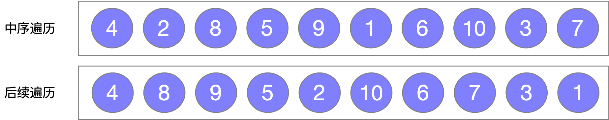
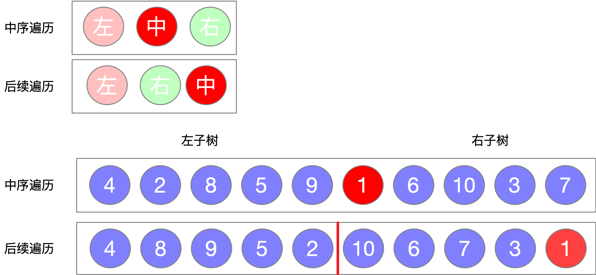
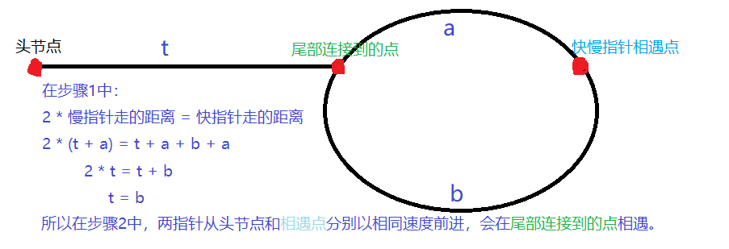

# 二叉树

leetcode的二叉树卡片开头给出的数结点模板：

```java
/** Definition for a binary tree node in leetcode */
public class TreeNode {
    int val;
    TreeNode left;
    TreeNode right;
    
    // constructor
    TreeNode(int x) {
        val = x;
    }
}
```

## 遍历

### 前序遍历leetcode 144

#### 递归算法

```java
class Solution {
    List<Integer> list = new ArrayList<>();
    public List<Integer> preorderTraversal(TreeNode root) {
        travelPre(root);
        return list;
    }
    public void travelPre(TreeNode node){
        if (node == null) return;
        list.add(node.val);
        travelPre(node.left);
        travelPre(node.right);
    }
}
```

#### 迭代算法1

从根节点一直向左，输出左孩子，右孩子进栈。

当不能再向左时，栈顶（最底部的右孩子）出栈，输出左孩子，右孩子进栈。。。

如此往复，直到栈空。

```java
class Solution {
    public List<Integer> preorderTraversal(TreeNode root) {
        List<Integer> list = new ArrayList<>();
        // 如果根节点为空，返回空列表
        if (root == null) return list;
        TreeNode node = root;
        // 使用栈辅助
        Stack<TreeNode> stack = new Stack<>();
        while (true) {
            // 遇到左孩子输出，右孩子进栈
            while (node != null) {
                list.add(node.val);
                stack.push(node.right);
                node = node.left;
            }
            // 栈空时退出
            if (stack.empty()) break;
            // 当不能再向左时，栈顶（最底部的右孩子）出栈
            node = stack.pop();
        }
        return list;
    }
}
```

#### 迭代算法2

将上一种方法中的while改写为if-else的形式

```java
class Solution {
    public List<Integer> preorderTraversal(TreeNode root) {
        List<Integer> list = new ArrayList<>();
        if (root == null) return list;

        TreeNode node = root;
        Stack<TreeNode> stack = new Stack<>();
        while (true) {
            if (node != null) {
                list.add(node.val);
                stack.push(node.right);
                node = node.left;
            } else if (!stack.empty())
                node = stack.pop();
            else break;
        }
        return list;
    }
}
```

### 中序遍历leetcode 94

#### 递归算法

```java
class Solution {
    List<Integer> list = new ArrayList<>();
    public List<Integer> inorderTraversal(TreeNode root) {
        travelIn(root);
        return list;
    }
    public void travelIn(TreeNode node){
        if (node == null) return;    
        travelIn(node.left);
        list.add(node.val);
        travelIn(node.right);
    }
}
```

#### 迭代算法1

从根节点一直向左并入栈，直到不能向左时，输出最左结点并出栈，然后转向该结点的右结点。


```java
class Solution {
    public List<Integer> inorderTraversal(TreeNode root) {
        List<Integer> list = new ArrayList<>();
        // 如果根节点为空，返回空列表
        if (root == null) return list;
        TreeNode node = root;
        // 使用栈辅助
        Stack<TreeNode> stack = new Stack<>();
        while (true) {
            // 从根节点一直向左并入栈，直到不能向左
            while (node != null) {
                stack.push(node);   // 注意这里是node入栈
                node = node.left;
            }
            // 栈空时退出
            if (stack.empty()) break;

            node = stack.pop();
            // 输出栈顶结点 并转向它的右结点
            list.add(node.val);
            node = node.right;
        }
        return list;
    }
}
```

#### 迭代算法2

由上一种方法改写，将上一种中的嵌套循环改写为if-else

```java
class Solution {
    public List<Integer> inorderTraversal(TreeNode root) {
        List<Integer> list = new ArrayList<>();
        if (root == null) return list;

        TreeNode node = root;
        Stack<TreeNode> stack = new Stack<>();
        while (true) {
            if (node != null) {
                stack.push(node);
                node = node.left;
            } else if (!stack.empty()) {
                node = stack.pop();
                list.add(node.val);
                node = node.right;
            } else break;
        }
        return list;
    }
}
```

### 后序遍历leetcode 145

#### 递归算法

```java
class Solution {
    List<Integer> list = new ArrayList<>();
    public List<Integer> postorderTraversal(TreeNode root) {
        travelPost(root);
        return list;
    }
    public void travelPost(TreeNode node){
        if (node == null) return;    
        travelPost(node.left);
        travelPost(node.right);
        list.add(node.val);
    }
}
```

#### 迭代算法1

宽度优先搜索+逆序=后序遍历。

按照从上到下从左到右的顺序将结点压入栈中，再将栈顶元素头插到列表，使得遍历顺序为先左后右。

这样在循环中是从右往左的向下深入，而逆序后在队列中则为先左后右，从下往上。


```java
class Solution {
    public List<Integer> postorderTraversal(TreeNode root) {
        LinkedList<Integer> list = new LinkedList<>();
        if (root == null) return list;

        Stack<TreeNode> stack = new Stack<>();
        stack.add(root);
        while (!stack.empty()) {
            // 右孩子后入栈，故先取出右孩子
            TreeNode node = stack.pop();
            list.addFirst(node.val);
            // 向下深入
            if (node.left != null) stack.push(node.left);
            if (node.right != null) stack.push(node.right);
        }
        return list;
    }
}
```

#### 迭代算法2

真正正确的后序遍历

后序遍历需要父结点在子结点之后输出，所以我们用一个集合记录访问过的结点，当左右子结点都被访问过时，像上一种方法一样使用栈，但这次是先右后左，因为栈顶入列不是头插而是普通的add方法。

此种方法效率略高于上一种。

```java
class Solution {
    public List<Integer> postorderTraversal(TreeNode root) {
        LinkedList<Integer> list = new LinkedList<>();
        Stack<TreeNode> stack = new Stack<>();
        // 集合记录访问过的结点
        Set<TreeNode> set = new HashSet<>();

        if (root == null) return list;

        stack.add(root);
        while (!stack.empty()){
            TreeNode node = stack.peek();

            boolean leftVisited = true;
            boolean rightVisted = true;

            // 左右结点判断的先后顺序是先右后左，因为输出要先左后右
            // 设置rightVisited和leftVisited变量是为了使第一次访问时不输出
            if (node.right != null && !set.contains(node.right)) {
                rightVisted = false;
                stack.push(node.right);
            }
            if (node.left != null && !set.contains(node.left)){
                leftVisited = false;
                stack.push(node.left);
            }
            if (leftVisited && rightVisted){
                list.add(node.val);
                set.add(node);
                stack.pop();
            }
        }
        return list;
    }
}
```

### 层序遍历leetcode 102

给定一个二叉树，返回其按层次遍历的节点值。 （即逐层地，从左到右访问所有节点）。

例如:
给定二叉树: `[3,9,20,null,null,15,7]`,

```c
    3
   / \
  9  20
    /  \
   15   7
```

返回其层次遍历结果：

```c
[
  [3],
  [9,20],
  [15,7]
]
```

#### 递归版本

```java
class Solution {
    List<List<Integer>> lists = new ArrayList<List<Integer>>();

    public List<List<Integer>> levelOrder(TreeNode root) {
        // 注意边界
        if (root == null) return lists;
        // 调用递归函数
        helper(root, 0);
        return lists;
    }

    public void helper(TreeNode node, int level) {
        // 如果层数不够用就新增一层
        if (level == lists.size()) lists.add(new ArrayList<>());
        // 将当前结点添加到对应层(队列)中
        lists.get(level).add(node.val);
        // 将当前结点的子结点添加到下一层中
        if (node.left != null)
            helper(node.left, level + 1);
        if (node.right != null)
            helper(node.right, level + 1);
    }
}
```

#### 自己写的迭代版本

```java
class Solution {
    public List<List<Integer>> levelOrder(TreeNode root) {
        List<List<Integer>> lists = new LinkedList<>();
        if (root == null) return lists;

        // 借助队列实现层序遍历
        Queue<TreeNode> queue = new LinkedList<>();
        queue.offer(root);
        while (!queue.isEmpty()) {
            List<Integer> list = new LinkedList<>();
            // 暂存下一层的结点
            List<TreeNode> temp = new ArrayList<>();
            while (!queue.isEmpty()) {
                TreeNode node = queue.poll();
                list.add(node.val); // 保存这一层的结点
                if (node.left != null) temp.add(node.left);
                if (node.right != null) temp.add(node.right);
            }
            // 将该层的结点放入结果
            lists.add(list);
            // 将暂存的结点放到队列中
            for (TreeNode tn : temp){
                queue.offer(tn);
            }
        }
        return lists;
    }
}
```

#### 官方题解的迭代版本

```java
class Solution {
    public List<List<Integer>> levelOrder(TreeNode root) {
        List<List<Integer>> lists = new ArrayList<List<Integer>>();
        if (root == null) return lists;

        Queue<TreeNode> queue = new LinkedList<TreeNode>();
        queue.add(root);
        // 记录当前是二叉树的第几层
        int level = 0;
        while ( !queue.isEmpty() ) {
            // 开始当前层
            lists.add(new ArrayList<Integer>());

            // 计算当前层中元素的个数
            int level_length = queue.size();
            for(int i = 0; i < level_length; ++i) {
                TreeNode node = queue.remove();

                // 像当前层的结果队列中 添加 当前层结点的值
                lists.get(level).add(node.val);

                // 将当前层结点的子结点入队
                // 供下一层使用
                if (node.left != null) queue.add(node.left);
                if (node.right != null) queue.add(node.right);
            }
            // 转到下一次
            level++;
        }
        return lists;
    }
}
```

区别在于我使用了另一个列表暂存当前层，官方题解采用queue.size()记录当前层的结点个数，节省了转移数据的开销。

## 运用递归解决问题

### 二叉树的最大深度leetcode 104

给定一个二叉树，找出其最大深度。

二叉树的深度为根节点到最远叶子节点的最长路径上的节点数。

说明: 叶子节点是指没有子节点的节点。

示例：
给定二叉树 [3,9,20,null,null,15,7]，

```c
   3
  / \
  9  20
    /  \
   15   7
```
返回它的最大深度 3 。

#### 自顶向下的递归

从上往下数，先计算层数，再递归

```java
class Solution {
    int ans = 0;

    public int maxDepth(TreeNode root) {
        recursive(root, 1);
        return ans;
    }

    public void recursive(TreeNode node, int depth){
        if (node == null) return;
        ans = Math.max(ans, depth);
        recursive(node.left, depth + 1);
        recursive(node.right, depth + 1);
    }
}
```

#### 自底向上的递归

从下往上数，先递归到最后一层，再计算答案。

```java
class Solution {
    public int maxDepth(TreeNode root) {
        return recursive(root);
    }

    public int recursive(TreeNode node) {
        if (node == null) return 0;
        int leftDepth = recursive(node.left);
        int rightDepth = recursive(node.right);
        return Math.max(leftDepth, rightDepth) + 1;
    }
}
```

### 对称二叉树leetcode 101

给定一个二叉树，检查它是否是镜像对称的。

例如，二叉树 `[1,2,2,3,4,4,3]` 是对称的。

```c
    1
   / \
  2   2
 / \ / \
3  4 4  3
```

但是下面这个 `[1,2,2,null,3,null,3]` 则不是镜像对称的:

```c
    1
   / \
  2   2
   \   \
   3    3
```

**说明:**

如果你可以运用递归和迭代两种方法解决这个问题，会很加分。

#### 使用递归

递归功能：分别向镜像的两个方向向下搜索，如果相同继续向下，不同返回false

递归结束的条件：

- 两个结点都为空：返回true
- 两个结点一个为空一个不为空，返回false
- 两个结点的值不同，返回false

```java
class Solution {
    public boolean isSymmetric(TreeNode root) {
        if (root == null) return true;
        return recursive(root, root);
    }

    public boolean recursive(TreeNode nodeLeft, TreeNode nodeRight) {
        if (nodeLeft == null && nodeRight == null) return true;
        if (nodeLeft == null || nodeRight == null) return false;

        if (nodeLeft.val == nodeRight.val)
            return recursive(nodeLeft.left, nodeRight.right) && recursive(nodeLeft.right, nodeRight.left);
        return false;
    }
}
```

#### 使用迭代

可以参考递归的功能，使用队列将镜像位置上的结点放到队列中的相邻位置。

```java
class Solution {
    public boolean isSymmetric(TreeNode root) {
        if (root == null) return true;
        Queue<TreeNode> queue = new LinkedList<>();
        queue.offer(root);
        queue.offer(root);

        // 维护一个队列，使对称位置的结点在队列的相邻位置上
        while (!queue.isEmpty()) {
            TreeNode node1 = queue.poll();
            TreeNode node2 = queue.poll();

            // 判断队头两个结点是否相等
            if (node1 == null && node2 == null) continue;
            if (node1 == null || node2 == null) return false;
            if (node1.val != node2.val) return false;

            // 镜像位置的结点入队
            queue.offer(node1.left);
            queue.offer(node2.right);
            queue.offer(node1.right);
            queue.offer(node2.left);
        }
        return true;
    }
}
```

### 路径总和leetcode 112

给定一个二叉树和一个目标和，判断该树中是否存在根节点到叶子节点的路径，这条路径上所有节点值相加等于目标和。

**说明:** 叶子节点是指没有子节点的节点。

**示例:** 
给定如下二叉树，以及目标和 `sum = 22`，

```c
              5
             / \
            4   8
           /   / \
          11  13  4
         /  \      \
        7    2      1
```

返回 `true`, 因为存在目标和为 22 的根节点到叶子节点的路径 `5->4->11->2`。

#### 递归解法

递归的功能，判断是否有一条根节点到叶子节点的路径，这条路径上所有节点值相加等于目标和。

递归结束条件：左右子结点都为空，计算最终结果是否等于目标和

```java
class Solution {

    int sum;

    public boolean hasPathSum(TreeNode root, int sum) {
        if (root == null) return false;
        this.sum = sum;
        return recursive(root, 0);
    }

    public boolean recursive(TreeNode node, int res) {
        // 左右子结点都为空，计算最终结果是否等于目标和
        if (node.left == null && node.right == null) return res + node.val == sum;
        // 左右子结点中一个为空，计算另外一支
        if (node.left == null) return recursive(node.right, res + node.val);
        if (node.right == null) return recursive(node.left, res + node.val);
        // 左右子结点都不为空，计算两支的或
        return recursive(node.left, res + node.val) || recursive(node.right, res + node.val);
    }
}
```

#### 迭代解法

 使用深度优先搜索的方法，计算每一条根节点到叶子节点的路径的和。用结点栈nodeStack保存当前搜索路径上的每一个结点，用总和栈sumStack保存搜索路径上每一步的和。通过出栈的方式更换搜索路线。

```java
class Solution {
    public boolean hasPathSum(TreeNode root, int sum) {
       if (root == null) return false;
        Stack<TreeNode> nodeStack = new Stack<>();
        Stack<Integer> sumStack = new Stack<>();

        nodeStack.add(root);
        sumStack.add(root.val);

        TreeNode node;
        int currentSum;
        // 深度优先搜索
        while (!nodeStack.empty()){
            node = nodeStack.pop();
            currentSum = sumStack.pop();

            // 找到给定目标和的情况
            if (node.left == null && node.right == null && currentSum == sum)
                return true;

            if (node.right != null){
                nodeStack.add(node.right);
                sumStack.add(currentSum + node.right.val);
            }
            if (node.left != null){
                nodeStack.add(node.left);
                sumStack.add(currentSum + node.left.val);
            }
        }
        return false; 
    }
}
```

## 总结

### 从中序与后序遍历序列构造二叉树leetcode106

根据一棵树的中序遍历与后序遍历构造二叉树。

**注意:**
你可以假设树中没有重复的元素。

例如，给出

```
中序遍历 inorder = [9,3,15,20,7]
后序遍历 postorder = [9,15,7,20,3]
```

返回如下的二叉树：

```c
    3
   / \
  9  20
    /  \
   15   7
```

**【思路】**

**前提**
解决此问题的关键在于要很熟悉树的各种遍历次序代表的什么，最好能够将图画出来。本题解带你先进行中序遍历和后续遍历二叉树，然后再根据遍历结果将二叉树进行还原。

首先，来一棵树


然后再看树的遍历结果



根据中序和后序遍历结果还原二叉树
中序遍历和后续遍历的特性
首先来看题目给出的两个已知条件中序遍历序列和后序遍历序列 根据这两种遍历的特性我们可以得出两个结论:

- 在后序遍历序列中,最后一个元素为树的根节点
- 在中序遍历序列中,根节点的左边为左子树，根节点的右边为右子树

如下图所示



树的还原过程描述
根据中序遍历和后续遍历的特性我们进行树的还原过程分析:

1. 首先在后序遍历序列中找到根节点(最后一个元素)
2. 根据根节点在中序遍历序列中找到根节点的位置
3. 根据根节点的位置将中序遍历序列分为左子树和右子树
4. 根据根节点的位置确定左子树和右子树在中序数组和后续数组中的左右边界位置
5. 递归构造左子树和右子树
6. 返回根节点结束

#### 自己写的递归

递归的功能：对每一个中序和后序的对应片段，后序的最后一个结点是根节点，找出根节点在中序中的下标，将中序分为**左子树**、**右子树**、**父结点**三部分，将父结点插入二叉树，再分别对左右子树进行递归运算。

递归结束的条件：当前子树为空，即inL > inR时，递归结束。当inL==inR时，当前子树有一个结点，递归不结束。

```java
class Solution {
    public TreeNode buildTree(int[] inorder, int[] postorder) {
        // 边界情况，数组为空时直接返回null
        if (inorder.length == 0) return null;

        // 要先有对象才能使用对象的引用
        TreeNode root = new TreeNode(0);
        recursive(inorder, 0, inorder.length - 1, postorder, 0, postorder.length - 1, root);
        return root;
    }

    // 根据当前子树中序的范围，后序的范围，求出父结点node的值，并深入到左右子结点
    public void recursive(int[] inorder, int inL, int inR, int[] postorder, int postL, int postR, TreeNode node) {
        // 递归结束的条件，左边界大于右边界，表示该子树为空
        if (inL > inR) return;
        // 后序的最后一个为父结点，也就是当前结点node，求出它在中序中的位置
        int mid = getIndex(inorder, postorder[postR]);
        // node的左子树的结点数 和 右子树的结点数
        int rightElements = inR - mid;
        int leftElements = mid - inL;

        node.val = postorder[postR];
        if (leftElements > 0) {
            node.left = new TreeNode(0);
            recursive(inorder, inL, mid - 1, postorder, postL, postL + leftElements - 1, node.left);
        }
        if (rightElements > 0) {
            node.right = new TreeNode(0);
            recursive(inorder, mid + 1, inR, postorder, postR - rightElements, postR - 1, node.right);
        }
    }

    // 求出数字num在数组中的下标
    public int getIndex(int[] arr, int num) {
        for (int i = 0; i < arr.length; i++) {
            if (arr[i] == num) return i;
        }
        return -1;
    }
}
```


#### 官方题解的递归

```java
class Solution {
    // 存储inorder数组的 结点 和 下标 的关系
    Map<Integer, Integer> map = new HashMap<>();
    // postorder数组的备份
    int[] post;

    public TreeNode buildTree(int[] inorder, int[] postorder) {
        // 转存inorder数组和postorder数组到类变量中
        for (int i = 0; i < inorder.length; i++)
            map.put(inorder[i], i);
        post = postorder;

        TreeNode root = recursive(0, inorder.length - 1, 0, postorder.length - 1);
        return root;
    }

    public TreeNode recursive(int inL, int inR, int postL, int postR){
        // 递归结束的条件
        if (inL > inR || postL > postR) return null;

        // 当前结点的值 和 其在中序数组中的下标
        int nodeVal = post[postR];
        int index = map.get(nodeVal);

        // 构造当前结点 并 向左右子树深入
        TreeNode node = new TreeNode(nodeVal);
        node.left = recursive(inL, index - 1, postL, postL + (index - inL) - 1);
        node.right = recursive(index + 1, inR, postL + (index - inL), postR - 1);
        return node;
    }
}
```

区别在于：

- 官方题解使用了map存放数组与下标的关系，效率更高
- 官方题解在递归函数中使用了返回值代替传参

### 从前序与中序遍历构造二叉树leetcode 105

根据一棵树的前序遍历与中序遍历构造二叉树。

注意:
你可以假设树中没有重复的元素。

例如，给出

> 前序遍历 preorder = [3,9,20,15,7]
> 中序遍历 inorder = [9,3,15,20,7]

返回如下的二叉树：

```c
   3
  / \
  9  20
    /  \
   15   7
```
 学习上一题的题解：

```java
class Solution {

    Map<Integer, Integer> map = new HashMap<>();
    int[] pre;

    public TreeNode buildTree(int[] preorder, int[] inorder) {
        for (int i = 0; i < inorder.length; i++) map.put(inorder[i], i);
        pre = preorder;
        TreeNode root = recursive(0, preorder.length - 1, 0, inorder.length - 1);
        return root;
    }

    public TreeNode recursive(int preL, int preR, int inL, int inR){
        if (preL > preR || inL > inR) return null;

        // 后序改为前序，就改成了pre[prel]
        int nodeVal = pre[preL];
        int index = map.get(nodeVal);

        TreeNode node = new TreeNode(nodeVal);
        // 下面的两句也发生了改变
        node.left = recursive(preL + 1, preL + (index - inL), inL, index - 1);
        node.right = recursive(preL + (index - inL) + 1, preR, index  +1, inR);
        return node;
    }
}
```

### 填充每个结点的下一个右侧结点指针leetcode 116

给定一个**完美二叉树**，其所有叶子节点都在同一层，每个父节点都有两个子节点。二叉树定义如下：

完美二叉树就是每个结点<u>度要么是0要么是2</u>的**满二叉树**

```c
struct Node {
  int val;
  Node *left;
  Node *right;
  Node *next;
}
```

填充它的每个 next 指针，让这个指针指向其下一个右侧节点。如果找不到下一个右侧节点，则将 next 指针设置为 `NULL`。

初始状态下，所有 next 指针都被设置为 `NULL`。

**示例：**


**提示：**

- 你只能使用常量级额外空间。
- 使用递归解题也符合要求，本题中递归程序占用的栈空间不算做额外的空间复杂度。

**思路：**

node.next默认为null，所以不用刻意为最右边的赋值。

可以使用**“拉拉链”**算法。以**当前结点**(root)为对称轴，将对称轴两边**最靠近对称轴**的结点连接起来，并不断向下重复，像一个从上往下拉的拉链。这是一次递归。

每一次递归都分别向左孩子和右孩子延续。

递归结束的条件是当前结点为空结点。


```java
class Solution {
    public Node connect(Node root) {
        if (root == null) return null;

        Node left = root.left;
        Node right = root.right;

        // 每一次循环连接一次，第一次循环连接的是当前root的左右子结点
        // 第二次以后连接的是 最靠近对称轴的两个结点
        while (left != null){
            left.next = right;
            left = left.right;
            right = right.left;
        }

        connect(root.left);
        connect(root.right);
        return root;
    }
}
```

### 填充每个结点的下一个右侧结点指针II leetcode 117

给定一个二叉树

```c
struct Node {
  int val;
  Node *left;
  Node *right;
  Node *next;
}
```

填充它的每个 next 指针，让这个指针指向其下一个右侧节点。如果找不到下一个右侧节点，则将 next 指针设置为 `NULL`。

初始状态下，所有 next 指针都被设置为 `NULL`。

**进阶：**

> - 你只能使用常量级额外空间。
> - 使用递归解题也符合要求，本题中递归程序占用的栈空间不算做额外的空间复杂度。

**示例：**


**思路：**

与上一题完全不同，要把题目中的next利用起来，next指向横向最近的结点，不断使用next可以遍历一层，这就是不需要层序遍历等需要O(1)以上空间复杂度的算法原因。

自顶向下，从右往左的构建法：

1. 当前结点有左孩子
   1. 有右孩子：左右孩子相连
   2. 没有右孩子：左孩子和右边水平距离最近的结点连接
2. 当前结点有右孩子：右孩子和右边水平距离最近的结点连接
3. 递归调用：注意一定要**先构建右子树**，再构建左子树，因为寻找当前结点的兄弟节点是从左到右遍历的，如果右子树未构建好就遍历，则会出错

另外，找到和左孩子右边水平距离最近的结点的方法：从左往右找当前结点的右兄弟，遇到的第一个有子结点的右兄弟的**左孩子**或**右孩子**(没有左孩子时)即为所求。

```java
class Solution {
    public Node connect(Node root) {
        if (root == null) return null;

        // 如果当前结点的左子结点不空
        if (root.left != null) {
            // 右孩子也不空时，直接连接
            if (root.right != null) root.left.next = root.right;
            // 右孩子为空时，向右边找水平距离最近的结点，连接
            else root.left.next = findNearestChild(root);
        }
        // 如果当前结点的右结点不空，向右边找水平距离最近的结点，连接
        if (root.right != null){
            root.right.next = findNearestChild(root);
        }

        // 这里注意一定要先构建右子树，再构建左子树
        // 因为寻找父节点的兄弟节点是从左到右遍历的，如果右子树未构建好就遍历，则会出错
        connect(root.right);
        connect(root.left);
        return root;
    }

    // 找到和node.left右边水平距离最近的结点
    private Node findNearestChild(Node node) {
        if (node.next == null) return null;
        node = node.next;
        // 一直横向得向右找node的兄弟结点
        while (node != null) {
            // 直到找到有左孩子或右孩子的
            if (node.left != null) return node.left;
            if (node.right != null) return node.right;
            node = node.next;
        }
        return null;
    }
}
```

### 二叉树的最近公共祖先leetcode236

给定一个二叉树, 找到该树中两个指定节点的最近公共祖先。

[百度百科](https://baike.baidu.com/item/最近公共祖先/8918834?fr=aladdin)中最近公共祖先的定义为：“对于有根树 T 的两个结点 p、q，最近公共祖先表示为一个结点 x，满足 x 是 p、q 的祖先且 x 的深度尽可能大（**一个节点也可以是它自己的祖先**）。”

例如，给定如下二叉树: root = [3,5,1,6,2,0,8,null,null,7,4]


**示例 1:**

> 输入: root = [3,5,1,6,2,0,8,null,null,7,4], p = 5, q = 1
> 输出: 3
> 解释: 节点 5 和节点 1 的最近公共祖先是节点 3。

**示例 2:**

> 输入: root = [3,5,1,6,2,0,8,null,null,7,4], p = 5, q = 4
> 输出: 5
> 解释: 节点 5 和节点 4 的最近公共祖先是节点 5。因为根据定义最近公共祖先节点可以为节点本身。

**说明:**

- 所有节点的值都是唯一的。
- p、q 为不同节点且均存在于给定的二叉树中。

#### 解法

1. 从根节点开始遍历树。
2. 如果当前节点本身是 p 或 q 中的一个，我们会将变量 mid 标记为 true，并继续搜索左右分支中的另一个节点。
3. 如果左分支或右分支中的任何一个返回 true，则表示在下面找到了两个节点中的一个。
4. 如果在遍历的任何点上，左、右或中三个标志中的任意两个变为 true，这意味着我们找到了节点 p 和 q 的最近公共祖先。

```java
class Solution {
    TreeNode ans = null;

    public TreeNode lowestCommonAncestor(TreeNode root, TreeNode p, TreeNode q) {
        recursive(root, p, q);
        return ans;
    }

    public boolean recursive(TreeNode node, TreeNode p, TreeNode q){
        if (node == null) return false;
        // 左子树中有p或q 左子树置1， 右子树和中间结点也是
        int left = recursive(node.left, p, q) ? 1 : 0;
        int right = recursive(node.right, p, q) ? 1 : 0;
        int mid = (node.val == p.val ||node.val == q.val) ? 1 : 0;

        // 如果三者之和大于等于2，该结点就是公共祖先
        if (left + right + mid >= 2) ans = node;
        // 如果任一子树或该节点中找到一个，就返回真
        return left + right + mid >= 1;
    }
}
```

#### 受到的启发

这个递归实现多个功能，判断该一个分支是否包含要找的节点、该结点对应的子树是否包含两个结点(是否为公共祖先)、将公共祖先返回或存储。

解决方法：

- 递归本身实现了判断该分支是否包含要找的结点的功能，使用返回值的形式不断传递。
- 将boolean转换为数字，并且用数字和的形式判断该结点是否为公共祖先。
- 将公共祖先存储在类变量ans中

### 二叉树的序列化与反序列化leetcode297

序列化是将一个数据结构或者对象转换为连续的比特位的操作，进而可以将转换后的数据存储在一个文件或者内存中，同时也可以通过网络传输到另一个计算机环境，采取相反方式重构得到原数据。

请设计一个算法来实现二叉树的序列化与反序列化。这里不限定你的序列 / 反序列化算法执行逻辑，你只需要保证一个二叉树可以被序列化为一个字符串并且将这个字符串反序列化为原始的树结构。

**示例:** 

你可以将以下二叉树：

>       1
>    / \
> 2   3
>         / \
>      4   5

序列化为 "[1,2,3,null,null,4,5]"

**解法：**

可以使用数组模拟树，再将数组转化为字符串，但是这种方法超出内存限制

所以我们使用一种**基于先序遍历**的序列化方法

示例中的二叉树可表示为12##34##5##，即对每一个非空结点，其后紧跟两个子结点，如2的两个子结点为两个空结点，表示为2##，当当前结点为空时，不再向下

所以序列化时递归结束的条件为`if (node == null) return "# ";`，递归进行的顺序为先左后右。

反序列化使同样可以根据先序来构建树

> (1 (2##) (3(4##)(5##) ) )
>
> ​     L         R RL     RR

```java
public class Codec {
    // Encodes a tree to a single string.
    public String serialize(TreeNode root) {
        return recursion(root);
    }

    // 基于先序的序列化： 当前结点 左 右
    public String recursion(TreeNode node) {
        if (node == null) return "# ";
        StringBuilder sb = new StringBuilder();
        sb.append(node.val).append(" ");
        sb.append(recursion(node.left));
        sb.append(recursion(node.right));
        return sb.toString();
    }

    // Decodes your encoded data to tree.
    public TreeNode deserialize(String data) {
        // 边界条件
        if (data == null) return null;
        // 拆分序列化字符串 并装入队列
        String values[] = data.split(" ");
        Queue<String> queue = new LinkedList<>();
        for (String str : values){
            queue.offer(str);
        }
        return recursiveRecovery(queue);
    }

    public TreeNode recursiveRecovery(Queue<String> queue){
        String str = queue.poll();
        if (str.equals("#")) return null;
        // 按照相同的当前 左 右 的顺序恢复
        TreeNode root = new TreeNode(Integer.parseInt(str));
        root.left = recursiveRecovery(queue);
        root.right = recursiveRecovery(queue);
        return root;
    }
}
```


# 递归

## 递归三要素

1、函数的功能

2、结束条件

3、等价关系

### 例1 斐波那契数列

**1、递归函数功能**

f(n) 的功能是求第 n 项的值，代码如下：

```java
int f(int n){
    
}
```

**2、找出递归结束的条件**

显然，当 n = 1 或者 n = 2 ,我们可以轻易着知道结果 f(1) = f(2) = 1。所以递归结束条件可以为  n <= 2。代码如下

```java
int f(int n){
	if (n <= 2) return 1;
	//...
}
```

**3、找出函数的等价关系式**

 f(n) = f(n-1) + f(n-2)

```java
int f(int n){
	if (n <= 2) return 1;
	return f(n - 1) + f(n - 2);
}
```

### 例2 小青蛙条台阶

> 一只青蛙一次可以跳上1级台阶，也可以跳上2级。求该青蛙跳上一个n级的台阶总共有多少种跳法。

**递归函数功能**

 f(n) 的功能是求青蛙跳上一个n级的台阶总共有多少种跳法。实际上也是斐波那契数列，同例1.

### 例3 反转单链表

> 反转单链表。例如链表为：1->2->3->4。反转后为 4->3->2->1

基础代码如下：

```java
public class SLinkedList {
    private static class Node {
        int value;
        Node next;
    }

    private Node head = new Node();

    // 使用递归的方式反转单链表
    Node reverseList(Node node) {
        if (node == null || node.next == null){
            return node;
        }

        // 反转除node结点之后(不含)的链表，深入到最后一个结点
        Node newHead = reverseList(node.next);
        // 1. 把下一结点的后继改为当前结点
        Node temp = node.next;
        temp.next = node;
        // 2. 把当前结点的后继置空
        node.next = null;
        // 3. 不论递归执行到哪个结点，都返回最后一个非空结点
        return newHead;
    }

    public void reverse(){
        head.next = reverseList(head.next);
    }

    public void insert(int n) {
        Node node = new Node();
        node.value = n;
        node.next = null;
        Node last = head;
        while(last.next != null){
            last = last.next;
        }
        last.next = node;
    }

    public void print() {
        Node node = head;
        while (node.next != null) {
            node = node.next;
            System.out.println(node.value);
        }
    }

    public static void main(String[] args) {
        SLinkedList list = new SLinkedList();
        list.insert(1);
        list.insert(2);
        list.insert(3);
        list.insert(4);
        list.print();
        list.reverse();
        list.print();
    }
}
```

**1、定义递归函数的功能**

reverseList(node) 的功能是反转单链表，其中 node表示链表的头节点。返回反转后的第一个结点。代码如下：

```java
Node reverseList(Node node) {
   
}
```

**2、结束条件**

当链表只有一个节点，或者如果是空表时，直接把 node返回。代码如下:

```java
Node reverseList(Node node) {
    if (node == null || node.next == null){
        return node;
    }
    return null;
}
```

**3、寻找等价关系**

从后往前，依次反转

初始状态


反转一次


再反转一次


以此类推，每次返回的都是最后一个结点（4）。

最终实现如下：

```java
Node reverseList(Node node) {
    if (node == null || node.next == null){
        return node;
    }

    // 反转除node结点之后(不含)的链表，深入到最后一个结点
    Node newHead = reverseList(node.next);
    // 1. 把下一结点的后继改为当前结点
    Node temp = node.next;
    temp.next = node;
    // 2. 把当前结点的后继置空
    node.next = null;
    // 3. 不论递归执行到哪个结点，都返回最后一个非空结点
    return newHead;
}
```

## 递归原理

> 递归是一种解决问题的有效方法，在递归过程中，函数将自身作为子例程调用

你可能想知道如何实现调用自身的函数。诀窍在于，每当递归函数调用自身时，它都会**将给定的问题拆解为子问题**。递归调用继续进行，直到到**子问题无需进一步递归就可以解决的地步**。

为了确保递归函数不会导致无限循环，它应具有以下属性：

1. 一个简单的`基本案例（basic case）`（或一些案例） —— 能够不使用递归来产生答案的终止方案。
2. 一组规则，也称作`递推关系（recurrence relation）`，可将所有其他情况拆分到基本案例。

注意，函数可能会有多个位置进行自我调用。

### 示例

> 以相反的顺序打印字符串。

可以使用迭代的办法轻而易举地解决这个问题，即从字符串的最后一个字符开始遍历字符串。但是如何递归地解决它呢？

首先，我们可以将所需的函数定义为 `printReverse(str[0...n-1])`，其中 `str[0]` 表示字符串中的第一个字符。然后我们可以分两步完成给定的任务：

1. `printReverse(str[1...n-1])`：以相反的顺序打印子字符串 `str[1...n-1]` 。
2. `print(str[0])`：打印字符串中的第一个字符。

注意，我们在第一步中调用函数本身，根据定义，它使函数递归。

下面给出了代码片段：

```java
private static void printReverse(char [] str) {
  helper(0, str);
}

private static void helper(int index, char [] str) {
  if (str == null || index >= str.length) {
    return;
  }
  helper(index + 1, str);	// 1. 以相反的顺序打印后面的字符串
  System.out.print(str[index]); // 2. 打印当前字符
}
```

### 反转字符串leetcode 344

编写一个函数，其作用是将输入的字符串反转过来。输入字符串以字符数组 `char[]` 的形式给出。

不要给另外的数组分配额外的空间，你必须**原地**、使用 **O(1)** 的额外空间解决这一问题。

你可以假设数组中的所有字符都是ASCII码表中的可打印字符。

**示例 1：**

```python
输入：["h","e","l","l","o"]
输出：["o","l","l","e","h"]
```

**示例 2：**

```R
输入：["H","a","n","n","a","h"]
输出：["h","a","n","n","a","H"]
```

**思路：**

1. 结束条件：数组中只有**1个或0个**元素
2. 交换当前数组的第一个和最后一个值
3. 剩余部分交给下一次递归

```java
class Solution {
    public void reverseString(char[] s) {
        recursion(s, 0, s.length - 1);
    }

    public void recursion(char[] s, int left, int right){
        if (left + 1 > right) return;

        char temp = s[left];
        s[left] = s[right];
        s[right] = temp;

        recursion(s, left + 1, right - 1);
    }
}
```

## 递归函数

对于一个问题，如果存在递归解决方案，我们可以按照以下步骤来实施它。

举个例子，我们将问题定义为有待实现的函数 $F(X)$，其中$X$是函数的输入，同时也定义了问题的范围。

然后，在函数$F(X)$ 中，我们将会：

1. 将问题逐步分解成较小的范围，例如$x_0 \in X, x_1 \in X, ..., x_n \in X$；
2. 调用函数$F(X_0), F(X_1),...,F(X_n)$ **递归地** 解决$X$ 的这些子问题；
3. 最后，处理调用递归函数得到的结果来解决对应$X$的问题。

### 两两交换链表中的节点leetcode 24

> 给定链表，交换每两个相邻节点并返回其头节点。
>
> 例如，对于列表 1-> 2 -> 3 -> 4，我们应当返回新列表 2 -> 1 -> 4 -> 3 的头节点。
>
> **你不能只是单纯的改变节点内部的值**，而是需要实际的进行节点交换。

我们可以定义函数 `swap(head)` 以实现解决方案，其中输入的参数 `head` 指向链表的头节点。而该函数应当返回将链表中每两个相邻节点交换后得到的新列表的头节点 `head` 。

按照我们上面列出的步骤，我们可以按下面的流程来实现函数：

1. 首先，我们交换列表中的前两个节点，也就是 `head` 和 `head.next`；
2. 然后我们以 `swap(head.next.next)` 的形式调用函数自身，以交换头两个节点之后列表的其余部分。
3. 最后，我们将步骤（2）中的子列表的返回头与步骤（1）中交换的两个节点相连，以形成新的链表。

**交换两个结点的本质：**

1. 将第一个结点的后继改为下一次递归的返回值（下一次递归是第三个结点和第四个结点交换，故返回值为第四个结点）
2. 将第二个结点的后继改为第一个结点


```java
class Solution {
    public ListNode swapPairs(ListNode head) {
        // 递归结束的条件
        if (head == null || head.next == null) return head;

        ListNode first = head;
        ListNode second = head.next;

        // 1. 第一个结点的后继是 下一次递归产生的新头节点
        first.next = swapPairs(second.next);
        second.next = first;    // 2. 第二个结点的后继是第一个结点
        // 新头节点是第二个结点
        return second;
    }
}
```

## 递推关系

在实现递归函数之前，有两件重要的事情需要弄清楚:

- `递推关系`： 一个问题的结果与其子问题的结果之间的关系。
- `基本情况`: 不需要进一步的递归调用就可以直接计算答案的情况。 有时，基本案例也被称为 *bottom cases*，因为它们往往是问题被减少到最小规模的情况，*也就是*如果我们认为将问题划分为子问题是一种自上而下的方式的最下层。

> 一旦我们计算出以上两个元素，再想要实现一个递归函数，就只需要根据`递推关系`调用函数本身，直到其抵达`基本情况`。

为了解释以上几点，让我们来看一个经典的问题，`帕斯卡三角（Pascal's Triangle）`:

> 帕斯卡三角形是排列成三角形的一系列数字。 在帕斯卡三角形中，每一行的最左边和最右边的数字总是 1。 对于其余的每个数字都是前一行中直接位于它上面的两个数字之和。

下面的插图给出了一个 5 行的帕斯卡三角：


**递推关系：**

让我们从帕斯卡三角形内的递推关系开始。


首先，我们定义一个函数 $f(i, j)$，它将会返回帕斯卡三角形`第 i 行`、`第 j 列`的数字。

我们可以用下面的公式来表示这一递推关系:
$$
f(i, j) = f(i - 1, j - 1) + f(i - 1, j)
$$

**基本情况**：

可以看到，每行的最左边和最右边的数字是`基本情况`，在这个问题中，它总是等于 1。

因此，我们可以将基本情况定义如下:

$$
f(i, j) = 1 \quad where \quad j = 1 \enspace or \enspace j = i
$$
**举例：**

我们可以将$ f(5, 3)$分解为$ f(5, 3) = f(4, 2) + f(4, 3)$，然后递归地调用$ f(4, 2)$ 和$ f(4, 3)$：

- 对于调用的 $f(4, 2)$，我们可以进一步展开它，直到到达基本情况，正如下面所描述的：


$$
f(4, 2) = f(3, 1) + f(3, 2) = f(3, 1) + (f(2, 1) + f(2, 2)) = 1 + (1 + 1) = 3
$$


- 对于调用的 $f(4, 3)$，类似地，我们可以将其分解为：


$$
f(4, 3) = f(3, 2) + f(3, 3) = (f(2, 1) + f(2, 2)) + f(3, 3) = (1 + 1) + 1 = 3
$$


- 最后，我们结合上述子问题的结果：


$$
f(5, 3) = f(4, 2) + f(4, 3) = 3 + 3 = 6
$$

### 杨辉三角leetcode 118

给定一个非负整数 *numRows，*生成杨辉三角的前 *numRows* 行。

**示例:**

```python
输入: 5
输出:
[
     [1],
    [1,1],
   [1,2,1],
  [1,3,3,1],
 [1,4,6,4,1]
]
```

**使用递归：**

```java
class Solution {
    public List<List<Integer>> generate(int numRows) {
        List<List<Integer>> lists = new ArrayList<>();
        for (int i = 0; i < numRows; i++){
            lists.add(new ArrayList<>());
            for (int j = 0; j <= i; j++){
                lists.get(i).add(triangle(i, j));
            }
        }
        return lists;
    }

    private int triangle(int i, int j){
        if (j == 0 || i == j) return 1;
        return triangle(i - 1, j - 1) + triangle(i - 1, j);
    }
}
```

**超时，使用DP解决:**

```java
class Solution {
    public List<List<Integer>> generate(int numRows) {
        List<List<Integer>> lists = new ArrayList<>();
        if (numRows == 0)return lists;
        // 第1行
        lists.add(new ArrayList<>());
        lists.get(0).add(1);
        for (int i = 1; i < numRows; i++){
            lists.add(new ArrayList<>());
            // 第一列
            lists.get(i).add(1);
            // 中间
            for (int j = 1; j <= i - 1; j++){
                lists.get(i).add(lists.get(i - 1).get(j - 1) + lists.get(i - 1).get(j));
            }
            // 最后一列
            lists.get(i).add(1);
        }
        return lists;
    }
}
```

### 杨辉三角II leetcode 119

给定一个非负索引 *k*，其中 *k* ≤ 33，返回杨辉三角的第 *k* 行。

**示例:**

```c
输入: 3
输出: [1,3,3,1]
```

**进阶：**

你可以优化你的算法到 *O*(*k*) 空间复杂度吗？

**思路：**

使用组合数，杨辉三角的第$n$行等于$(a+b)^n$的二项式展开，所以问题转换为组合数的计算方法。
$$
\tbinom{n}{m} = c(n, m) = c_n^m = \frac {n!}{m!(n-m)!}
$$
计算组合数不可以使用递归，因为$2^{21} > long的表示范围$。

```java
class Solution {
    public List<Integer> getRow(int rowIndex) {
        List<Integer> list = new ArrayList<>();
        for (int i = 0; i <= rowIndex; i++) {
            list.add((int) combinatorialNumber(rowIndex, i));
        }
        return list;
    }

    public long combinatorialNumber(int n, int m) {
        // 组合数的性质 C(n,m)=C(n-1,m-1)+C(n-1,m)
        if (m < n - m) m = n - m;
        long res = 1;
        // A(下n, 上m) = n! / m!;
        for (int i = m + 1; i <= n; i++) res *= i;
        // 除以(n - m)!
        for (int i = 1; i <= n - m; i++) res /= i;
        return res;
    }
}
```

然而这种解法会超出long的数据范围第15行$c_{30}^{15}$超出了数据范围

**优化解法：**

公式简化后为：
$$
C_n^m = \frac{n!}{m!(n-m)!} = \frac{n*(n-1)*(n-2)*...*(n-m+1)}{m!}
$$
重要的一点是分母上下的**项数相同**。这样我们就可以合并15行和17行的循环。

```java
class Solution {
    public List<Integer> getRow(int rowIndex) {
        List<Integer> list = new ArrayList<>();
        for (int i = 0; i <= rowIndex; i++) {
            list.add((int) combinatorialNumber(rowIndex, i));
        }
        return list;
    }

    public long combinatorialNumber(int n, int m) {
        long res = 1;
        for (int i = 1; i <= m; i++)
            res = res * (n - m + i) / i;
        return res;
    }
}
```

这样就可以通过了，但还可以更好，因为相邻两个组合数是有联系的：
$$
c_n^m = c_n^{m-1} \times \frac{(n - k + 1)}{k}
$$
这样我们需要一个变量存储之前的组合数，最终的解法如下：

```java
class Solution {
    public List<Integer> getRow(int rowIndex) {
        List<Integer> list = new ArrayList<>();
        // 第一个一定是1
        list.add(1);
        long pre = 1;    // pre存储c(n - 1, m)
        for (int i = 1; i <= rowIndex; i++) {
            // c(n, m) = c(n - 1, m) * (n - m + 1) / m
            pre = pre * (rowIndex - i + 1) / i;
            list.add((int) pre);
        }
        return list;
    }
}
```

### 反转链表leetcode 206

反转一个单链表。

**示例:**

```
输入: 1->2->3->4->5->NULL
输出: 5->4->3->2->1->NULL
```

**进阶:**
你可以迭代或递归地反转链表。你能否用两种方法解决这道题？

**递归：**

从后往前，依次反转，使用递归栈存储每个结点

初始状态


反转一次


再反转一次


```Java
class Solution {
    public ListNode reverseList(ListNode head) {
        return recursion(head);
    }

    private ListNode recursion(ListNode node){
        if (node == null || node.next == null) return node;
        // 反转除node结点之后(不含)的链表，深入到最后一个结点
        ListNode newHead = recursion(node.next);
        // 1. 把下一结点的后继改为当前结点
        ListNode temp = node.next;
        temp.next = node;
        // 2. 把当前结点的后继置空
        node.next = null;
        return newHead;// 3. 不论递归执行到哪个结点，都返回最后一个非空结点
    }
}
```

**迭代：**

递归可以用递归栈存储每一次递归的当前结点，而迭代则需要使用变量存储前后结点。

```java
class Solution {
    public ListNode reverseList(ListNode head) {
        // 存储前一个结点
        ListNode pre = null;
        ListNode cur = head;
        while (cur != null){
            ListNode temp = cur.next; // 存储后一个结点
            cur.next = pre; // 当前节点后继改为前一个结点
            // 改变pre和cur
            pre = cur;
            cur = temp;
        }
        // 返回最后一个结点
        return pre;
    }
}
```

## memorization（记忆化）技术

### 斐波那契数leetcode 509

**斐波那契数**，通常用 `F(n)` 表示，形成的序列称为**斐波那契数列**。该数列由 `0` 和 `1` 开始，后面的每一项数字都是前面两项数字的和。也就是：

```
F(0) = 0,   F(1) = 1
F(N) = F(N - 1) + F(N - 2), 其中 N > 1.
```

给定 `N`，计算 `F(N)`。

**解法：**

使用HashMap记忆中间结果，减少重复计算.

```java
class Solution {
    Map<Integer, Integer> map = new HashMap<>();

    public int fib(int N) {
        if (map.containsKey(N))return map.get(N);
        if (N == 0 || N == 1) return N;
        int res = fib(N - 1) + fib(N - 2);
        map.put(N, res);
        return res;
    }
}
```

### 爬楼梯leetcode 70

假设你正在爬楼梯。需要 *n* 阶你才能到达楼顶。

每次你可以爬 1 或 2 个台阶。你有多少种不同的方法可以爬到楼顶呢？

**注意：**给定 *n* 是一个正整数。

**示例 1：**

```
输入： 2
输出： 2
解释： 有两种方法可以爬到楼顶。
1.  1 阶 + 1 阶
2.  2 阶
```

**示例 2：**

```
输入： 3
输出： 3
解释： 有三种方法可以爬到楼顶。
1.  1 阶 + 1 阶 + 1 阶
2.  1 阶 + 2 阶
3.  2 阶 + 1 阶
```

**解法：**

由数学归纳法可知：n级台阶的方法数等于$fib(n+1)$，所以直接调用上一题代码即可通过：

```java
class Solution {
    public int climbStairs(int n) {
        return fib(n + 1);
    }
    Map<Integer, Integer> map = new HashMap<>();

    public int fib(int N) {
        if (map.containsKey(N))return map.get(N);
        if (N == 0 || N == 1) return N;
        int res = fib(N - 1) + fib(N - 2);
        map.put(N, res);
        return res;
    }
}
```

 ### 爬楼梯问题的6种解法

#### 1. 暴力法

在暴力法中，我们将会把所有可能爬的阶数进行组合，也就是 1 和 2 。而在每一步中我们都会继续调用函数$f$模拟爬 1 阶和 2 阶的情形，并返回两个函数的返回值之和
$$
f(i,n) = f(i + 1, n) + f(i + 2, n)
$$
其中$ i$ 定义了当前阶数，而 $n$定义了目标阶数。意思是下一步可以走一级也可以走两级。

```java
public class Solution {
    public int climbStairs(int n) {
        climb_Stairs(0, n);
    }
    public int climb_Stairs(int i, int n) {
        if (i > n) {
            return 0;
        }
        if (i == n) {
            return 1;
        }
        return climb_Stairs(i + 1, n) + climb_Stairs(i + 2, n);
    }
}
```

**复杂度：**

时间复杂度$O(2^n)$。

空间复杂度$O(n)$。

#### 2. 记忆化递归

在上一种方法中，我们计算每一步的结果时出现了冗余。另一种思路是，我们可以把每一步的结果存储在$memo$数组之中，每当函数再次被调用，我们就直接从数$memo$组返回结果。

在$memo$数组的帮助下，我们得到了一个修复的递归树，其大小减少到$n$。

```java
public class Solution {
    public int climbStairs(int n) {
        int memo[] = new int[n + 1];
        return climb_Stairs(0, n, memo);
    }
    public int climb_Stairs(int i, int n, int memo[]) {
        if (i > n) {
            return 0;
        }
        if (i == n) {
            return 1;
        }
        if (memo[i] > 0) {
            return memo[i];
        }
        memo[i] = climb_Stairs(i + 1, n, memo) + climb_Stairs(i + 2, n, memo);
        return memo[i];
    }
}
```

**复杂度：**

时间复杂度$O(n)$。

空间复杂度$O(n)$。

#### 3. 动态规划

不难发现，这个问题可以被分解为一些包含最优子结构的子问题，即它的最优解可以从其子问题的最优解来有效地构建，我们可以使用动态规划来解决这一问题。

第 $i$ 阶可以由以下两种方法得到：

1. 在第$i-1$阶后向上爬1阶。
2. 在第$i-2$阶后向上爬2阶。

所以到达第 $i$ 阶的方法总数就是到第$i-1$阶和第$i - 2$阶的方法数之和。

令$dp[i]$表示能到达第 $i$ 阶的方法总数：

$$
dp[i] = dp[i - 1] + dp[i - 2]
$$

```java
public class Solution {
    public int climbStairs(int n) {
        if (n == 1) {
            return 1;
        }
        int[] dp = new int[n + 1];
        dp[1] = 1;
        dp[2] = 2;
        for (int i = 3; i <= n; i++) {
            dp[i] = dp[i - 1] + dp[i - 2];
        }
        return dp[n];
    }
}
```

**复杂度：**

时间复杂度$O(n)$。

空间复杂度$O(n)$。

#### 4. 斐波那契法

动态规划的递推关系符合斐波那契数列，根据本题的题意$fib(1) = 1$，$fib(2) = 2$。上一级有一种方法，上两级有两种方法。

```java
public class Solution {
    public int climbStairs(int n) {
        if (n == 1) {
            return 1;
        }
        int first = 1;
        int second = 2;
        for (int i = 3; i <= n; i++) {
            int third = first + second;
            first = second;
            second = third;
        }
        return second;
    }
}
```

**复杂度：**

时间复杂度$O(n)$。

空间复杂度$O(1)$。

#### 5. Binets 方法

这里有一种有趣的解法，它使用矩阵乘法来得到第$n$个斐波那契数。矩阵形式如下：
$$
\left[\begin{matrix}F_{n+1}&F_n\\F_n&F_{n-1}\end{matrix}\right] = \left[\begin{matrix}1&1\\1&0\end{matrix}\right]
$$
令$Q = \left[\begin{matrix}F_{n+1}&F_n\\F_n&F_{n-1}\end{matrix}\right]$。按照此方法，第n个斐波那契数由$Q^{n-1}[0,0]$给出，即矩阵中最左上的数字。

如$Q^2 = \left[\begin{matrix}2&1\\1&1\end{matrix}\right]$，表示$fib(3) = 2$。

我们需要为我们的问题做的唯一改动就是将斐波那契数列的初始项修改为 2 和 1 来代替原来的 1 和 0 。或者，另一种方法是使用相同的初始矩阵$Q$并使用 $result = Q^{n}[0,0]$得出最后结果。发生这种情况的原因是我们必须使用原斐波那契数列的第 2 项和第 3 项作为初始项。

```java
public class Solution {
    public int climbStairs(int n) {
        int[][] q = {{1, 1}, {1, 0}};
        int[][] res = pow(q, n);
        return res[0][0];
    }
    public int[][] pow(int[][] a, int n) {	// log(n)的乘方计算方法
        int[][] ret = {{1, 0}, {0, 1}};	// 单位矩阵
        while (n > 0) {
            if ((n & 1) == 1) {
                ret = multiply(ret, a);
            }
            n >>= 1;
            a = multiply(a, a);
        }
        return ret;
    }
    public int[][] multiply(int[][] a, int[][] b) {
        int[][] c = new int[2][2];
        for (int i = 0; i < 2; i++) {
            for (int j = 0; j < 2; j++) {
                c[i][j] = a[i][0] * b[0][j] + a[i][1] * b[1][j];
            }
        }
        return c;
    }
}
```

**复杂度：**

时间复杂度$O(log(n))$。

空间复杂度$O(1)$。

#### 6. 斐波那契公式

我们可以使用这一公式来找出第 $n$ 个斐波那契数：
$$
F_n = \frac{1}{\sqrt5}[{(\frac{1+\sqrt5}{2})}^n - {(\frac{1-\sqrt5}{2})}^n]
$$

```java
public class Solution {
    public int climbStairs(int n) {
        double sqrt5=Math.sqrt(5);
        double fibn=Math.pow((1+sqrt5)/2,n+1)-Math.pow((1-sqrt5)/2,n+1);
        return (int)(fibn/sqrt5);
    }
}
```

**复杂度：**

时间复杂度$O(log(n))$。Math.pow将用去$log(n)$的时间。

空间复杂度$O(1)$。

## 复杂度分析

### 时间复杂度

时间复杂度 = 递归调用的数量 * 单个计算的时间复杂度

递归调用的数量 = 递归执行树的结点数

记忆化可以减少递归执行树的分支

### 空间复杂度

递归相关空间 = 递归执行树的层次，即递归调用的深度，每一层递归的**返回地址**、**参数**、**局部变量**。

递归无关空间 = 全局变量所使用的空间

### 尾递归

> 尾递归函数是递归函数的一种，其中递归调用是递归函数中的最后一条指令。并且在函数中应该只有一次递归调用。

尾递归的好处是，它可以避免递归调用期间栈空间开销的累积，因为系统可以为每个递归调用重用栈中的固定空间。

请注意，在尾递归的情况下，一旦从递归调用返回，我们也会立即返回，因此我们可以跳过整个递归调用返回链，直接返回到原始调用方。这意味着我们根本不需要所有递归调用的调用栈，这为我们节省了空间。

尾递归函数可以作为非尾递归函数来执行，也就是说，带有调用栈并不会对结果造成影响。通常，编译器会识别尾递归模式，并优化其执行。然而，并不是所有的编程语言都支持这种优化，比如 C，C++ 支持尾递归函数的优化。另一方面，Java 和 Python 不支持尾递归优化。

### 二叉树的最大深度leetcode 104

给定一个二叉树，找出其最大深度。

二叉树的深度为根节点到最远叶子节点的最长路径上的节点数。

**说明:** 叶子节点是指没有子节点的节点。

**示例：**
给定二叉树 `[3,9,20,null,null,15,7]`，

```
    3
   / \
  9  20
    /  \
   15   7
```

返回它的最大深度 3 。

```java
class Solution {
    public int maxDepth(TreeNode root) {
        if (root == null) return 0;
        return Math.max(maxDepth(root.left), maxDepth(root.right)) + 1;
    }
}
```

### Pow(x, n) leetcode 50

实现 [pow(*x*, *n*)](https://www.cplusplus.com/reference/valarray/pow/) ，即计算 x 的 n 次幂函数。

**示例 1:**

```
输入: 2.00000, 10
输出: 1024.00000
```

**示例 2:**

```
输入: 2.10000, 3
输出: 9.26100
```

**示例 3:**

```
输入: 2.00000, -2
输出: 0.25000
解释: 2-2 = 1/22 = 1/4 = 0.25
```

**说明:**

- -100.0 < *x* < 100.0
- *n* 是 32 位有符号整数，其数值范围是 [−231, 231 − 1] 。

**递归：**

```java
class Solution {
    public double myPow(double x, int n) {
        long N = n; // 细节：2^-31在int的表示范围而2^31不在
        if (n < 0) {
            x = 1 / x;
            N = 0 - n;
        }
        return pow(x, N);
    }

    private double pow(double x, long n){
        if (n == 0) return 1;
        double sqrt = pow(x, n / 2); // 把变量存起来，避免重复计算
        if (n % 2 == 0) return sqrt * sqrt;
        else return sqrt * sqrt * x;
    }
}
```

**迭代：**

```java
class Solution {
    public double myPow(double x, int n) {
        long N = n; // 细节：2^-31在int的表示范围而2^31不在
        if (n < 0) {
            x = 1 / x;
            // 细节：一定是-N而不是-n
            // -((int)-2147483648) = -2147483648
            N = -N;
        }
        return pow(x, N);
    }
    
    // 从爬楼梯第五种解法学来的pow
    private double pow(double x, long n) {
        double res = 1.0;
        while (n > 0) {
            if ((n & 1) == 1) res = res * x;
            n >>= 1;
            x = x * x;
        }
        return res;
    }
}
```

## 总结

### 合并两个有序链表leetcode 21

将两个有序链表合并为一个新的有序链表并返回。新链表是通过拼接给定的两个链表的所有节点组成的。 

**示例：**

```
输入：1->2->4, 1->3->4
输出：1->1->2->3->4->4
```

**递归：**

合并结果的产生方法：
$$
\begin{cases}list1 + merge(list1.next, list2)& \text list1.val <= list2.val\\list2 + merge(list1, list2.next)& \text otherwise\end{cases}
$$
我们取两个列表头部中较小的那个，然后再加上合并其余元素所得到的结果。

```java
class Solution {
    public ListNode mergeTwoLists(ListNode l1, ListNode l2) {
        if (l1 == null) return l2;
        if (l2 == null) return l1;
        if (l1.val <= l2.val) {
            l1.next = mergeTwoLists(l1.next, l2);
            return l1;
        } else {
            l2.next = mergeTwoLists(l2.next, l1);
            return l2;
        }
    }
}
```

时间复杂度$O( m + n )$。

空间复杂度$O( m+n )$。

**迭代：**

新建一个链表，尾插结点

```java
class Solution {
    public ListNode mergeTwoLists(ListNode l1, ListNode l2) {
        ListNode head = new ListNode(0);
        ListNode prev = head;
        while (l1 != null && l2 != null) {
            if (l1.val <= l2.val){
                prev.next = l1;
                l1 = l1.next;
            }else {
                prev.next = l2;
                l2 = l2.next;
            }
            prev = prev.next;
        }
        if (l1 == null) prev.next = l2;
        else prev.next = l1;
        return head.next;
    }
}
```

时间复杂度$O(m+n)$。

空间复杂度$O( 1 )$。

### 第K个语法符号leetcode 779

在第一行我们写上一个 `0`。接下来的每一行，将前一行中的`0`替换为`01`，`1`替换为`10`。

给定行数 `N` 和序数 `K`，返回第 `N` 行中第 `K`个字符。（`K`从1开始）。

**例子:**

```
输入: N = 1, K = 1
输出: 0

输入: N = 2, K = 1
输出: 0

输入: N = 2, K = 2
输出: 1

输入: N = 4, K = 5
输出: 1

解释:
第一行: 0
第二行: 01
第三行: 0110
第四行: 01101001
```

**注意：**

1. `N` 的范围 `[1, 30]`.
2. `K` 的范围 `[1, 2^(N-1)]`.

**分析：**

第N行第K个元素取决于第$N-1$行第$k- 1$个元素(以下称为上一个元素)。

k为奇数时：上一个元素是0， $k = 0$。上一个元素是1， $k = 1$。

k为偶数时：上一个元素是0， $k = 1 $。上一个元素是1， $k = 0 $。

```java
class Solution {
    public int kthGrammar(int N, int K) {
        if (N == 1 && K == 1) return 0;
        if (K % 2 == 1) {
            if (kthGrammar(N - 1, (K + 1) / 2) == 0) return 0;
            else return 1;
        } else {
            if (kthGrammar(N - 1, K / 2) == 0) return 1;
            else return 0;
        }
    }
}
```

### 不同的二叉搜索树II leetcode 95

给定一个整数 *n*，生成所有由 1 ... *n* 为节点所组成的**二叉搜索树**。

**示例:**

```c
输入: 3
输出:
[
  [1,null,3,2],
  [3,2,null,1],
  [3,1,null,null,2],
  [2,1,3],
  [1,null,2,null,3]
]
解释:
以上的输出对应以下 5 种不同结构的二叉搜索树：

   1         3     3      2      1
    \       /     /      / \      \
     3     2     1      1   3      2
    /     /       \                 \
   2     1         2                 3
```

**卡特兰数：**

第n个卡特兰数的计算方法。第0个卡特兰数是0。
$$
h(n) = \frac {c_{2n}^n}{n+1}
$$
这个题中输入为n，输出第n个卡特兰数棵树。

**解法：**

由于是二叉搜索树，所以根节点的左子树全小于根节点，右子树全大于根节点。

所以我们先列举根节点的所有可能，再链接对应的左右子树的所有可能。

左右子树的所有可能也使用相同的解法。

```java
class Solution {
    public List<TreeNode> generateTrees(int n) {
        if (n == 0) return new LinkedList<TreeNode>();
        return recursion(1, n);
    }

    // 求[start, end]范围内所有节点构造出的所有子树
    private List<TreeNode> recursion(int start, int end) {
        // 当前子树的所有可能的排列
        List<TreeNode> allTrees = new LinkedList<>();
        if (start > end) {
            allTrees.add(null); // 这一句是必须的，否则创建不了结点
            return allTrees;
        }

        for (int i = start; i <= end; i++) {
            // 当前子树的左子树和右子树的所有可能的排列
            List<TreeNode> leftTrees = recursion(start, i - 1);
            List<TreeNode> rightTrees = recursion(i + 1, end);

            // 构建出当前子树所有可能的排列
            for (TreeNode left : leftTrees)
                for (TreeNode right : rightTrees) {
                    TreeNode node = new TreeNode(i);
                    node.left = left;
                    node.right = right;
                    allTrees.add(node);
                }
        }

        return allTrees;
    }
}
```

# 哈希表

## 设计哈希表

### 哈希表的原理

哈希表是一种数据结构，它使用哈希函数组织数据，以支持**快速插入和搜索**。

哈希表的关键思想是使用哈希函数**将键映射到存储桶**。更确切地说，

1. 当我们插入一个新的键时，哈希函数将决定该键应该分配到哪个桶中，并将该键存储在相应的桶中；
2. 当我们想要搜索一个键时，哈希表将使用相同的哈希函数来查找对应的桶，并只在特定的桶中进行搜索。

**示例：**


在示例中，我们使用 $y = x ％ 5$ 作为哈希函数。让我们使用这个例子来完成插入和搜索策略：

1. 插入：我们通过哈希函数解析键，将它们映射到相应的桶中。
   - 例如，1987 分配给桶 2，而 24 分配给桶 4。
2. 搜索：我们通过相同的哈希函数解析键，并仅在特定存储桶中搜索。
   - 如果我们搜索 1987，我们将使用相同的哈希函数将1987 映射到 2。因此我们在桶 2 中搜索，我们在那个桶中成功找到了 1987。
   - 例如，如果我们搜索 23，将映射 23 到 3，并在桶 3 中搜索。我们发现 23 不在桶 3 中，这意味着 23 不在哈希表中。

### 设计哈希表的关键

#### 哈希函数

哈希函数是哈希表中最重要的组件，该哈希表用于将键映射到特定的桶。在上一篇文章中的示例中，我们使用 $y = x % 5$ 作为散列函数，其中 $x$ 是键值，$y$ 是分配的桶的索引。

散列函数将取决于**键值的范围**和**桶的数量**。

哈希函数的设计是一个开放的问题。其思想是尽可能将键分配到桶中，理想情况下，完美的哈希函数将是键和桶之间的一对一映射。然而，在大多数情况下，哈希函数并不完美，它需要在桶的数量和桶的容量之间进行权衡。

#### 冲突解决

理想情况下，如果我们的哈希函数是完美的一对一映射，我们将不需要处理冲突。不幸的是，在大多数情况下，冲突几乎是不可避免的。例如，在我们之前的哈希函数y = x % 5中，1987 和 2 都分配给了桶 2，这是一个**冲突**。

冲突解决算法应该解决以下几个问题：

1. 如何组织在同一个桶中的值？
2. 如果为同一个桶分配了太多的值，该怎么办？
3. 如何在特定的桶中搜索目标值？

根据我们的哈希函数，这些问题与**桶的容量**和可能映射到**同一个桶**的**键的数目**有关。

让我们假设存储最大键数的桶有 N 个键。

通常，如果 *N* 是常数且很小，我们可以简单地使用一个数组将键存储在同一个桶中。如果 *N* 是可变的或很大，我们可能需要使用**高度平衡的二叉树**来代替.。

### 设计哈希集合leetcode 705

不使用任何内建的哈希表库设计一个哈希集合

具体地说，你的设计应该包含以下的功能

- `add(value)`：向哈希集合中插入一个值。
- `contains(value)` ：返回哈希集合中是否存在这个值。
- `remove(value)`：将给定值从哈希集合中删除。如果哈希集合中没有这个值，什么也不做。

**示例:**

```
MyHashSet hashSet = new MyHashSet();
hashSet.add(1);         
hashSet.add(2);         
hashSet.contains(1);    // 返回 true
hashSet.contains(3);    // 返回 false (未找到)
hashSet.add(2);          
hashSet.contains(2);    // 返回 true
hashSet.remove(2);          
hashSet.contains(2);    // 返回  false (已经被删除)
```

**注意：**

- 所有的值都在 `[0, 1000000]`的范围内。
- 操作的总数目在`[1, 10000]`范围内。
- 不要使用内建的哈希集合库。

**解法：**

值的范围是十万，我们设置一万个桶，ArrayList的初始大小为10。

使用长度为一万的数组，数组中的每个元素都是一个ArrayList<Integer>。

```java
class MyHashSet {
    private final int MAX_LEN = 100000; // 桶的数量
    private List<Integer>[] set;    // 使用数组实现HashSet，多个list组成数组

    /** Initialize your data structure here. */
    public MyHashSet() {
        // 奇怪的初始化方式
        set = (List<Integer>[]) new ArrayList[MAX_LEN];
    }

    // 确定元素在桶里的第几个位置
    private int getPosi(int key, int index){
        List<Integer> temp = set[index];
        if (temp == null) return -1;
        for (int i = 0; i < temp.size(); i++){
            if (temp.get(i) == key)return i;
        }
        return -1;
    }

    public void add(int key) {
        int index = key % MAX_LEN;
        int posi = getPosi(key, index); // 检查元素是否已存在
        if (posi < 0){  // 如果不存在就添加
            if (set[index] == null) set[index] = new ArrayList<>();
            set[index].add(key);
        }
    }

    public void remove(int key) {
        int index = key % MAX_LEN;
        int posi = getPosi(key, index);
        if (posi >= 0)  // 如果元素存在就删除
            set[index].remove(posi);
    }

    /** Returns true if this set contains the specified element */
    public boolean contains(int key) {
        int index = key % MAX_LEN;
        int posi = getPosi(key, index);
        return posi >= 0;
    }
}
```

### 设计哈希映射leetcode 706

不使用任何内建的哈希表库设计一个哈希映射

具体地说，你的设计应该包含以下的功能

- `put(key, value)`：向哈希映射中插入(键,值)的数值对。如果键对应的值已经存在，更新这个值。
- `get(key)`：返回给定的键所对应的值，如果映射中不包含这个键，返回-1。
- `remove(key)`：如果映射中存在这个键，删除这个数值对。

**示例：**

```
MyHashMap hashMap = new MyHashMap();
hashMap.put(1, 1);          
hashMap.put(2, 2);         
hashMap.get(1);            // 返回 1
hashMap.get(3);            // 返回 -1 (未找到)
hashMap.put(2, 1);         // 更新已有的值
hashMap.get(2);            // 返回 1 
hashMap.remove(2);         // 删除键为2的数据
hashMap.get(2);            // 返回 -1 (未找到) 
```

**注意：**

- 所有的值都在 `[1, 1000000]`的范围内。
- 操作的总数目在`[1, 10000]`范围内。
- 不要使用内建的哈希库。

**解法：**

使用内部类实现类似于pair的功能

```java
class MyHashMap {
    private class Pair<K, V> {
        K key;
        V value;
        Pair(K key, V value) {
            this.key = key;
            this.value = value;
        }
    }

    private final int MAX_LEN = 10000;
    private List<Pair<Integer, Integer>>[] map;

    /**
     * Initialize your data structure here.
     */
    public MyHashMap() {
        map = (List<Pair<Integer, Integer>>[]) new ArrayList[MAX_LEN];
    }

    // 确定元素在桶里的第几个位置
    private int getPosi(int key, int index) {
        List<Pair<Integer, Integer>> temp = map[index];
        if (temp == null) return -1;
        for (int i = 0; i < temp.size(); i++) {
            if (temp.get(i).key == key) return i;
        }
        return -1;
    }

    /**
     * value will always be non-negative.
     */
    public void put(int key, int value) {
        int index = key % MAX_LEN;
        int posi = getPosi(key, index);
        if (posi < 0) { // 没有插入
            if (map[index] == null)
                map[index] = new ArrayList<>();
            map[index].add(new Pair<>(key, value));
        } else {        // 有就更新
            map[index].get(posi).value = value;
        }
    }

    public int get(int key) {
        int index = key % MAX_LEN;
        int posi = getPosi(key, index);
        if (posi >= 0) return map[index].get(posi).value;
        return -1;
    }

    public void remove(int key) {
        int index = key % MAX_LEN;
        int posi = getPosi(key, index);
        if (posi >= 0) map[index].remove(posi);
    }
}
```

### 复杂度分析

如果总共有 *M* 个键，那么在使用哈希表时，可以很容易地达到 $O(M)$ 的空间复杂度。

但是，你可能已经注意到哈希表的时间复杂度与设计有很强的关系。

我们中的大多数人可能已经在每个桶中使用**数组**来将值存储在同一个桶中，理想情况下，桶的大小足够小时，可以看作是一个**常数**。插入和搜索的时间复杂度都是 $O(1)$。

但在最坏的情况下，桶大小的最大值将为 *N*。插入时时间复杂度为 $O(1)$，搜索时为 $O(N)$。

### 内置哈希表的原理

内置哈希表的典型设计是：

1.  键值可以是任何**可哈希化的**类型。并且属于可哈希类型的值将具有**哈希码**。此哈希码将用于映射函数以获取存储区索引。
2.  每个桶包含一个**数组**，用于在初始时将所有值存储在同一个桶中。
3.  如果在同一个桶中有太多的值，这些值将被保留在一个**高度平衡的二叉树搜索树**中。

插入和搜索的平均时间复杂度仍为 O(1)。最坏情况下插入和搜索的时间复杂度是 $O(logN)$，使用高度平衡的 BST。这是在插入和搜索之间的一种权衡。

## 实际应用HashSet

### 用法

```java
// "static void main" must be defined in a public class.
public class Main {
    public static void main(String[] args) {
        // 1. initialize the hash set
        Set<Integer> hashSet = new HashSet<>();     
        // 2. add a new key
        hashSet.add(3);
        hashSet.add(2);
        hashSet.add(1);
        // 3. remove the key
        hashSet.remove(2);        
        // 4. check if the key is in the hash set
        if (!hashSet.contains(2)) {
            System.out.println("Key 2 is not in the hash set.");
        }
        // 5. get the size of the hash set
        System.out.println("The size of has set is: " + hashSet.size());     
        // 6. iterate the hash set
        for (Integer i : hashSet) {
            System.out.print(i + " ");
        }
        System.out.println("are in the hash set.");
        // 7. clear the hash set
        hashSet.clear();
        // 8. check if the hash set is empty
        if (hashSet.isEmpty()) {
            System.out.println("hash set is empty now!");
        }
    }
}
```

### 存在重复元素leetcode 217

给定一个整数数组，判断是否存在重复元素。

如果任何值在数组中出现至少两次，函数返回 true。如果数组中每个元素都不相同，则返回 false。

**示例 1:**

```
输入: [1,2,3,1]
输出: true
```

**示例 2:**

```
输入: [1,2,3,4]
输出: false
```

**示例 3:**

```
输入: [1,1,1,3,3,4,3,2,4,2]
输出: true
```

**解法：**

```java
class Solution {
    public boolean containsDuplicate(int[] nums) {
        Set<Integer> set = new HashSet<>();
        for(int i = 0; i < nums.length; i++){
            if (set.contains(nums[i])) return true;
            set.add(nums[i]);
        }
        return false;
    }
}
```

### 只出现一次的数字leetcode 136

给定一个**非空**整数数组，除了某个元素只出现一次以外，其余每个元素均出现两次。找出那个只出现了一次的元素。

**说明：**

你的算法应该具有线性时间复杂度。 你可以不使用额外空间来实现吗？

**示例 1:**

```
输入: [2,2,1]
输出: 1
```

**示例 2:**

```
输入: [4,1,2,1,2]
输出: 4
```

**解法：**

元素第一次出现时加入set，第二次出现时移出set。这样到最后set中仅剩一个元素没有出现第二次，即为所求。

```java
class Solution {
    public int singleNumber(int[] nums) {
        Set<Integer> set = new HashSet<>();
        for (int i = 0; i < nums.length; i++) {
            if (set.contains(nums[i])) set.remove(nums[i]); //第二次出现是移出set
            else set.add(nums[i]);  // 第一次出现时加入set
        }
        return set.iterator().next();   // 最后set中的一个元素即为所求
    }
}
```

### 两个数组的交集leetcode 349

给定两个数组，编写一个函数来计算它们的交集。

**示例 1:**

```
输入: nums1 = [1,2,2,1], nums2 = [2,2]
输出: [2]
```

**示例 2:**

```
输入: nums1 = [4,9,5], nums2 = [9,4,9,8,4]
输出: [9,4]
```

**说明:**

- 输出结果中的每个元素一定是唯一的。
- 我们可以不考虑输出结果的顺序。

**解法：**

```java
class Solution {
    public int[] intersection(int[] nums1, int[] nums2) {
        // 使用两个set
        Set<Integer> set1 = new HashSet<>();
        Set<Integer> set2 = new HashSet<>();
        for (int value : nums1) set1.add(value);
        for (int value : nums2) set2.add(value);
        // 取出相同元素
        int[] res = new int[set2.size()];
        int idx = 0;
        for (int num : set1){
            if (set2.contains(num)) res[idx++] = num;
        }
        return Arrays.copyOfRange(res, 0, idx);
    }
}
```

java的set有内置的交际操作，retainAll， set1.retainAll(set2)的结果存在set1中。

```java
class Solution {
    public int[] intersection(int[] nums1, int[] nums2) {
        HashSet<Integer> set1 = new HashSet<Integer>();
        HashSet<Integer> set2 = new HashSet<Integer>();
        for (Integer n : nums1) set1.add(n);
        for (Integer n : nums2) set2.add(n);

        set1.retainAll(set2);   // java内置的交集操作，结果为set1

        int [] output = new int[set1.size()];
        int idx = 0;
        for (int s : set1) output[idx++] = s;
        return output;
    }
}
```

### 快乐数leetcode 202

编写一个算法来判断一个数是不是“快乐数”。

一个“快乐数”定义为：对于一个正整数，每一次将该数替换为它每个位置上的数字的平方和，然后重复这个过程直到这个数变为 1，也可能是无限循环但始终变不到 1。如果可以变为 1，那么这个数就是快乐数。

**示例:** 

> 输入: 19
> 输出: true
> 解释: 
> $1^2 + 9^2 = 82$
> $8^2 + 2^2 = 68$
> $6^2 + 8^2 = 100$
> $1^2 + 0^2 + 0^2 = 1$

**解法：**

如果出现循环，则不可能变到1。所以使用set存储结果，contain判断循环

```java
class Solution {
    public boolean isHappy(int n) {
        Set<Integer> set = new HashSet<>();
        set.add(n);
        while(n!=1){
            n = step(n);
            if (set.contains(n))return false;
            set.add(n);
        }
        return true;
    }

    // 计算每一位的平方和
    public int step(int n) {
        int num = 0;
        while (n != 0) {
            num += (n % 10) * (n % 10);
            n /= 10;
        }
        return num;
    }
}
```

#### 使用Floyd判圈法代替集合

> 判断是否有环
>
> 龟兔解法的基本思想可以用我们跑步的例子来解释，如果两个人同时出发，如果赛道有环，那么快的一方总能追上慢的一方。进一步想，追上时快的一方肯定比慢的一方多跑了几圈，即多跑的路的长度是圈的长度的倍数。
>
> 基于上面的想法，Floyd用两个指针，一个慢指针（龟）每次前进一步，快指针（兔）指针每次前进两步（两步或多步效果是等价的，只要一个比另一个快就行，从后面的讨论我们可以看出这一点）。如果两者在链表头以外的某一点相遇（即相等）了，那么说明链表有环，否则，如果（快指针）到达了链表的结尾，那么说明没环。

上面的环在本题中为无限循环，我们使快指针每次走两步，慢指针每次走一步。

1的每一位的平方和还是1，只要算到1，下一步也是1，一直是1。

```java
class Solution {
    public boolean isHappy(int n) {
        int fast = n, slow = n;
        do {
            slow = step(slow);  // 慢指针走一步
            fast = step(fast);
            fast = step(fast);  // 快指针走两步
        }while (fast != slow);
        // 如果是1则n是快乐数，否则存在无限循环。
        return fast == 1;
    }

    // 计算每一位的平方和
    public int step(int n) {
        int num = 0;
        while (n != 0) {
            num += (n % 10) * (n % 10);
            n /= 10;
        }
        return num;
    }
}
```

## 实际应用hashMap

### 用法

```java
public class Main {
    public static void main(String[] args) {
        // 1. initialize a hash map
        Map<Integer, Integer> hashmap = new HashMap<>();
        // 2. insert a new (key, value) pair
        hashmap.putIfAbsent(0, 0);
        hashmap.putIfAbsent(2, 3);
        // 3. insert a new (key, value) pair or update the value of existed key
        hashmap.put(1, 1);
        hashmap.put(1, 2);
        // 4. get the value of specific key
        System.out.println("The value of key 1 is: " + hashmap.get(1));
        // 5. delete a key
        hashmap.remove(2);
        // 6. check if a key is in the hash map
        if (!hashmap.containsKey(2)) {
            System.out.println("Key 2 is not in the hash map.");
        }
        // 7. get the size of the hash map
        System.out.println("The size of hash map is: " + hashmap.size()); 
        // 8. iterate the hash map
        for (Map.Entry<Integer, Integer> entry : hashmap.entrySet()) {
            System.out.print("(" + entry.getKey() + "," + entry.getValue() + ") ");
        }
        System.out.println("are in the hash map.");
        // 9. clear the hash map
        hashmap.clear();
        // 10. check if the hash map is empty
        if (hashmap.isEmpty()) {
            System.out.println("hash map is empty now!");
        }
    }
}
```

### 场景1-提供更多信息

使用哈希映射的第一个场景是，我们**需要更多的信息**，而不仅仅是键。然后通过哈希映射**建立密钥与信息之间的映射关系**。

**示例：**

> 给定一个整数数组，返回两个数字的**索引**，使它们相加得到特定目标。(两数之和)

在这个例子中，如果我们只想在有解决方案时返回 true，我们可以使用哈希集合来存储迭代数组时的所有值，并检查 **target - current_value** 是否在哈希集合中。

但是，我们被要求**返回更多信息**，这意味着我们不仅关心值，还关心索引。我们不仅需要存储数字作为键，还需要存储索引作为值。因此，我们应该使用哈希映射而不是哈希集合。

**更重要的是：**

在某些情况下，我们需要更多信息，不仅要返回更多信息，还要**帮助我们做出决策**。

在前面的示例中，当我们遇到重复的键时，我们将立即返回相应的信息。但有时，我们可能想先检查键的值是否可以接受。

**解决此类问题的模板：**

```java
ReturnType aggregateByKey_hashmap(List<Type>& keys) {
    // Replace Type and InfoType with actual type of your key and value
    Map<Type, InfoType> hashmap = new HashMap<>();
    for (Type key : keys) {
        if (hashmap.containsKey(key)) {
            if (hashmap.get(key) satisfies the requirement) {
                return needed_information;
            }
        }
        // Value can be any information you needed (e.g. index)
        hashmap.put(key, value);    
    }
    return needed_information;
}
```

### 两数之和leetcode 1

给定一个整数数组 `nums` 和一个目标值 `target`，请你在该数组中找出和为目标值的那 **两个** 整数，并返回他们的数组下标。

你可以假设每种输入只会对应一个答案。但是，你不能重复利用这个数组中同样的元素。

**示例:**

```c
给定 nums = [2, 7, 11, 15], target = 9

因为 nums[0] + nums[1] = 2 + 7 = 9
所以返回 [0, 1]
```

解法：

将数组的值存储为key，数组的下标存储为value，存入HashMap。如果map.containsKay(target - currentKey)，那么【map.get(currentKey)，map.get(target - currentKey)】即为所求。

```java
class Solution {
    public int[] twoSum(int[] nums, int target) {
        int[] res = new int[2];
        Map<Integer, Integer> map = new HashMap<>();
        for (int i = 0; i < nums.length; i++) {
            if (map.containsKey(target - nums[i])) {
                res[0] = map.get(target - nums[i]);  // 一个是之前存的下标
                res[1] = i;     // 另一个是当前下标
                break;
            }
            // 这一句必须在判断的后面，否则当nums[i] = target/2时会出错
            map.put(nums[i], i);    // 存下标
        }
        return res;
    }
}
```

### 同构字符串leetcode 205

给定两个字符串 ***s*** 和 ***t\***，判断它们是否是同构的。

如果 ***s*** 中的字符可以被替换得到 ***t\*** ，那么这两个字符串是同构的。

所有出现的字符都必须用另一个字符替换，同时保留字符的顺序。两个字符不能映射到同一个字符上，但字符可以映射自己本身。

**示例 1:**

```
输入: s = "egg", t = "add"
输出: true
```

**示例 2:**

```
输入: s = "foo", t = "bar"
输出: false
```

**示例 3:**

```
输入: s = "paper", t = "title"
输出: true
```

**说明:**
你可以假设 **s** 和 **t**具有相同的长度。

**解法：**

将 s 中的第 i 个字母视为key，将 t 中的字母视为value，key和value需要一一映射。所以：

1. s 中的相同重复字母，t 中也必须相同。如add-egg，pip-wow。（line 6）
2. s 和 t 必须一一对应，如 ab-bc，既不能 ab-cc （line 6）也不能 aa-bc（line 10）。

```java
class Solution {
    public boolean isIsomorphic(String s, String t) {
        Map<Character, Character> map = new HashMap<>();
        for (int i = 0; i < s.length(); i++) {
            // 1. 当s中的相同字母，t中也要用相同字母替换 egg-add
            if (map.containsKey(s.charAt(i))) {
                if (t.charAt(i) != map.get(s.charAt(i)))
                    return false;
            } else {// 2. s中的一个字母要唯一对应一个t中字母 ab-cd而不能ab-cc
                if (map.containsValue(t.charAt(i)))
                    return false;// t中一个字母对应s中两个字母的情况
            }
            map.put(s.charAt(i), t.charAt(i));
        }
        return true;
    }
}
```

### 两个列表的最小索引总和leetcode 599

假设Andy和Doris想在晚餐时选择一家餐厅，并且他们都有一个表示最喜爱餐厅的列表，每个餐厅的名字用字符串表示。

你需要帮助他们用**最少的索引和**找出他们**共同喜爱的餐厅**。 如果答案不止一个，则输出所有答案并且不考虑顺序。 你可以假设总是存在一个答案。

**示例 1:**

```
输入:
["Shogun", "Tapioca Express", "Burger King", "KFC"]
["Piatti", "The Grill at Torrey Pines", "Hungry Hunter Steakhouse", "Shogun"]
输出: ["Shogun"]
解释: 他们唯一共同喜爱的餐厅是“Shogun”。
```

**示例 2:**

```
输入:
["Shogun", "Tapioca Express", "Burger King", "KFC"]
["KFC", "Shogun", "Burger King"]
输出: ["Shogun"]
解释: 他们共同喜爱且具有最小索引和的餐厅是“Shogun”，它有最小的索引和1(0+1)。
```

**提示:**

1. 两个列表的长度范围都在 [1, 1000]内。
2. 两个列表中的字符串的长度将在[1，30]的范围内。
3. 下标从0开始，到列表的长度减1。
4. 两个列表都没有重复的元素。

**解法：**

```java
class Solution {
    public String[] findRestaurant(String[] list1, String[] list2) {
        // key是字符串，value是下标
        Map<String, Integer> map1 = new HashMap<>();
        Map<String, Integer> map2 = new HashMap<>();
        for (int i = 0; i < list1.length; i++) map1.put(list1[i], i);
        for (int i = 0; i < list2.length; i++) map2.put(list2[i], i);

        // 取key的交集
        Set<String> set = map1.keySet();
        set.retainAll(map2.keySet());
        
        // 找出最小值
        int minn = list1.length + list2.length;      
        for (String s : set) {
            int sum = map1.get(s) + map2.get(s);
            if (sum < minn) minn = sum;
        }
        // 找出最小值对应的字符串
        ArrayList<String> arrayList = new ArrayList<>();
        for (String s : set) {
            if (map1.get(s) + map2.get(s) == minn) arrayList.add(s);
        }

        // 返回字符串数组
        return arrayList.toArray(new String[arrayList.size()]);
    }
}
```

以上的方法效率不高，因为使用了两个map一个set，可以优化为：

1. 只使用一个map，也就是只把第一个数组存成map，第二个数组使用遍历。
2. 将<u>找出最小值</u>和<u>找出最小值对应的字符串</u> 合并到一起。

```java
public class Solution {
    public String[] findRestaurant(String[] list1, String[] list2) {
        Map<String, Integer> map = new HashMap<>();
        for (int i = 0; i < list1.length; i++) map.put(list1[i], i);
        ArrayList<String> res = new ArrayList<>();
        int minn = Integer.MAX_VALUE;
        int sum = 0;
        // 遍历list2，但是下标已经超过 下标和的最小值 就不用了
        for (int i = 0; i < list2.length && i <= minn; i++) {
            if (map.containsKey(list2[i])) {
                sum = i + map.get(list2[i]);
                if (sum < minn) {   // 有新的最小值时
                    minn = sum;
                    res.clear();    // 清空原列表
                    res.add(list2[i]);  // 加入当前字符串
                } else if (sum == minn) {   // 等于最小值时
                    res.add(list2[i]);  // 加入当前字符串
                }
            }
        }
        // 将ArrayList转化为数组的方法
        return res.toArray(new String[res.size()]);
    }
}
```

### 场景2-按键聚合

另一个常见的场景是**按键聚合所有信息**。我们也可以使用哈希映射来实现这一目标。

这是一个例子：

> 给定一个字符串，找到它中的第一个非重复字符并返回它的索引。如果它不存在，则返回 -1。

解决此问题的一种简单方法是首先**计算每个字符的出现次数**。然后通过结果找出第一个与众不同的角色。

因此，我们可以维护一个哈希映射，其键是字符，而值是相应字符的计数器。每次迭代一个字符时，我们只需将相应的值加 1。

**解决此类问题的关键：**

解决此类问题的关键是在**遇到现有键时确定策略**。

在上面的示例中，我们的策略是计算事件的数量。有时，我们可能会将所有值加起来。有时，我们可能会用最新的值替换原始值。策略取决于问题，实践将帮助您做出正确的决定。

**模板：**

```java
ReturnType aggregateByKey_hashmap(List<Type>& keys) {
    // Replace Type and InfoType with actual type of your key and value
    Map<Type, InfoType> hashmap = new HashMap<>();
    for (Type key : keys) {
        if (hashmap.containsKey(key)) {
            hashmap.put(key, updated_information);
        }
        // Value can be any information you needed (e.g. index)
        hashmap.put(key, value);    
    }
    return needed_information;
}
```

### 字符串中的第一个唯一字符leetcode 387

给定一个字符串，找到它的第一个不重复的字符，并返回它的索引。如果不存在，则返回 -1。

**案例:**

```
s = "leetcode"
返回 0.

s = "loveleetcode",
返回 2.
```

 **注意事项：**您可以假定该字符串只包含小写字母。

```java
class Solution {
    public int firstUniqChar(String s) {
        // 将 字母-出现次数 存到map中
        Map<Character, Integer> map = new HashMap<>();
        for (int i = 0; i < s.length(); i++){
            char c = s.charAt(i);
            if (map.containsKey(c))
                map.put(c, map.get(c) + 1);
            else map.put(c, 1);
        }

        // 依次检查出现次数是否为1
        for (int i = 0; i < s.length(); i++){
            if (map.get(s.charAt(i)) == 1) return i;
        }
        return -1;
    }
}
```

### 两个数组的交集II leetcode 350

给定两个数组，编写一个函数来计算它们的交集。

**示例 1:**

```
输入: nums1 = [1,2,2,1], nums2 = [2,2]
输出: [2,2]
```

**示例 2:**

```
输入: nums1 = [4,9,5], nums2 = [9,4,9,8,4]
输出: [4,9]
```

**说明：**

- 输出结果中每个元素出现的次数，应与元素在两个数组中出现的次数一致。
- 我们可以不考虑输出结果的顺序。

**进阶:**

- 如果给定的数组已经排好序呢？你将如何优化你的算法？
- 如果 *nums1* 的大小比 *nums2* 小很多，哪种方法更优？
- 如果 *nums2* 的元素存储在磁盘上，磁盘内存是有限的，并且你不能一次加载所有的元素到内存中，你该怎么办？

```java
class Solution {
    public int[] intersect(int[] nums1, int[] nums2) {
        // 将nums1的 数字-出现次数 装入map
        Map<Integer, Integer> map = new HashMap<>();
        // getOrdefault(key, defaultValue)
        for (int num : nums1)
            map.put(num, map.getOrDefault(num, 0) + 1);

        // 遍历nums2，每找到一个： 1加入结果集，2在map中value - 1
        ArrayList<Integer> list = new ArrayList<>();
        for (int num : nums2)
            if (map.containsKey(num) && map.get(num) > 0) {
                list.add(num);
                map.put(num, map.get(num) - 1);
            }

        // 返回结果
        int[] res = new int[list.size()];
        for (int i = 0; i < list.size(); i++)
            res[i] = list.get(i);
        return res;
    }
}
```

### 存在重复的元素II leetcode 219

给定一个整数数组和一个整数 *k*，判断数组中是否存在两个不同的索引 *i* 和 *j*，使得 **nums [i] = nums [j]**，并且 *i* 和 *j* 的差的绝对值最大为 *k*。

Given an array of integers and an integer k, find out whether there are two distinct indices i and j in the array such that nums[i] = nums[j] and the absolute difference between i and j is at most k.

意思是 i 和 j 的最大j距离为k，也可以小于 k。

**示例 1:**

```
输入: nums = [1,2,3,1], k = 3
输出: true
```

**示例 2:**

```
输入: nums = [1,0,1,1], k = 1
输出: true
```

**示例 3:**

```
输入: nums = [1,2,3,1,2,3], k = 2
输出: false
```

**解法：**

从前往后遍历数组，维护一个key为数数字，value为下标的map，并且不断更新value下标。

当数组的当前值存在与map中时，判断下标，如果下标差小于返回true。

遍历玩还没有返回，返回false。

```java
class Solution {
    public boolean containsNearbyDuplicate(int[] nums, int k) {
        Map<Integer, Integer> map = new HashMap<>();
        for (int i = 0; i < nums.length; i++){
            if (map.containsKey(nums[i]) && i - map.get(nums[i]) <= k)
                return true;
            map.put(nums[i], i);
        }
        return false;
    }
}
```

**官方题解的解法：**

使用滑动窗口算法，维持一个大小为 key 的滑动窗口

```java
class Solution {
    public boolean containsNearbyDuplicate(int[] nums, int k) {
        Set<Integer> set = new HashSet<>();
        for (int i = 0; i < nums.length; i++){
            // 如果当前滑动窗口中有相同值，返回真
            if (set.contains(nums[i])) return true;
            // 维持滑动窗口
            set.add(nums[i]);
            if (i >= k)
                set.remove(nums[i - k]);
        }
        return false;
    }
}
```

### 日志速率限制器leetcode 359

请你设计一个日志系统，可以流式接收日志以及它的时间戳。

该日志会被打印出来，需要满足一个条件：当且仅当日志内容 **在过去的 10 秒钟内没有被打印过**。

给你一条日志的内容和它的时间戳（粒度为秒级），如果这条日志在给定的时间戳应该被打印出来，则返回 true，否则请返回 false。

要注意的是，可能会有多条日志在同一时间被系统接收。

**示例：**

```c
Logger logger = new Logger();

// 日志内容 "foo" 在时刻 1 到达系统
logger.shouldPrintMessage(1, "foo"); returns true; 

// 日志内容 "bar" 在时刻 2 到达系统
logger.shouldPrintMessage(2,"bar"); returns true;

// 日志内容 "foo" 在时刻 3 到达系统
logger.shouldPrintMessage(3,"foo"); returns false;

// 日志内容 "bar" 在时刻 8 到达系统
logger.shouldPrintMessage(8,"bar"); returns false;

// 日志内容 "foo" 在时刻 10 到达系统
logger.shouldPrintMessage(10,"foo"); returns false;

// 日志内容 "foo" 在时刻 11 到达系统
logger.shouldPrintMessage(11,"foo"); returns true;
```

**解法**：

使用set存储10秒内的信息，并且判断当前信息是否与10秒内的重复。

使用queue维持10秒信息的滑动窗口，添加新信息删除旧信息，并且set可以按照queue增删信息。

```java
class Logger {
    class Pair{ // Pair内部类
        String content;
        int timestamp;
        Pair(String content, int timestamp){
            this.content = content;
            this.timestamp = timestamp;
        }
    }

    Set<String> set = new HashSet<>();
    Queue<Pair> queue = new LinkedList<>();

    public Logger() { }

    public boolean shouldPrintMessage(int timestamp, String message) {
        // 清空10秒之前的信息
        while (!queue.isEmpty()){
            if (queue.peek().timestamp <= timestamp - 10)
                set.remove(queue.poll().content);
            else break;
        }

        // 判断是否在10秒内出现
        if (set.contains(message)) return false;
        else {
            set.add(message);
            queue.offer(new Pair(message, timestamp));
            return true;
        }
    }
}
```

## 设计键-建立映射关系

### 设计键

在以前的问题中，键的选择相对简单。不幸的是，有时你必须考虑在使用哈希表时`设计合适的键`。

**示例：**

> 给定一组字符串，将字母异位词组合在一起。

众所周知，哈希映射可以很好地按键分组信息。但是我们不能直接使用原始字符串作为键。我们必须设计一个合适的键来呈现字母异位词的类型。例如，有字符串 “eat” 和 “ate” 应该在同一组中。但是 “eat” 和 “act” 不应该组合在一起。

**解决方案：**

实际上，**设计关键**是在原始信息和哈希映射使用的实际键之间**建立映射关系**。设计键时，需要保证：

1. 属于同一组的所有值都将映射到同一组中。

2. 需要分成不同组的值不会映射到同一组。

此过程类似于设计哈希函数，但这是一个本质区别。哈希函数满足第一个规则但`可能不满足第二个规则`。但是你的映射函数应该满足它们。

在上面的示例中，我们的映射策略可以是：对字符串进行排序并使用排序后的字符串作为键。也就是说，“eat” 和 “ate” 都将映射到 “aet”。

有时，设计映射策略可能是非常`棘手的`。我们将在本章为您提供一些练习，并在此之后给出总结。

### 字母异位词分组leetcode 49

给定一个字符串数组，将字母异位词组合在一起。字母异位词指字母相同，但排列不同的字符串。

**示例:**

```
输入: ["eat", "tea", "tan", "ate", "nat", "bat"],
输出:
[
  ["ate","eat","tea"],
  ["nat","tan"],
  ["bat"]
]
```

**说明：**

- 所有输入均为小写字母。
- 不考虑答案输出的顺序。

**解法：**

把所有的单词全都按照**字典序排列**字母，这样字母异位词对应同一个字典序字符串。

然后使用map存储 **单词分组** 和 **列表**的关系。

```java
class Solution {
    public List<List<String>> groupAnagrams(String[] strs) {
        List<List<String>> lists = new ArrayList<>();
        // key是字符串，value是所在列表下标
        Map<String, Integer> map = new HashMap<>();
        int idx = 0;    // 列表的下标，表示第几个列表
        for (String str : strs) {
            // 使用字典序判断是否字母异位
            String sortted = sorttedString(str);    
            if (map.containsKey(sortted)){  // 如果和别的单词字母异位
                lists.get(map.get(sortted)).add(str);   // 加入对应列表
            } else {              // 否则
                lists.add(new ArrayList<>());   // 新建一个列表
                lists.get(idx).add(str);    // 加入当前单词
                map.put(sorttedString(str), idx++); // 向map中添加键值对
            }
        }
        return lists;
    }

    // 将单词按照字典序排序
    private String sorttedString(String str){
        char[] chars = str.toCharArray();
        Arrays.sort(chars);
        return new String(chars);
    }
}
```

### 移位字符串分组leetcode 249

给定一个字符串，对该字符串可以进行 “移位” 的操作，也就是将字符串中每个字母都变为其在字母表中后续的字母，比如：`"abc" -> "bcd"`。这样，我们可以持续进行 “移位” 操作，从而生成如下移位序列：

```
"abc" -> "bcd" -> ... -> "xyz"
```

给定一个包含仅小写字母字符串的列表，将该列表中所有满足 “移位” 操作规律的组合进行分组并返回。

**示例：**

```c
输入: ["abc", "bcd", "acef", "xyz", "az", "ba", "a", "z"]
输出: 
[
  ["abc","bcd","xyz"],
  ["az","ba"],
  ["acef"],
  ["a","z"]
]
```

**解法：**

把所有的单词转换为**相邻字符间的距离**，比如 az 表示为 #25，ba 也表示为 #25，acef表示为 #2#2#1，单个字符表示为空串，将这个表示**距离的字符串**作为 map 的 key。这样“移位”字符串就对应相同的key。

value仍然表示第几个list。

```java
class Solution {
    public List<List<String>> groupStrings(String[] strings) {
        List<List<String>> lists = new ArrayList<>();
        Map<String, Integer> map = new HashMap<>(); // 字符串，第几个数组
        int index = 0;
        for (String string : strings) {
            String first = firstString(string);
            if (map.containsKey(first)) lists.get(map.get(first)).add(string);
            else {  // 存在↑就加到对应数组中，不存在↓就新建数组，添加到新数组，新建映射
                lists.add(new ArrayList<>());
                lists.get(index).add(string);
                map.put(first, index++);
            }
        }
        return lists;
    }

    // 把字母的序列转换为当前字母到上一个字母的距离，并用#隔开
    private String firstString(String string) {
        StringBuilder sb = new StringBuilder();
        char pre = string.charAt(0);
        for (int i = 1; i < string.length(); i++) {
            sb.append("#").append((string.charAt(i) - pre + 26) % 26);
            pre = string.charAt(i);
        }
        return sb.toString();
    }
}
```

### 有效的数独leetcode 36

判断一个 9x9 的数独是否有效。只需要**根据以下规则**，验证已经填入的数字是否有效即可。

1. 数字 `1-9` 在每一行只能出现一次。
2. 数字 `1-9` 在每一列只能出现一次。
3. 数字 `1-9` 在每一个以粗实线分隔的 `3x3` 宫内只能出现一次。


上图是一个部分填充的有效的数独。

数独部分空格内已填入了数字，空白格用 `'.'` 表示。

**示例 1:**

```
输入:
[
  ["5","3",".",".","7",".",".",".","."],
  ["6",".",".","1","9","5",".",".","."],
  [".","9","8",".",".",".",".","6","."],
  ["8",".",".",".","6",".",".",".","3"],
  ["4",".",".","8",".","3",".",".","1"],
  ["7",".",".",".","2",".",".",".","6"],
  [".","6",".",".",".",".","2","8","."],
  [".",".",".","4","1","9",".",".","5"],
  [".",".",".",".","8",".",".","7","9"]
]
输出: true
```

**示例 2:**

```
输入:
[
  ["8","3",".",".","7",".",".",".","."],
  ["6",".",".","1","9","5",".",".","."],
  [".","9","8",".",".",".",".","6","."],
  ["8",".",".",".","6",".",".",".","3"],
  ["4",".",".","8",".","3",".",".","1"],
  ["7",".",".",".","2",".",".",".","6"],
  [".","6",".",".",".",".","2","8","."],
  [".",".",".","4","1","9",".",".","5"],
  [".",".",".",".","8",".",".","7","9"]
]
输出: false
解释: 除了第一行的第一个数字从 5 改为 8 以外，空格内其他数字均与 示例1 相同。
     但由于位于左上角的 3x3 宫内有两个 8 存在, 因此这个数独是无效的。
```

**说明:**

- 一个有效的数独（部分已被填充）不一定是可解的。
- 只需要根据以上规则，验证已经填入的数字是否有效即可。
- 给定数独序列只包含数字 `1-9` 和字符 `'.'` 。
- 给定数独永远是 `9x9` 形式的。

**解法：**

每行，每列，每个九宫都使用一个set。一共27个set。

遍历每个数字，如果已经在对应的set中（行、列、九宫中有相同的数字），返回false。如果没有，添加该数字到对应的set。

```java
class Solution {
    public boolean isValidSudoku(char[][] board) {
        // 初始化set
        Set<Character>[] rows = new HashSet[9];   // 行
        Set<Character>[] cols = new HashSet[9];   // 列
        Set<Character>[] boxes = new HashSet[9];  // 3X3的九宫
        for (int i = 0; i < 9; i++) {
            rows[i] = new HashSet<>();  // 每行对应一个set
            cols[i] = new HashSet<>();  // 每列对应一个set
            boxes[i] = new HashSet<>(); // 每个九宫对应一个set
        }

        // 遍历每个格子
        for (int i = 0; i < 9; i++)
            for (int j = 0; j < 9; j++) {
                char a = board[i][j];
                if (a == '.') continue;
                if (rows[i].contains(a) || cols[j].contains(a))
                    return false;   // 在同一行或同一列出现，返回false
                if (boxes[(i / 3) * 3 + j / 3].contains(a))
                    return false;   // 在同一个九宫出现，返回false
                // 将这个点填到对应的set中
                rows[i].add(a);
                cols[j].add(a);
                boxes[(i / 3) * 3 + j / 3].add(a);
            }
        
        return true;
    }
}
```

### 寻找重复的子树leetcode 652

给定一棵二叉树，返回所有重复的子树。对于同一类的重复子树，你只需要返回其中任意**一棵**的根结点即可。

两棵树重复是指它们具有相同的结构以及相同的结点值。

**示例 1：**

```c
        1
       / \
      2   3
     /   / \
    4   2   4
       /
      4
```

下面是两个重复的子树：

```c
      2
     /
    4
```

和

```c
    4
```

因此，你需要以列表的形式返回上述重复子树的根结点。

**解法：**

为每个节点**设计键**，这个键应该和一个**节点对应的子树**一一映射。所以我们的键使用 <u>当前节点L左子树R右子树</u> 的形式表示。

使用两个map，一个是键-节点，另一个是键-出现次数。map需要映射多个信息时最简单的方法就是多建几个map

再加上简单的递归，问题就解决了。

```java
class Solution {
    Map<String, TreeNode> map = new HashMap<>();    // 节点描述-节点
    Map<String, Integer> count = new HashMap<>();   // 节点描述-出现次数

    public List<TreeNode> findDuplicateSubtrees(TreeNode root) {
        List<TreeNode> list = new ArrayList<>();
        recursion(root);
        for (Map.Entry<String, Integer> entry:count.entrySet()){
            if (entry.getValue() > 1) list.add(map.get(entry.getKey()));
        }
        return list;
    }

    // 递归地用 当前节点L左子树R右子树 的形式表示当前子树，并存入两个映射
    private String recursion(TreeNode node) {
        if (node == null) return "k";
        String nodeStr = node.val + "L" + recursion(node.left) + "R" + recursion(node.right);
        map.computeIfAbsent(nodeStr, x->node);
        count.put(nodeStr, count.getOrDefault(nodeStr, 0) + 1);
        return nodeStr;
    }
}
```

**注意的点：**

1. 要唯一表示一个树时，要 **当前-左-右** 地递归，而不是 左-当前-右。
2. map.computeIfAbsent(key, 函数)的功能是：当key对应的value不存在或为null时，根据提供的函数算出value来。
3. map.getOrDefault(key, defaultValue)的功能是：返回key对应的value，如果key不存在，返回defaultvalue

### 总结

1. 顺序不重要时，可以使用排序后的 **字符串/数组** 作为键。
2. 如果只关心每个值的偏移量，通常是第一个值的偏移量，则可以使用**偏移量**作为键。
3. 在树中，你有时可能会希望直接使用 **TreeNode** 作为键。 但在大多数情况下，采用**子树的序列化表述**可能是一个更好的主意。
4. 在矩阵中，你可能希望使用**行索引**或**列索引**作为键。
5. 在数独中，可以将**行索引和列索引组合**来标识此元素属于哪个`块`。
6. 有时，在矩阵中，可能需要将值聚合在**同一对角线**中。

## 小结

### 宝石与石头leetcode 771

给定字符串`J` 代表石头中宝石的类型，和字符串 `S`代表你拥有的石头。 `S` 中每个字符代表了一种你拥有的石头的类型，你想知道你拥有的石头中有多少是宝石。

`J` 中的字母不重复，`J` 和 `S`中的所有字符都是字母。字母区分大小写，因此`"a"`和`"A"`是不同类型的石头。

**示例 1:**

```c
输入: J = "aA", S = "aAAbbbb"
输出: 3
```

**示例 2:**

```c
输入: J = "z", S = "ZZ"
输出: 0
```

**注意:**

- `S` 和 `J` 最多含有50个字母。
-  `J` 中的字符不重复。

```java
class Solution {
    public int numJewelsInStones(String J, String S) {
        Set<Character> set = new HashSet<>(); // 表示宝石的字母集合
        for (int i = 0; i < J.length(); i++)
            set.add(J.charAt(i));

        int res = 0;
        for (int i = 0; i < S.length(); i++)
            if (set.contains(S.charAt(i))) res++;

        return res;
    }
}
```

### 无重复字符的最长子串leetcode 3

给定一个字符串，请你找出其中不含有重复字符的 **最长子串** 的长度。

**示例 1:**

```c
输入: "abcabcbb"
输出: 3 
解释: 因为无重复字符的最长子串是 "abc"，所以其长度为 3。
```

**示例 2:**

```c
输入: "bbbbb"
输出: 1
解释: 因为无重复字符的最长子串是 "b"，所以其长度为 1。
```

**示例 3:**

```c
输入: "pwwkew"
输出: 3
解释: 因为无重复字符的最长子串是 "wke"，所以其长度为 3。
     请注意，你的答案必须是 子串 的长度，"pwke" 是一个子序列，不是子串。
```

**解法：**

使用滑动窗口，遇到重复字符，窗口左边界右移，窗口的最大尺寸即为所求。

```java
class Solution {
    class Pair {
        char ch;    // 字符
        int idx;    // 下标

        Pair(char ch, int idx) {
            this.ch = ch;
            this.idx = idx;
        }
    }

    public int lengthOfLongestSubstring(String s) {
        Queue<Pair> queue = new LinkedList<>(); // 队列是为了维持滑动窗口
        Map<Character, Integer> map = new HashMap();    // 字符-下标
        int idx = 0, res = 0;   // idx是滑窗最左端的下标，res是窗口的最大尺寸
        // 维持滑窗的过程
        for (int i = 0; i < s.length(); i++) {
            if (map.containsKey(s.charAt(i))) {
                idx = map.get(s.charAt(i));
                while (!queue.isEmpty() && queue.peek().idx <= idx){
                    map.remove(queue.poll().ch);
                }
                map.put(s.charAt(i), i);
                queue.offer(new Pair(s.charAt(i), i));
            } else {
                map.put(s.charAt(i), i);
                queue.offer(new Pair(s.charAt(i), i));
                if (map.size() > res) res = map.size();
            }
        }
        return res;
    }
}
```

**别人的滑动窗口：**

因为字符可以由字符串下标得到。所以只需要存窗口的左右下标即可，这样省去了queue，并且只需要一个set。

```java
public class Solution {
    public int lengthOfLongestSubstring(String s) {
        int n = s.length();
        Set<Character> set = new HashSet<>();
        int ans = 0, i = 0, j = 0;
        while (i < n && j < n) {
            // try to extend the range [i, j]
            if (!set.contains(s.charAt(j))){
                set.add(s.charAt(j++));
                ans = Math.max(ans, j - i);
            }
            else {
                set.remove(s.charAt(i++));
            }
        }
        return ans;
    }
}
```

### 两数之和 III - 数据结构设计leetcode 170

设计并实现一个 TwoSum 的类，使该类需要支持 `add` 和 `find` 的操作。

`add` 操作 - 对内部数据结构增加一个数。
`find` 操作 - 寻找内部数据结构中是否存在一对整数，使得两数之和与给定的数相等。

**示例 1:**

```java
add(1); add(3); add(5);
find(4) -> true
find(7) -> false
```

**示例 2:**

```java
add(3); add(1); add(2);
find(3) -> true
find(6) -> false
```

**解法：**

使用和两数之和类似的方法，用map的key表示数字，value表示出现次数。

和两数之和的区别在于：两数之和的数字不重复，而这一题的数字可能重复。

比如集合中有一个 3时，find(6) == false，有两个 3 时，find(6) == true。

除了判断 目标数 - 集合中的一个数 是否在集合中出现外，还要判断两个数是否相等，相等则需要出现两次以上。

```java
class TwoSum {
    Map<Integer, Integer> map = new HashMap<>(); // 数字-出现次数

    /** Initialize your data structure here. */
    public TwoSum() { }

    /** Add the number to an internal data structure.. */
    public void add(int number) {
        map.put(number, map.getOrDefault(number, 0) + 1);
    }

    /** Find if there exists any pair of numbers which sum is equal to the value. */
    public boolean find(int value) {
        for (int i : map.keySet()){
            if (map.containsKey(value - i))  // 必须是两个不同的数
                if (value - i != i || map.get(i) >= 2)
                    return true;
        }
        return false;
    }
}
```

### 四数相加 II leetcode 454

给定四个包含整数的数组列表 A , B , C , D ,计算有多少个元组 `(i, j, k, l)` ，使得 `A[i] + B[j] + C[k] + D[l] = 0`。

为了使问题简单化，所有的 A, B, C, D 具有相同的长度 N，且 0 ≤ N ≤ 500 。所有整数的范围在 -228 到 228 - 1 之间，最终结果不会超过 231 - 1 。

**例如:**

```c
输入:
A = [ 1, 2]
B = [-2,-1]
C = [-1, 2]
D = [ 0, 2]

输出:
2

解释:
两个元组如下:
1. (0, 0, 0, 1) -> A[0] + B[0] + C[0] + D[1] = 1 + (-2) + (-1) + 2 = 0
2. (1, 1, 0, 0) -> A[1] + B[1] + C[0] + D[0] = 2 + (-1) + (-1) + 0 = 0
```

解法：

如果直接暴力法四个循环，复杂度为$O(n^4)$，如果使用map存两数组之和，暴力另外两个数组，复杂度减少为$O(n^2) + O(n^2) \times map的访问速度$ 。

map的key为前两个数组两个元素的和，value为这个和的出现次数。最后两个数组循环时，如果查到对应的key，只需要把对应的value加到总和中即可。

```java
class Solution {
    public int fourSumCount(int[] A, int[] B, int[] C, int[] D) {
        Map<Integer, Integer> map = new HashMap<>();    // AB元素的和-出现次数
        for (int i = 0; i < A.length; i++)  // 建立map
            for (int j = 0; j < B.length; j++){
                int sumAB = A[i] + B[j];
                map.put(sumAB, map.getOrDefault(sumAB, 0)  + 1);
            }
        // 计算结果
        int res = 0;
        for (int i = 0 ; i < C.length; i++)
            for (int j = 0; j < D.length; j++){
                int NSumCD = 0 - C[i] - D[j];
                if (map.containsKey(NSumCD)) res += map.get(NSumCD);
            }
        return res;
    }
}
```

### 前 K 个高频元素leetcode 347

给定一个非空的整数数组，返回其中出现频率前 ***k\*** 高的元素。

**示例 1:**

```
输入: nums = [1,1,1,2,2,3], k = 2
输出: [1,2]
```

**示例 2:**

```
输入: nums = [1], k = 1
输出: [1]
```

**说明：**

- 你可以假设给定的 *k* 总是合理的，且 1 ≤ k ≤ 数组中不相同的元素的个数。
- 你的算法的时间复杂度**必须**优于 O(*n* log *n*) , *n* 是数组的大小。

**解法：**

使用map记录**元素和出现次数**，使用优先队列（堆）取出前k个。

```java
class Solution {
    public List<Integer> topKFrequent(int[] nums, int k) {
        Map<Integer, Integer> map = new HashMap<>();    // 元素-出现次数
        for (int num : nums){   // 构建map
            map.put(num, map.getOrDefault(num, 0) + 1);
        }
        // 前 - 后 为小根堆，也就是出现频率少的在堆顶
        PriorityQueue<Integer> heap =
                new PriorityQueue<>((a, b) -> map.get(a) - map.get(b));
        for (int elem : map.keySet()){  // 维持大小为k的堆，选出前k高频的元素
            heap.add(elem);
            if (heap.size() > k){
                heap.poll();    // 堆顶元素出堆
            }
        }
        // 将堆中内容转换为答案
        List<Integer> res = new ArrayList<>();
        while (!heap.isEmpty()){
            res.add(heap.poll());
        }
        return res;
    }
}

```

### 单词的唯一缩写leetcode 288

一个单词的缩写需要遵循 <起始字母><中间字母数><结尾字母> 这样的格式。

以下是一些单词缩写的范例：

```c
a) it                      --> it    (没有缩写)

     1
     ↓
b) d|o|g                   --> d1g

     1---5---10---15-18
     ↓   ↓    ↓    ↓  ↓    
c) i|nternationalizatio|n  --> i18n

     1---5---10
     ↓   ↓    ↓
d) l|ocalizatio|n          --> l10n
```

假设你有一个字典和一个单词，请你判断该单词的缩写在这本字典中是否唯一。若单词的缩写在字典中没有任何 *其他* 单词与其缩写相同，则被称为单词的唯一缩写。

**示例：**

```c
给定 dictionary = [ "deer", "door", "cake", "card" ]

isUnique("dear") -> false
isUnique("cart") -> true
isUnique("cane") -> false
isUnique("make") -> true
```

**解法：**

字典外的单词不同于字典中的任一单词的条件：字典中没有与之相同的缩写

字典内的单词不同于其他单词的条件：

1. 字典中完全相同的单词可以重复
2. 字典中不存在另一个与之相同的缩写

为了条件1，我们需要一个set存储所有的单词，为了条件2，我们徐娅一个map存储单词缩写和出现次数。

```java
class ValidWordAbbr {
    Map<String, Integer> map = new HashMap<>(); // 单词缩写-出现次数
    Set<String> set = new HashSet<>();  // 字典里的单词

    private String simplify(String string) { // 缩写成指定格式
        if (string.length() <= 2) return string;
        return string.substring(0, 1) + (string.length() - 2) + string.charAt(string.length() - 1);
    }

    public ValidWordAbbr(String[] dictionary) {
        for (String string : dictionary) {
            String simplify = simplify(string);
            if (!set.contains(string))
                map.put(simplify, map.getOrDefault(simplify, 0) + 1);
            set.add(string);
        }
    }

    public boolean isUnique(String word) {
        String s = simplify(word);
        if (set.contains(word)) // 在字典中，判断缩写是否唯一
            return map.get(s) == 1;
        return !map.containsKey(s); // 不在字典中，判断是否与字典中的缩写重复
    }
}
```

### 常数时间插入、删除和获取随机元素leetcode 380

设计一个支持在*平均* 时间复杂度 **O(1)** 下，执行以下操作的数据结构。

1. `insert(val)`：当元素 val 不存在时，向集合中插入该项。
2. `remove(val)`：元素 val 存在时，从集合中移除该项。
3. `getRandom`：随机返回现有集合中的一项。每个元素应该有**相同的概率**被返回。

**示例 :**

```java
// 初始化一个空的集合。
RandomizedSet randomSet = new RandomizedSet();

// 向集合中插入 1 。返回 true 表示 1 被成功地插入。
randomSet.insert(1);

// 返回 false ，表示集合中不存在 2 。
randomSet.remove(2);

// 向集合中插入 2 。返回 true 。集合现在包含 [1,2] 。
randomSet.insert(2);

// getRandom 应随机返回 1 或 2 。
randomSet.getRandom();

// 从集合中移除 1 ，返回 true 。集合现在包含 [2] 。
randomSet.remove(1);

// 2 已在集合中，所以返回 false 。
randomSet.insert(2);

// 由于 2 是集合中唯一的数字，getRandom 总是返回 2 。
randomSet.getRandom();
```

解法：

insert和remove可以使用HashSet完成。

但是random需要一个ArrayList，所以需要把HashSet变为HashMap，key存元素，value存数组中下标。

每次插入时，ArrayList.size() - 1正好是元素在数组中的下标。

```java
public class RandomizedSet {

    Map<Integer, Integer> map = new HashMap<>();
    List<Integer> list = new ArrayList<>();
    Random random = new Random();

    public RandomizedSet() { }

    public boolean insert(int val) {
        if (map.containsKey(val))return false;
        list.add(list.size(), val);
        map.put(val, list.size() - 1);
        return true;
    }

    public boolean remove(int val) {
        if (!map.containsKey(val))return false;
        int idx = map.get(val); // 要删除的下标
        int last = list.size() - 1; // 列表最后一个元素的下标
        // 交换要删除的下标和最后一个的下标
        map.put(list.get(last),  idx);// 交换之前弄对列表最后一个元素的映射关系
        list.set(idx, list.get(last));
        // 删除
        map.remove(val);
        list.remove(last);
        return true;
    }

    public int getRandom() {
        int idx = random.nextInt(list.size());
        return list.get(idx);
    }
}
```

# 数组和字符串

## 数组和动态数组

### 寻找数组的中心索引leetcode 724

给定一个整数类型的数组 `nums`，请编写一个能够返回数组**“中心索引”**的方法。

我们是这样定义数组**中心索引**的：数组中心索引的左侧所有元素相加的和等于右侧所有元素相加的和。

如果数组不存在中心索引，那么我们应该返回 -1。如果数组有多个中心索引，那么我们应该返回最靠近左边的那一个。

**示例 1:**

```c
输入: 
nums = [1, 7, 3, 6, 5, 6]
输出: 3
解释: 
索引3 (nums[3] = 6) 的左侧数之和(1 + 7 + 3 = 11)，与右侧数之和(5 + 6 = 11)相等。
同时, 3 也是第一个符合要求的中心索引。
```

**示例 2:**

```c
输入: 
nums = [1, 2, 3]
输出: -1
解释: 
数组中不存在满足此条件的中心索引。
```

**说明:**

- `nums` 的长度范围为 `[0, 10000]`。
- 任何一个 `nums[i]` 将会是一个范围在 `[-1000, 1000]`的整数。

解法：

计算出数组的值的总和sum，计算出前 i 个数的和leftSum，就可以通过计算 sum - nums[i] -leftSum 计算出右边元素的和。而左边元素的和可以动态地计算。时间复杂度为 O(n)。

```java
class Solution {
    public int pivotIndex(int[] nums) {
        int sum = 0;
        for (int num : nums) sum += num;
        int leftSum = 0;    // 前缀和
        for (int i = 0; i < nums.length; i++){
            if (leftSum == sum - leftSum - nums[i])
                return i;
            leftSum+=nums[i];   // 前缀和动态增长
        }
        return -1;
    }
}
```

 ### 至少是其他数字两倍的最大数leetcode 747

在一个给定的数组`nums`中，总是存在一个最大元素 。

查找数组中的最大元素是否至少是数组中每个其他数字的两倍。

如果是，则返回最大元素的索引，否则返回-1。

**示例 1:**

```c
输入: nums = [3, 6, 1, 0]
输出: 1
解释: 6是最大的整数, 对于数组中的其他整数,
6大于数组中其他元素的两倍。6的索引是1, 所以我们返回1.
```

**示例 2:**

```c
输入: nums = [1, 2, 3, 4]
输出: -1
解释: 4没有超过3的两倍大, 所以我们返回 -1.
```

**提示:**

1. `nums` 的长度范围在`[1, 50]`.
2. 每个 `nums[i]` 的整数范围在 `[0, 100]`.

**解法：**

线性扫描法：找出最大的两个数，然后比较。

```java
class Solution {
    public int dominantIndex(int[] nums) {
        if (nums.length < 2) return 0;
        int firstIndex = 0, secondIndex = 1;    // 第一大的和第二大的元素下标
        if (nums[0] < nums[1]) {
            firstIndex = 1;
            secondIndex = 0;
        }
        for (int i = 2; i < nums.length; i++) {
            if (nums[i] > nums[firstIndex]) {
                secondIndex = firstIndex;
                firstIndex = i;
            } else if (nums[i] > nums[secondIndex]) {
                secondIndex = i;
            }
        }   // 以上为找出数组中最大的两个数的下标
        return (nums[firstIndex] >= 2 * nums[secondIndex]) ? firstIndex : -1;
    }
}
```

### 加一leetcode 66

给定一个由**整数**组成的**非空**数组所表示的非负整数，在该数的基础上加一。

最高位数字存放在数组的首位， 数组中每个元素只存储**单个**数字。

你可以假设除了整数 0 之外，这个整数不会以零开头。

**示例 1:**

```c
输入: [1,2,3]
输出: [1,2,4]
解释: 输入数组表示数字 123。
```

**示例 2:**

```c
输入: [4,3,2,1]
输出: [4,3,2,2]
解释: 输入数组表示数字 4321。
```

**解法：**

和竖式方法一样，从右往左加就可以，但是要考虑999的情况，结果比原数组多一位。

```java
class Solution {
    public int[] plusOne(int[] digits) {
        for (int i = digits.length - 1; i >=0; i--){
            if (digits[i] == 9){
                digits[i] = 0;
                if (i == 0){    // 应付9999的情况,需要在前面多加一位
                    int[] res = new int[digits.length + 1];
                    res[0] = 1;
                    return res;
                }
            }
            else {
                digits[i] = digits[i] + 1;
                break;
            }
        }
        return digits;
    }
}
```

## 二维数组

### 对角线遍历leetcode 498

给定一个含有 M x N 个元素的矩阵（M 行，N 列），请以对角线遍历的顺序返回这个矩阵中的所有元素，对角线遍历如下图所示。

**示例:**

```c
输入:
[
 [ 1, 2, 3 ],
 [ 4, 5, 6 ],
 [ 7, 8, 9 ]
]

输出:  [1,2,4,7,5,3,6,8,9]
```


**说明:**

1. 给定矩阵中的元素总数不会超过 100000 。

**解法：**

```java
class Solution {
    public int[] findDiagonalOrder(int[][] matrix) {
        if (matrix.length == 0|| matrix[0].length == 0)return new int[0];
        int i = 0, j = 0;   // 横纵下标
        boolean leftUp = true;  // 是否在向左上走
        int lasti = matrix.length - 1;  // 右下横坐标
        int lastj = matrix[0].length - 1;   // 右下纵坐标
        int[] res = new int[matrix.length * matrix[0].length];
        int idx = 0;    // 结果数组的下标

        while (i != lasti || j != lastj) {
            res[idx++] = matrix[i][j];
            // 到边界时换方向
            if ((i == 0 || j == lastj) && leftUp) {
                if (j != lastj) j++;
                else i++;
                leftUp = false;
            }else if ((j == 0 || i == lasti) && !leftUp) {
                if (i != lasti) i++;
                else j++;
                leftUp = true;
            }else if (leftUp) {
                i = i - 1;
                j = j + 1;
            } else {
                i = i + 1;
                j = j - 1;
            }
        }
        res[idx] = matrix[i][j];
        return res;
    }
}
```

### 螺旋矩阵leetcode 54

给定一个包含 *m* x *n* 个元素的矩阵（*m* 行, *n* 列），请按照顺时针螺旋顺序，返回矩阵中的所有元素。

**示例 1:**

``` c 
输入:
[
 [ 1, 2, 3 ],
 [ 4, 5, 6 ],
 [ 7, 8, 9 ]
]
输出: [1,2,3,6,9,8,7,4,5]
```

**示例 2:**

```c
输入:
[
  [1, 2, 3, 4],
  [5, 6, 7, 8],
  [9,10,11,12]
]
输出: [1,2,3,4,8,12,11,10,9,5,6,7]
```

**解法：**

模拟螺旋走法

```java
class Solution {
    public List<Integer> spiralOrder(int[][] matrix) {
        List<Integer> list = new ArrayList<>();
        if (matrix.length == 0 || matrix[0].length == 0) return list;

        int bottom = matrix.length - 1, right = matrix[0].length - 1;//边界
        int direction = 0;  // 可以是0,1,2,3表示右 下 左 上
        int i = 0, j = 0;   // 下标
        int length = matrix.length * matrix[0].length;
        for (int k = 0; k < length; k++) {
            list.add(matrix[i][j]);
            matrix[i][j] = 0;   // 访问过的标记为0
            if (direction == 0) {
                if (j == right || matrix[i][j + 1] == 0) {  // 如果需要旋转
                    direction = (direction + 1) % 4;    // 顺时针转向
                    i++;    // 转完方向，走一格
                } else j++; // 否则向右一格
            } else if (direction == 1) {
                if (i == bottom || matrix[i + 1][j] == 0) {
                    direction = (direction + 1) % 4;
                    j--;
                } else i++;
            } else if (direction == 2) {
                if (j == 0 || matrix[i][j - 1] == 0) {
                    direction = (direction + 1) % 4;
                    i--;
                } else j--;
            } else {
                if (i == 0 || matrix[i - 1][j] == 0){
                    direction = (direction + 1) % 4;
                    j++;
                } else i--;
            }
        }
        return list;
    }
}
```

### 杨辉三角leetcode 118

给定一个非负整数 *numRows，*生成杨辉三角的前 *numRows* 行。

在杨辉三角中，每个数是它左上方和右上方的数的和。

**示例:**

```c
输入: 5
输出:
[
     [1],
    [1,1],
   [1,2,1],
  [1,3,3,1],
 [1,4,6,4,1]
]
```

**解法：**

```java
class Solution {
    public List<List<Integer>> generate(int numRows) {
        List<List<Integer>> lists = new ArrayList<>();
        if (numRows == 0) return lists;

        lists.add(new ArrayList<>());
        lists.get(0).add(1);
        for (int i = 1; i < numRows; i++) {
            lists.add(new ArrayList<>());
            // 第一列
            lists.get(i).add(1);
            // 中间的列
            for (int j = 1; j < i; j++){
                lists.get(i).add(lists.get(i-1).get(j-1) + lists.get(i-1).get(j));
            }
            // 最后一列
            lists.get(i).add(1);
        }
        return lists;
    }
}
```

## 字符串

### 二进制求和leetcode 67

给定两个二进制字符串，返回他们的和（用二进制表示）。

输入为**非空**字符串且只包含数字 `1` 和 `0`。

**示例 1:**

```c
输入: a = "11", b = "1"
输出: "100"
```

**示例 2:**

```c
输入: a = "1010", b = "1011"
输出: "10101"
```

**解法：**

设置一个表示进位的类变量。

```java
class Solution {
    char c = '0';   // 进位

    public String addBinary(String a, String b) {
        StringBuilder sb = new StringBuilder();
        int i = a.length() - 1, j = b.length() - 1;
        // 循环计算
        for (; i >= 0 || j >= 0; i--, j--) {
            if (i < 0) sb.append(add('0', b.charAt(j)));
            else if (j < 0) sb.append(add(a.charAt(i), '0'));
            else sb.append(add(a.charAt(i), b.charAt(j)));
        }
        if (c == '1') sb.append('1');   // 如果进位为一需要加个1
        return sb.reverse().toString(); // 反序字符串，输出
    }

    // 单个位的加法，附带进位处理
    private char add(char a, char b) {
        int i = a - '0';
        int j = b - '0';
        int k = c - '0';
        int sum = i + j + k;
        if (sum > 1) c = '1';
        else c = '0';
        return (char) (sum % 2 + '0');
    }
}
```

### 实现 strStr() leetcode28

实现 [strStr()](https://baike.baidu.com/item/strstr/811469) 函数。

给定一个 haystack 字符串和一个 needle 字符串，在 haystack 字符串中找出 needle 字符串出现的第一个位置 (从0开始)。如果不存在，则返回 **-1**。

**示例 1:**

```
输入: haystack = "hello", needle = "ll"
输出: 2
```

**示例 2:**

```
输入: haystack = "aaaaa", needle = "bba"
输出: -1
```

**说明:**

当 `needle` 是空字符串时，我们应当返回什么值呢？这是一个在面试中很好的问题。

对于本题而言，当 `needle` 是空字符串时我们应当返回 0 。这与C语言的 [strstr()](https://baike.baidu.com/item/strstr/811469) 以及 Java的 [indexOf()](https://docs.oracle.com/javase/7/docs/api/java/lang/String.html#indexOf(java.lang.String)) 定义相符。

**一行解法：**

```java
class Solution {
    public int strStr(String haystack, String needle) {
        return haystack.indexOf(needle);
    }
}
```


### 最长公共前缀leetcode 14

编写一个函数来查找字符串数组中的最长公共前缀。

如果不存在公共前缀，返回空字符串 `""`。

**示例 1:**

```c
输入: ["flower","flow","flight"]
输出: "fl"
```

**示例 2:**

```c
输入: ["dog","racecar","car"]
输出: ""
解释: 输入不存在公共前缀。
```

**说明:**

所有输入只包含小写字母 `a-z` 。

**解法：**

暴力求解：

```java
class Solution {
    public String longestCommonPrefix(String[] strs) {
        if (strs.length == 0) return "";
        StringBuilder sb = new StringBuilder();
        label:
        for (int i = 0; i < strs[0].length(); i++) {
            for (int j = 1; j < strs.length; j++) {
                if (strs[j].length() <= i) break label;
                if (strs[j].charAt(i) != strs[0].charAt(i)) break label;
            }
            sb.append(strs[0].charAt(i));
        }
        return sb.toString();
    }
}
```

## 双指针技巧

### 反转字符串leetcode 344

编写一个函数，其作用是将输入的字符串反转过来。输入字符串以字符数组 `char[]` 的形式给出。

不要给另外的数组分配额外的空间，你必须**[原地](https://baike.baidu.com/item/原地算法)修改输入数组**、使用 O(1) 的额外空间解决这一问题。

你可以假设数组中的所有字符都是 [ASCII](https://baike.baidu.com/item/ASCII) 码表中的可打印字符。

**示例 1：**

```c
输入：["h","e","l","l","o"]
输出：["o","l","l","e","h"]
```

**示例 2：**

```c
输入：["H","a","n","n","a","h"]
输出：["h","a","n","n","a","H"]
```

**解法：**

双指针法：

```java
class Solution {
    public void reverseString(char[] s) {
        int left = 0;
        int right = s.length - 1;
        while (left < right){
            char temp = s[left];
            s[left] = s[right];
            s[right] = temp;
            left++;
            right--;
        }
    }
}
```

### 数组拆分leetcode 561

给定长度为 **2n** 的数组, 你的任务是将这些数分成 **n** 对, 例如 (a1, b1), (a2, b2), ..., (an, bn) ，使得从1 到 n 的 min(ai, bi) 总和最大。

**示例 1:**

```c
输入: [1,4,3,2]

输出: 4
解释: n 等于 2, 最大总和为 4 = min(1, 2) + min(3, 4).
```

**提示:**

1. **n** 是正整数,范围在 [1, 10000].
2. 数组中的元素范围在 [-10000, 10000].

**解法：**

直接使用排序，与双指针无关。

```java
class Solution {
    public int arrayPairSum(int[] nums) {
        Arrays.sort(nums);
        int sum = 0;
        for (int i = 0; i < nums.length; i += 2) {
            sum += nums[i];
        }
        return sum;
    }
}
```

### 两数之和 II - 输入有序数组leetcode 167

给定一个已按照***升序排列\*** 的有序数组，找到两个数使得它们相加之和等于目标数。

函数应该返回这两个下标值 index1 和 index2，其中 index1 必须小于 index2*。*

**说明:**

- 返回的下标值（index1 和 index2）不是从零开始的。
- 你可以假设每个输入只对应唯一的答案，而且你不可以重复使用相同的元素。

**示例:**

```c
输入: numbers = [2, 7, 11, 15], target = 9
输出: [1,2]
解释: 2 与 7 之和等于目标数 9 。因此 index1 = 1, index2 = 2 。
```

**解法：**

我们使用两个指针，初始分别位于第一个元素和最后一个元素位置，比较这两个元素之和与目标值的大小。如果和等于目标值，我们发现了这个唯一解。如果比目标值小，我们将较小元素指针增加一。如果比目标值大，我们将较大指针减小一。移动指针后重复上述比较知道找到答案。

```java
class Solution {
    public int[] twoSum(int[] numbers, int target) {
        int[] res = new int[2];

        int left = 0;
        int right = numbers.length - 1;
        while (left < right) {
            if (numbers[left] + numbers[right] < target) left++;
            else if (numbers[left] + numbers[right] > target) right--;
            else {
                res[0] = left + 1;
                res[1] = right + 1;
                break;
            }
        }
        return res;
    }
}
```

### 移除元素leetcode 27

给定一个数组 *nums* 和一个值 *val*，你需要**[原地](https://baike.baidu.com/item/原地算法)**移除所有数值等于 *val* 的元素，返回移除后数组的新长度。

不要使用额外的数组空间，你必须在**[原地](https://baike.baidu.com/item/原地算法)修改输入数组**并在使用 O(1) 额外空间的条件下完成。

元素的顺序可以改变。你不需要考虑数组中超出新长度后面的元素。

**示例 1:**

```c
给定 nums = [3,2,2,3], val = 3,

函数应该返回新的长度 2, 并且 nums 中的前两个元素均为 2。

你不需要考虑数组中超出新长度后面的元素。
```

**示例 2:**

```c
给定 nums = [0,1,2,2,3,0,4,2], val = 2,

函数应该返回新的长度 5, 并且 nums 中的前五个元素为 0, 1, 3, 0, 4。

注意这五个元素可为任意顺序。

你不需要考虑数组中超出新长度后面的元素。
```

**说明:**

为什么返回数值是整数，但输出的答案是数组呢?

请注意，输入数组是以**“引用”**方式传递的，这意味着在函数里修改输入数组对于调用者是可见的。

你可以想象内部操作如下:

```c
// nums 是以“引用”方式传递的。也就是说，不对实参作任何拷贝
int len = removeElement(nums, val);

// 在函数里修改输入数组对于调用者是可见的。
// 根据你的函数返回的长度, 它会打印出数组中该长度范围内的所有元素。
for (int i = 0; i < len; i++) {
    print(nums[i]);
}
```

**解法：**

一个指针指向最左端，另一个指向最右端，

右指针向遇到val是向左移

左指针遇到val时，nums[left]和nums[right]交换位置，left右移，right左移。

都没遇到val时，只 left 左移。

```java
class Solution {
    public int removeElement(int[] nums, int val) {
        int res = 0;
        int left = 0;
        int right = nums.length - 1;
        while (left <= right) {
            if (nums[right] == val) {
                res++;
                right--;
            } else if (nums[left] == val) {
                int temp = nums[left];
                nums[left] = nums[right];
                nums[right] = temp;
                res++;
                left++;
                right--;
            } else left++;
        }
        return nums.length - res;
    }
}
```

### 最大连续1的个数leetcode 485

给定一个二进制数组， 计算其中最大连续1的个数。

**示例 1:**

```
输入: [1,1,0,1,1,1]
输出: 3
解释: 开头的两位和最后的三位都是连续1，所以最大连续1的个数是 3.
```

**注意：**

- 输入的数组只包含 `0` 和`1`。
- 输入数组的长度是正整数，且不超过 10,000。

**解法：**

双指针法：

左右指针刚开始都在最左，遇到 0 时都右移。

遇到 1 时，左指针不动，右指针右移，右指针遇到边界停止，

右指针再次遇到 0 时，左指针移动到右指针的位置上。

```java
class Solution {
    public int findMaxConsecutiveOnes(int[] nums) {
        int res = 0;
        int left = 0;
        int right = 0;
        while (right < nums.length && left <= right) {
            if (nums[left] != 1 && left == right) {
                left++;     // 左指针没遇到0，窗口大小为0
                right++;
            } else if (nums[left] == 1 && nums[right] != 1) {
                if (right - left > res) res = right - left;
                left = right;   // 右指针初次不为1，记录窗口大小，窗口大小归零
            } else if (nums[left] == 1 && right + 1 == nums.length) {
                if (right - left + 1 > res) {
                    res = right - left + 1; // 细节： 这里+1
                }// 右指针到最后一位。记录最后一个窗口大小，退出
                break;
            } else if (nums[left] == 1 && nums[right] == 1) {
                right++;    // 左右指针都是1时，右指针向右，窗口扩大
            }
        }
        return res;
    }
}
```

**更简单的方法：**

使用计数器，遇到 1 就++，遇到0就更新结果并归零。

```java
class Solution {
    public int findMaxConsecutiveOnes(int[] nums) {
        int res = 0;
        int cnt = 0;
        for (int i = 0; i < nums.length; i++) {
            if (nums[i] == 1) {
                cnt++;
            } else {
                res = Math.max(cnt, res);
                cnt = 0;
            }
        }
        return Math.max(cnt, res);
    }
}
```

### 长度最小的子数组leetcode 209

给定一个含有 **n** 个正整数的数组和一个正整数 **s ，**找出该数组中满足其和 **≥ s** 的长度最小的连续子数组**。**如果不存在符合条件的连续子数组，返回 0。

**示例:** 

```c
输入: s = 7, nums = [2,3,1,2,4,3]
输出: 2
解释: 子数组 [4,3] 是该条件下的长度最小的连续子数组。
```

**进阶:**

如果你已经完成了*O*(*n*) 时间复杂度的解法, 请尝试 *O*(*n* log *n*) 时间复杂度的解法。

**解法：**

使用双指针法，left 表示左侧指针，i 表示右侧指针。

左右指针之间的数字和大于 s 时，更新 res。

两个指针的都只遍历一次数组，所以时间复杂度为O(2n) -> O(n)。

```java
class Solution {
    public int minSubArrayLen(int s, int[] nums) {
        int ans = Integer.MAX_VALUE;
        int sum = 0;
        int left = 0;   // 左侧指针
        for (int i = 0; i < nums.length; i++){  // i是右侧指针
            sum += nums[i];
            while (sum >= s){   // 左右指针之间的和大于s时，更新res
                ans = Math.min(ans, i - left + 1);
                sum -= nums[left++];
            }
        }
        return ans == Integer.MAX_VALUE ? 0 : ans;
    }
}
```

## 小结

### 数组相关的技术

1. 相关的数据结构：

- 字符串
- 链表
- 哈希表
- 队列
- 栈

2. 排序

3. 二分

4. 双指针和滑动窗口

### 旋转数组leetcode 189

给定一个数组，将数组中的元素向右移动 *k* 个位置，其中 *k* 是非负数。

**示例 1:**

```c++
输入: [1,2,3,4,5,6,7] 和 k = 3
输出: [5,6,7,1,2,3,4]
解释:
向右旋转 1 步: [7,1,2,3,4,5,6]
向右旋转 2 步: [6,7,1,2,3,4,5]
向右旋转 3 步: [5,6,7,1,2,3,4]
```

**示例 2:**

```c
输入: [-1,-100,3,99] 和 k = 2
输出: [3,99,-1,-100]
解释: 
向右旋转 1 步: [99,-1,-100,3]
向右旋转 2 步: [3,99,-1,-100]
```

**说明:**

- 尽可能想出更多的解决方案，至少有三种不同的方法可以解决这个问题。
- 要求使用空间复杂度为 O(1) 的 **原地** 算法。

**解法：**

把移出去的元素存起来，然后放到数组的前k个元素。

```java
class Solution {
    public void rotate(int[] nums, int k) {
        // 把移出数组的元素存起来
        k = k % nums.length;
        int[] tmp = new int[k];
        int idx = 0;
        for (int i = nums.length - k; i < nums.length; i++){
            tmp[idx++] = nums[i];
        }
        // 其他元素向右移动k位
        for (int i = nums.length - k - 1; i >= 0; i--){
            nums[i + k] = nums[i];
        }
        // 移出的元素放到前 k 位
        for (int i = 0; i < k; i++){
            nums[i] = tmp[i];
        }
    }

```

### 杨辉三角II leetcode 119

给定一个非负索引 *k*，其中 *k* ≤ 33，返回杨辉三角的第 *k* 行。

在杨辉三角中，每个数是它左上方和右上方的数的和。

**示例:**

```
输入: 3
输出: [1,3,3,1]
```

**进阶：**

你可以优化你的算法到 *O*(*k*) 空间复杂度吗？

**解法：**

详见`递归->递推关系->杨辉三角II leetcode 119`。

```java
class Solution {
    public List<Integer> getRow(int rowIndex) {
        List<Integer> list = new ArrayList<>();
        // 第一个一定是1
        list.add(1);
        long pre = 1;    // pre存储c(n - 1, m)
        for (int i = 1; i <= rowIndex; i++) {
            // c(n, m) = c(n - 1, m) * (n - m + 1) / m
            pre = pre * (rowIndex - i + 1) / i;
            list.add((int) pre);
        }
        return list;
    }
}
```

### 翻转字符串里的单词leetcode 151

给定一个字符串，逐个翻转字符串中的每个单词。

**示例 1：**

```c
输入: "the sky is blue"
输出: "blue is sky the"
```

**示例 2：**

```c
输入: "  hello world!  "
输出: "world! hello"
解释: 输入字符串可以在前面或者后面包含多余的空格，但是反转后的字符不能包括。
```

**示例 3：**

```c
输入: "a good   example"
输出: "example good a"
解释: 如果两个单词间有多余的空格，将反转后单词间的空格减少到只含一个。
```

**说明：**

- 无空格字符构成一个单词。
- 输入字符串可以在前面或者后面包含多余的空格，但是反转后的字符不能包括。
- 如果两个单词间有多余的空格，将反转后单词间的空格减少到只含一个。

**进阶：**

请选用 C 语言的用户尝试使用 *O*(1) 额外空间复杂度的原地解法。

**解法：**

分割成字符串数组，然后数组反序。

```java
class Solution {
    public String reverseWords(String s) {
        String[] strs = s.split("\\s+");
        StringBuilder sb = new StringBuilder();
        for (int i = strs.length - 1; i >= 0; i--){
            sb.append(strs[i]).append(" ");
        }
        return sb.toString().trim();
    }
}
```

### 反转字符串中的单词III leetcode 557

给定一个字符串，你需要反转字符串中每个单词的字符顺序，同时仍保留空格和单词的初始顺序。

**示例 1:**

```
输入: "Let's take LeetCode contest"
输出: "s'teL ekat edoCteeL tsetnoc" 
```

**注意：**

在字符串中，每个单词由单个空格分隔，并且字符串中不会有任何额外的空格。

**解法：**

直接调用库函数

```java
class Solution {
    public String reverseWords(String s) {
        String[] strs = s.split(" ");
        StringBuilder sb = new StringBuilder();
        for (String str : strs){
            StringBuilder sb2 = new StringBuilder(str);
            sb.append(sb2.reverse()).append(" ");
        }
        return sb.toString().trim();
    }
}
```

### 删除排序数组中的重复项leetcode 26

给定一个排序数组，你需要在**[原地](http://baike.baidu.com/item/原地算法)**删除重复出现的元素，使得每个元素只出现一次，返回移除后数组的新长度。

不要使用额外的数组空间，你必须在**[原地](https://baike.baidu.com/item/原地算法)修改输入数组**并在使用 O(1) 额外空间的条件下完成。

**示例 1:**

```c
给定数组 nums = [1,1,2], 

函数应该返回新的长度 2, 并且原数组 nums 的前两个元素被修改为 1, 2。 

你不需要考虑数组中超出新长度后面的元素。
```

**示例 2:**

```c
给定 nums = [0,0,1,1,1,2,2,3,3,4],

函数应该返回新的长度 5, 并且原数组 nums 的前五个元素被修改为 0, 1, 2, 3, 4。

你不需要考虑数组中超出新长度后面的元素。
```

**解法：**

使用快慢指针，快指针找到第一个与慢指针不同的元素，并且与慢指针的下一个元素交换。

```java
class Solution {
    public int removeDuplicates(int[] nums) {
        int res = 1;
        int fast = 1, slow = 0;
        while (fast < nums.length){
            if (nums[fast] == nums[slow]) fast++;
            else if (nums[fast] != nums[slow] && slow + 1 == fast){
                fast++; slow++;
                res++;
            } else {
                int tmp = nums[slow + 1];
                nums[slow + 1] = nums[fast];
                nums[fast] = tmp;
                fast++; slow++;
                res++;
            }
        }
        return res;
    }
}
```

### 移动零leetcode 283

给定一个数组 `nums`，编写一个函数将所有 `0` 移动到数组的末尾，同时保持非零元素的相对顺序。

**示例:**

```c
输入: [0,1,0,3,12]
输出: [1,3,12,0,0]
```

**说明**:

1. 必须在原数组上操作，不能拷贝额外的数组。
2. 尽量减少操作次数。

**解法：**

快慢指针同时前进，慢指针遇到 0 停止，与非 0 的快指针交换。

```java
public void moveZeroes(int[] nums) {
        int slow = 0;
        for (int i = 0; i < nums.length; i++) {
            if (nums[slow] == 0){
                if (nums[i] != 0){
                    int temp = nums[slow];
                    nums[slow] = nums[i];
                    nums[i] = temp;
                    slow++;
                }
            }
            else slow++;
        }
    }
```

**更为简洁的题解：**

遇到非 0 就放到慢指针上，其余的用 0 补齐。

```java
class Solution {
	public void moveZeroes(int[] nums) {
        int slow = 0;
        for (int i = 0; i < nums.length; i++) {
            if (nums[i] != 0){
                nums[slow++] = nums[i];
            }
        }
        for (int i = slow; i < nums.length; i++){
            nums[slow++] = 0;
        }
    }
}
```

为了省去补 0 的过程，可以将上面的第 6 行的赋值改为交换。

```java
class Solution {
    public void moveZeroes(int[] nums) {
        int slow = 0;
        for (int i = 0; i < nums.length; i++) {
            if (nums[i] != 0){
                int temp = nums[slow];
                nums[slow] = nums[i];
                nums[i] = temp;
                slow++;
            }
        }
    }
}
```

这样看来我的解法更好，减少了交换次数。

# 队列 & 栈

## 队列FIFO

### 设计循环队列leetcode 622

设计你的循环队列实现。 循环队列是一种线性数据结构，其操作表现基于 FIFO（先进先出）原则并且队尾被连接在队首之后以形成一个循环。它也被称为“环形缓冲器”。

循环队列的一个好处是我们可以利用这个队列之前用过的空间。在一个普通队列里，一旦一个队列满了，我们就不能插入下一个元素，即使在队列前面仍有空间。但是使用循环队列，我们能使用这些空间去存储新的值。

你的实现应该支持如下操作：

- `MyCircularQueue(k)`: 构造器，设置队列长度为 k 。
- `Front`: 从队首获取元素。如果队列为空，返回 -1 。
- `Rear`: 获取队尾元素。如果队列为空，返回 -1 。
- `enQueue(value)`: 向循环队列插入一个元素。如果成功插入则返回真。
- `deQueue()`: 从循环队列中删除一个元素。如果成功删除则返回真。
- `isEmpty()`: 检查循环队列是否为空。
- `isFull()`: 检查循环队列是否已满。

**示例：**

```java
MyCircularQueue circularQueue = new MycircularQueue(3); // 设置长度为 3

circularQueue.enQueue(1);  // 返回 true

circularQueue.enQueue(2);  // 返回 true

circularQueue.enQueue(3);  // 返回 true

circularQueue.enQueue(4);  // 返回 false，队列已满

circularQueue.Rear();  // 返回 3

circularQueue.isFull();  // 返回 true

circularQueue.deQueue();  // 返回 true

circularQueue.enQueue(4);  // 返回 true

circularQueue.Rear();  // 返回 4
```

**提示：**

- 所有的值都在 0 至 1000 的范围内；
- 操作数将在 1 至 1000 的范围内；
- 请不要使用内置的队列库。

**解法：**

浪费一个空间，head表示队头，tail指向队尾 + 1的为置，head = tail + 1为队满，head = tail为队空。

```java
class MyCircularQueue {
    int[] elems;
    int head;
    int tail;

    /** Initialize your data structure here. Set the size of the queue to be k. */
    public MyCircularQueue(int k) {
        elems = new int[k + 1];
        head = 0;
        tail = 0;
    }

    /** Insert an element into the circular queue. Return true if the operation is successful. */
    public boolean enQueue(int value) {
        if (isFull()) return false;
        elems[tail] = value;
        tail = (tail + 1) % elems.length;
        return true;
    }

    /** Delete an element from the circular queue. Return true if the operation is successful. */
    public boolean deQueue() {
        if (isEmpty()) return false;
        head = (head + 1) % elems.length;
        return true;
    }

    /** Get the front item from the queue. */
    public int Front() {
        if (isEmpty()) return -1;
        return elems[head];
    }

    /** Get the last item from the queue. */
    public int Rear() {
        if (isEmpty()) return -1;
        int idx = (tail - 1 + elems.length) % elems.length;
        return elems[idx];
    }

    /** Checks whether the circular queue is empty or not. */
    public boolean isEmpty() {
        return head == tail;
    }

    /** Checks whether the circular queue is full or not. */
    public boolean isFull() {
        return (tail + 1) % elems.length == head;
    }
}
```

不需要浪费一个空间的方法，head仍然是队头，tail用head + size表示。

```java
class MyCircularQueue {
    int[] elems;
    int head;
    int capacity;   // 容量
    int size;   // 装了几个元素
    
    public MyCircularQueue(int k) {
        elems = new int[k];
        head = 0;
        capacity = k;
        size = 0;
    }
    
    public boolean enQueue(int value) {
        if (isFull()) return false;
        elems[(head + size) % capacity] = value;
        size++;
        return true;
    }

    public boolean deQueue() {
        if (isEmpty()) return false;
        head = (head + 1) % elems.length;
        size--;
        return true;
    }

    public int Front() {
        if (isEmpty()) return -1;
        return elems[head];
    }

    public int Rear() {
        if (isEmpty()) return -1;
        int idx = (head + size - 1) % capacity;
        return elems[idx];
    }

    public boolean isEmpty() {
        return size == 0;
    }

    public boolean isFull() {
        return size == capacity;
    }
}
```

### 数据流中的移动平均值leetcode 346

给定一个整数数据流和一个窗口大小，根据该滑动窗口的大小，计算其所有整数的移动平均值。

**示例:**

```c
MovingAverage m = new MovingAverage(3);
m.next(1) = 1
m.next(10) = (1 + 10) / 2
m.next(3) = (1 + 10 + 3) / 3
m.next(5) = (10 + 3 + 5) / 3
```

**解法：**

不需要出队的循环队列，head永远是 0 。

```java
class MovingAverage {
    int[] elems;
    int index;
    int capacity;
    int size;

    public MovingAverage(int size) {
        elems = new int[size];
        index = 0;
        capacity = size;
        this.size = 0;
    }

    public double next(int val) {
        int res = 0;
        elems[index] = val;
        index = (index + 1) % capacity;
        if (size < capacity) size++;
        for (int i = 0; i < size; i++) res += elems[i];
        return res / size;
    }
}
```

## 队列和BFS

### 队列和BFS

广度优先搜索（BFS）的一个常见应用是找出从根结点到目标结点的最短路径。

**1. 结点的处理顺序是什么？**

在第一轮中，我们处理根结点。在第二轮中，我们处理根结点旁边的结点；在第三轮中，我们处理距根结点两步的结点；等等等等。

与树的层序遍历类似，`越是接近根结点的结点将越早地遍历`。

如果在第 k 轮中将结点 `X` 添加到队列中，则根结点与 `X` 之间的最短路径的长度恰好是 `k`。也就是说，第一次找到目标结点时，你已经处于最短路径中。

**2. 队列的入队和出队顺序是什么？**

我们首先将根结点排入队列。然后在每一轮中，我们逐个处理已经在队列中的结点，并将所有邻居添加到队列中。值得注意的是，新添加的节点`不会`立即遍历，而是在下一轮中处理。

结点的处理顺序与它们`添加`到队列的顺序是`完全相同的顺序`，即先进先出（FIFO）。这就是我们在 BFS 中使用队列的原因。

### 模板

模板1：

```java
// Return the length of the shortest path between root and target node.
int BFS(Node root, Node target) {
    Queue<Node> queue;  // store all nodes which are waiting to be processed
    int step = 0;       // number of steps neeeded from root to current node
    // initialize
    add root to queue;
    // BFS
    while (queue is not empty) {
        step = step + 1;
        // iterate the nodes which are already in the queue
        int size = queue.size();
        for (int i = 0; i < size; ++i) {
            Node cur = the first node in queue;
            return step if cur is target;
            for (Node next : the neighbors of cur) {
                add next to queue;
            }
            remove the first node from queue;
        }
    }
    return -1;          // there is no path from root to target
}
```

1. 如代码所示，在每一轮中，队列中的结点是`等待处理的结点`(line 13)。
2. 在每个更外一层的 `while` 循环之后，我们`距离根结点更远一步`。变量 `step` 指示从根结点到我们正在访问的当前结点的距离。

模板2：

有时，确保我们永远`不会访问一个结点两次`很重要。否则，我们可能陷入无限循环。如果是这样，我们可以在上面的代码中添加一个哈希集来解决这个问题。

```java
// Return the length of the shortest path between root and target node.
int BFS(Node root, Node target) {
    Queue<Node> queue;  // store all nodes which are waiting to be processed
    Set<Node> used;     // store all the used nodes
    int step = 0;       // number of steps neeeded from root to current node
    // initialize
    add root to queue;
    add root to used;
    // BFS
    while (queue is not empty) {
        step = step + 1;
        // iterate the nodes which are already in the queue
        int size = queue.size();
        for (int i = 0; i < size; ++i) {
            Node cur = the first node in queue;
            return step if cur is target;
            for (Node next : the neighbors of cur) {
                if (next is not in used) {
                    add next to queue;
                    add next to used;
                }
            }
            remove the first node from queue;
        }
    }
    return -1;          // there is no path from root to target
}
```

有两种情况你不需要使用哈希集：

1. 你完全确定没有循环，例如，在树遍历中；
2. 你确实希望多次将结点添加到队列中。

### 墙与门leetcode 286

你被给定一个 *m × n* 的二维网格，网格中有以下三种可能的初始化值：

1. `-1` 表示墙或是障碍物
2. `0` 表示一扇门
3. `INF` 无限表示一个空的房间。然后，我们用 `231 - 1 = 2147483647` 代表 `INF`。你可以认为通往门的距离总是小于 `2147483647` 的。

你要给每个空房间位上填上该房间到 *最近* 门的距离，如果无法到达门，则填 `INF` 即可。

**示例：**

给定二维网格：

```c
INF  -1  0  INF
INF INF INF  -1
INF  -1 INF  -1
  0  -1 INF INF
```

运行完你的函数后，该网格应该变成：

```c
  3  -1   0   1
  2   2   1  -1
  1  -1   2  -1
  0  -1   3   4
```

**解法：**

与其从房间开始找门，不如从门开始找房间。从每个门开始BFS，每遇到一个房间值比距离大的，更新一次。

只需对每个门做一次BFS即可。

通过限制入队条件来避免重复。

```java
    int height;
    int width;

    public void wallsAndGates(int[][] rooms) {
        if (rooms.length == 0 || rooms[0].length == 0) return;
        this.height = rooms.length;
        this.width = rooms[0].length;

        for (int i = 0; i < height; i++)
            for (int j = 0; j < width; j++)
                if (rooms[i][j] == 0) calcuDistance(i, j, rooms);
    }

    private void calcuDistance(int i, int j, int[][] rooms) {
        int distance = 0;
        Queue<Integer> rowIndex = new LinkedList<>();
        Queue<Integer> colIndex = new LinkedList<>();
        rowIndex.offer(i);
        colIndex.offer(j);
        while (!rowIndex.isEmpty()) {
            distance++;
            int size = rowIndex.size();
            for (int k = 0; k < size; k++) {
                int curi = rowIndex.poll(), curj = colIndex.poll();

                // 想四个方向拓展
                if (curi != 0 && rooms[curi - 1][curj] > distance) {    // 上
                    rooms[curi - 1][curj] = distance;
                    rowIndex.offer(curi - 1);
                    colIndex.offer(curj);
                }
                if (curj != 0 && rooms[curi][curj - 1] > distance) {    // 左
                    rooms[curi][curj - 1] = distance;
                    rowIndex.offer(curi);
                    colIndex.offer(curj - 1);
                }
                if (curi + 1 != height && rooms[curi + 1][curj] > distance) {   // 下
                    rooms[curi + 1][curj] = distance;
                    rowIndex.offer(curi + 1);
                    colIndex.offer(curj);
                }
                if (curj + 1 != width && rooms[curi][curj + 1] > distance) {	// 右
                    rooms[curi][curj + 1] = distance;
                    rowIndex.offer(curi);
                    colIndex.offer(curj + 1);
                }
            }
        }
    }
```

### 岛屿数量leetcode 200

给定一个由 `'1'`（陆地）和 `'0'`（水）组成的的二维网格，计算岛屿的数量。一个岛被水包围，并且它是通过水平方向或垂直方向上相邻的陆地连接而成的。你可以假设网格的四个边均被水包围。

**示例 1:**

```c
输入:
11110
11010
11000
00000

输出: 1
```

**示例 2:**

```c
输入:
11000
11000
00100
00011

输出: 3
```

**解法：**

对每个 1 bfs，bfs遍历到的置 0。

```java
class Solution {
    int height;
    int width;

    public int numIslands(char[][] grid) {
        if (grid.length == 0 || grid[0].length == 0) return 0;
        height = grid.length;
        width = grid[0].length;
        int res = 0;
        for (int i = 0; i < height; i++)
            for (int j = 0; j < width; j++){
                if (grid[i][j] == '1'){
                    res++;
                    dfs(i, j, grid);
                }
            }
        return res;
    }

    private void bfs(int i, int j, char[][] grid){
        Queue<Integer> rowIndex = new LinkedList<>();
        Queue<Integer> colIndex = new LinkedList<>();
        rowIndex.offer(i);
        colIndex.offer(j);
        grid[i][j] = '0';
        while (!rowIndex.isEmpty()){
            int curi = rowIndex.poll(), curj = colIndex.poll();
            if (curi != 0 && grid[curi - 1][curj] != '0') {  //上
                rowIndex.offer(curi - 1);
                colIndex.offer(curj);
                grid[curi - 1][curj] = '0';
            }
            if (curj != 0 && grid[curi][curj - 1] != '0'){  // 左
                rowIndex.offer(curi);
                colIndex.offer(curj - 1);
                grid[curi][curj - 1] = '0';
            }
            if (curi + 1 != height && grid[curi + 1][curj] != '0'){ // 下
                rowIndex.offer(curi + 1);
                colIndex.offer(curj);
                grid[curi + 1][curj] = '0';
            }
            if (curj + 1 != width && grid[curi][curj + 1] != '0') { // 右
                rowIndex.offer(curi);
                colIndex.offer(curj + 1);
                grid[curi][curj + 1] = '0';
            }
        }
    }
}
```

### 打开转盘锁leetcode 752

你有一个带有四个圆形拨轮的转盘锁。每个拨轮都有10个数字： `'0', '1', '2', '3', '4', '5', '6', '7', '8', '9'` 。每个拨轮可以自由旋转：例如把 `'9'` 变为 `'0'`，`'0'` 变为 `'9'` 。每次旋转都只能旋转一个拨轮的一位数字。

锁的初始数字为 `'0000'` ，一个代表四个拨轮的数字的字符串。

列表 `deadends` 包含了一组死亡数字，一旦拨轮的数字和列表里的任何一个元素相同，这个锁将会被永久锁定，无法再被旋转。

字符串 `target` 代表可以解锁的数字，你需要给出最小的旋转次数，如果无论如何不能解锁，返回 -1。

**示例 1:**

```c
输入：deadends = ["0201","0101","0102","1212","2002"], target = "0202"
输出：6
解释：
可能的移动序列为 "0000" -> "1000" -> "1100" -> "1200" -> "1201" -> "1202" -> "0202"。
注意 "0000" -> "0001" -> "0002" -> "0102" -> "0202" 这样的序列是不能解锁的，
因为当拨动到 "0102" 时这个锁就会被锁定。
```

**示例 2:**

```c
输入: deadends = ["8888"], target = "0009"
输出：1
解释：
把最后一位反向旋转一次即可 "0000" -> "0009"。
```

**示例 3:**

```c
输入: deadends = ["8887","8889","8878","8898","8788","8988","7888","9888"], target = "8888"
输出：-1
解释：
无法旋转到目标数字且不被锁定。
```

**示例 4:**

```c
输入: deadends = ["0000"], target = "8888"
输出：-1
```

**提示：**

1. 死亡列表 `deadends` 的长度范围为 `[1, 500]`。
2. 目标数字 `target` 不会在 `deadends` 之中。
3. 每个 `deadends` 和 `target` 中的字符串的数字会在 10,000 个可能的情况 `'0000'` 到 `'9999'` 中产生。

**解法：**

把转盘锁看成一个图，每一个状态(数字)都是一个结点，由于每个四位数的每一位都可以上下拨，所以一个状态可以转化为 8 种状态，即一个“结点”有 8 个相邻结点。deadend可以看作是墙(不可访问的结点)。通过 bfs 计算图上距离。

```java
class Solution {
    public int openLock(String[] deadends, String target) {
        Set<String> set = new HashSet<>();  // 集合存放deadend和被访问过的
        for (String s : deadends) set.add(s);

        Queue<String> queue = new LinkedList<>();
        queue.offer("0000");
        if (set.contains("0000")) return -1;    // 特殊情况处理
        set.add("0000");
        int step = 0;
        while (!queue.isEmpty()) {  // 套用模板
            step++;
            int k = queue.size();
            for (int j = 0; j < k; j++) {
                String cur = queue.poll();
                if (cur.equals(target)) return step - 1;
                for (int i = 0; i < 4; i++) {   //四位数分别向上拨和向下拨
                    char cUp = (char) ((cur.charAt(i) - '0' + 1) % 10 + '0');
                    char cDown = (char) ((cur.charAt(i) - '0' + 9) % 10 + '0');
                    String up = cur.substring(0, i) + cUp + cur.substring(i + 1, 4);
                    String down = cur.substring(0,i)+cDown + cur.substring(i + 1, 4);
                    if (!set.contains(up)) {    // 如果up不是deadend也没被访问过
                        queue.offer(up);    // 入队
                        set.add(up);        // 标记为访问过
                    }
                    if (!set.contains(down)) {  // dowm同理
                        queue.offer(down);
                        set.add(down);
                    }
                }
            }
        }
        return -1;
    }
}
```

### 完全平方数leetcode 279

给定正整数 *n*，找到若干个完全平方数（比如 `1, 4, 9, 16, ...`）使得它们的和等于 *n*。你需要让组成和的完全平方数的个数最少。

**示例 1:**

```c
输入: n = 12
输出: 3 
解释: 12 = 4 + 4 + 4.
```

**示例 2:**

```c
输入: n = 13
输出: 2
解释: 13 = 4 + 9.
```

**解法：**

将 n 视为遍历的起点，n 可以减去任何一个完全平方数，减去后的值即为与 n 相邻的结点。所以可以使用bfs解决。当 n 被减为 0 时，step即为所求。

优化：不使用set避免重复，超时；只使用set，1500+ms；入队时判断代替出队时判断，<100ms。

```java
class Solution {
    public int numSquares(int n) {
        // 存储中间的数字，避免重复计算
        Set<Integer> set = new HashSet<>();

        Queue<Integer> queue = new LinkedList<>();
        queue.offer(n);
        set.add(n);
        int step = 0;
        while (!queue.isEmpty()) {  // bfs模板2
            step++;
            int k = queue.size();
            for (int i = 0; i < k; i++) {
                int cur = queue.poll();
                for (int j = 1; j * j <= cur; j++) {
                    int rest = cur - j * j;
                    if (rest == 0) return step; // 提前判断，提高效率
                    if (!set.contains(rest)) {  // 使用set避免重复
                        queue.add(rest);
                        set.add(rest);
                    }
                }
            }
        }
        return -1;
    }
}
```

**启示：**

bfs 不仅使用与墙与门，岛屿数量等二维数组上的搜索，还适用于状态变化问题，求变化到某状态的最短变化次数

## 栈LIFO

### 最小栈leetcode 155

设计一个支持 push，pop，top 操作，并能在常数时间内检索到最小元素的栈。

- push(x) -- 将元素 x 推入栈中。
- pop() -- 删除栈顶的元素。
- top() -- 获取栈顶元素。
- getMin() -- 检索栈中的最小元素。

**示例:**

```java
MinStack minStack = new MinStack();
minStack.push(-2);
minStack.push(0);
minStack.push(-3);
minStack.getMin();   --> 返回 -3.
minStack.pop();
minStack.top();      --> 返回 0.
minStack.getMin();   --> 返回 -2.
```

**解法：**

使用两个栈，栈A表示元素的插入顺序，栈B表示一个状态的最小值。新元素加入时，入栈A，当前最小值入栈B。出栈时，AB都pop，栈B的栈顶仍为当前状态的最小值。

```java
class MinStack {
    Stack<Integer> stack = new Stack<>();
    Stack<Integer> min = new Stack<>();

    public MinStack() { }

    public void push(int x) {
        stack.push(x);
        if (min.empty() || min.peek() > x) min.push(x);
        else min.push(min.peek());
    }

    public void pop() {
        stack.pop();
        min.pop();
    }

    public int top() {
        return stack.peek();
    }

    public int getMin() {
        return min.peek();
    }
}
```

### 有效的括号leetcode 20

给定一个只包括 `'('`，`')'`，`'{'`，`'}'`，`'['`，`']'` 的字符串，判断字符串是否有效。

有效字符串需满足：

1. 左括号必须用相同类型的右括号闭合。
2. 左括号必须以正确的顺序闭合。

注意空字符串可被认为是有效字符串。

**示例 1:**

```c
输入: "()"
输出: true
```

**示例 2:**

```c
输入: "()[]{}"
输出: true
```

**示例 3:**

```c
输入: "(]"
输出: false
```

**示例 4:**

```c
输入: "([)]"
输出: false
```

**示例 5:**

```c
输入: "{[]}"
输出: true
```

**解法：**

```java
class Solution {
    public boolean isValid(String s) {
        Map<Character, Character> map = new HashMap<>();
        map.put('{', '}');
        map.put('[', ']');
        map.put('(', ')');

        Stack<Character> stack = new Stack<>();
        for (int i = 0; i < s.length(); i++) {
            char c = s.charAt(i);
            if (map.containsKey(c)) stack.add(c);   // 左括号入栈
            else if (!stack.isEmpty() && map.get(stack.peek()) == c)
                stack.pop();// 和栈顶左括号匹配
            else return false;  // 既不是左括号，又不和栈顶酦醅
        }
        return stack.isEmpty();
    }
}
```

### 每日温度leetcode 739

根据每日 `气温` 列表，请重新生成一个列表，对应位置的输入是你需要再等待多久温度才会升高超过该日的天数。如果之后都不会升高，请在该位置用 `0` 来代替。

例如，给定一个列表 `temperatures = [73, 74, 75, 71, 69, 72, 76, 73]`，你的输出应该是 `[1, 1, 4, 2, 1, 1, 0, 0]`。

**提示：**`气温` 列表长度的范围是 `[1, 30000]`。每个气温的值的均为华氏度，都是在 `[30, 100]` 范围内的整数。

**解法：**

从后往前遍历，用栈记录温度和下标，保持栈内温度都大于当前值，计算下标差即可。

举个例子：我们反向遍历处理 t=[73，74，75，71，69，72，76，73] ，通过看栈元素的变化来理解是如何工作的。为了清楚 stack 只包含索引 i，但是将把 T[i] 的值写在旁边的括号中，例如 0 (73)。

- 当 i = 7，stack = [7 (73)]。ans[i] = 0。
- 当 i = 6，stack = [6 (76)]。ans[i] = 0。
- 当 i = 5，stack = [5 (72), 6 (76)]。ans[i] = 1。
- 当 i = 4，stack = [4 (69), 5 (72), 6 (76)]。ans[i] = 1。
- 当 i = 3，stack = [3 (71), 5 (72), 6 (76)]。ans[i] = 2。
- 当 i = 2，stack = [2 (75), 6 (76)]。ans[i] = 4。
- 当 i = 1，stack = [1 (74), 2 (75), 6 (76)]。ans[i] = 1。
- 当 i = 0，stack = [0 (73), 1 (74), 2 (75), 6 (76)]。ans[i] = 1。

```java
class Solution {
    public int[] dailyTemperatures(int[] T) {
        int[] res = new int[T.length];
        Stack<Integer> stack = new Stack<>();   // 存值
        Stack<Integer> index = new Stack<>();   // 存下标
        for (int i = T.length - 1; i >= 0; i--) {
            while (!stack.isEmpty() && stack.peek() <= T[i]) {
                stack.pop();
                index.pop();
            }
            if (stack.isEmpty()) res[i] = 0;
            else res[i] = index.peek() - i;
            stack.push(T[i]);
            index.push(i);
        }
        return res;
    }
}
```

实际上只存下标就可以了，值可以按下标访问。

### 逆波兰表达式求值leetcode 150

根据[逆波兰表示法](https://baike.baidu.com/item/逆波兰式/128437)，求表达式的值。

有效的运算符包括 `+`, `-`, `*`, `/` 。每个运算对象可以是整数，也可以是另一个逆波兰表达式。

**说明：**

- 整数除法只保留整数部分。
- 给定逆波兰表达式总是有效的。换句话说，表达式总会得出有效数值且不存在除数为 0 的情况。

**示例 1：**

```c
输入: ["2", "1", "+", "3", "*"]
输出: 9
解释: ((2 + 1) * 3) = 9
```

**示例 2：**

```c
输入: ["4", "13", "5", "/", "+"]
输出: 6
解释: (4 + (13 / 5)) = 6
```

**示例 3：**

```c
输入: ["10", "6", "9", "3", "+", "-11", "*", "/", "*", "17", "+", "5", "+"]
输出: 22
解释: 
  ((10 * (6 / ((9 + 3) * -11))) + 17) + 5
= ((10 * (6 / (12 * -11))) + 17) + 5
= ((10 * (6 / -132)) + 17) + 5
= ((10 * 0) + 17) + 5
= (0 + 17) + 5
= 17 + 5
= 22
```

解法：

```java
class Solution {
    public int evalRPN(String[] tokens) {
        Stack<Integer> values = new Stack<>();
        for (String token : tokens) {
            if (token.length() > 1 || Character.isDigit(token.charAt(0)))
                values.push(Integer.valueOf(token));
            else if (token.equals("+")) values.push(values.pop() + values.pop());
            else if (token.equals("*")) values.push(values.pop() * values.pop());
            else if (token.equals("-")) {
                int a = values.pop();   // 这里不能直接pop - pop
                int b = values.pop();   // 顺序会错
                values.push(b - a);
            } else if (token.equals("/")) {
                int a = values.pop();   // 除法也是
                int b = values.pop();
                values.push(b / a);
            }
        }
        return values.pop();
    }
}
```

## 栈和DFS

### 模板

在大多数情况下，我们在能使用 BFS 时也可以使用 DFS。但是有一个重要的区别：`遍历顺序`。

与 BFS 不同，`更早访问的结点可能不是更靠近根结点的结点`。因此，你在 DFS 中找到的第一条路径`可能不是最短路径`。

**递归：**

```java
boolean DFS(Node cur, Node target, Set<Node> visited) {
    return true if cur is target;
    for (next : each neighbor of cur) {
        if (next is not in visited) {
            add next to visted;
            return true if DFS(next, target, visited) == true;
        }
    }
    return false;
}
```

当我们递归地实现 DFS 时，似乎不需要使用任何栈。但实际上，我们使用的是由系统提供的隐式栈，也称为调用栈（[Call Stack](https://en.wikipedia.org/wiki/Call_stack)）。

使用栈：

```java
boolean DFS(int root, int target) {
    Set<Node> visited;
    Stack<Node> s;
    add root to s;
    while (s is not empty) {
        Node cur = the top element in s;
        return true if cur is target;
        for (Node next : the neighbors of cur) {
            if (next is not in visited) {
                add next to s;
                add next to visited;
            }
        }
        remove cur from s;
    }
    return false;
}
```


### 岛屿数量leetcode 200

给定一个由 `'1'`（陆地）和 `'0'`（水）组成的的二维网格，计算岛屿的数量。一个岛被水包围，并且它是通过水平方向或垂直方向上相邻的陆地连接而成的。你可以假设网格的四个边均被水包围。

**示例 1:**

```c
输入:
11110
11010
11000
00000

输出: 1
```

**示例 2:**

```c
输入:
11000
11000
00100
00011

输出: 3
```

**解法：**

```java
class Solution {
    int height;
    int width;

    public int numIslands(char[][] grid) {
        if (grid.length == 0 || grid[0].length == 0) return 0;
        height = grid.length;
        width = grid[0].length;
        int res = 0;
        for (int i = 0; i < height; i++)
            for (int j = 0; j < width; j++)
                if (grid[i][j] == '1') {
                    res++;
                    dfs(i, j, grid);
                }
        return res;
    }

    private void dfs(int i, int j, char[][] grid) {
        grid[i][j] = '0';
        if (i != 0 && grid[i - 1][j] != '0') dfs(i - 1, j, grid);
        if (j != 0 && grid[i][j - 1] != '0') dfs(i, j - 1, grid);
        if (i + 1 != height && grid[i + 1][j] != '0') dfs(i + 1, j, grid);
        if (j + 1 != width && grid[i][j + 1] != '0') dfs(i, j + 1, grid);
    }
}
```

### 克隆图leetcode 133

给你无向 **[连通](https://baike.baidu.com/item/连通图/6460995?fr=aladdin)** 图中一个节点的引用，请你返回该图的 [**深拷贝**](https://baike.baidu.com/item/深拷贝/22785317?fr=aladdin)（克隆）。

图中的每个节点都包含它的值 `val`（`int`） 和其邻居的列表（`list[Node]`）。

```java
class Node {
    public int val;
    public List<Node> neighbors;
}
```

**测试用例格式：**

简单起见，每个节点的值都和它的索引相同。例如，第一个节点值为 1，第二个节点值为 2，以此类推。该图在测试用例中使用邻接列表表示。

邻接列表是用于表示有限图的无序列表的集合。每个列表都描述了图中节点的邻居集。

给定节点将始终是图中的第一个节点（值为 1）。你必须将 **给定节点的拷贝** 作为对克隆图的引用返回。

**提示：**

1. 节点数介于 1 到 100 之间。
2. 每个节点值都是唯一的。
3. 无向图是一个[简单图](https://baike.baidu.com/item/简单图/1680528?fr=aladdin)，这意味着图中没有重复的边，也没有自环。
4. 由于图是无向的，如果节点 *p* 是节点 *q* 的邻居，那么节点 *q* 也必须是节点 *p* 的邻居。
5. 图是连通图，你可以从给定节点访问到所有节点。

**解法：**

由于图的每个结点值是唯一的，所以map的key是结点的值，value是复制出的相同结点。

dfs遍历图并复制，遇到复制过的结点要返回已有的结点，而不是new一个新的。

```java
class Solution {
    Map<Integer, Node> map = new HashMap<>();

    public Node cloneGraph(Node node) {
        if (node == null) return null;
        return dfs(node);
    }

    private Node dfs(Node node){
        if (map.containsKey(node.val)) return map.get(node.val);
        Node newNode = new Node(node.val);
        map.put(node.val, newNode);
        for (Node n : node.neighbors)
            newNode.neighbors.add(dfs(n));
        return newNode;
    }
}
```

### 目标和leetcode 494

给定一个非负整数数组，a1, a2, ..., an, 和一个目标数，S。现在你有两个符号 `+` 和 `-`。对于数组中的任意一个整数，你都可以从 `+` 或 `-`中选择一个符号添加在前面。

返回可以使最终数组和为目标数 S 的所有添加符号的方法数。

**示例 1:**

```
输入: nums: [1, 1, 1, 1, 1], S: 3
输出: 5
解释: 

-1+1+1+1+1 = 3
+1-1+1+1+1 = 3
+1+1-1+1+1 = 3
+1+1+1-1+1 = 3
+1+1+1+1-1 = 3

一共有5种方法让最终目标和为3。
```

**注意:**

1. 数组非空，且长度不会超过20。
2. 初始的数组的和不会超过1000。
3. 保证返回的最终结果能被32位整数存下。

**解法：**

用dfs试每一位的正负号。

```java
class Solution {
    int res = 0;

    public int findTargetSumWays(int[] nums, int S) {
        dfs(nums, 0, 0, S);
        return res;
    }

    // 数组 当前下标 当前总和 目标和
    private void dfs(int[] nums, int idx, int sum, int s) {
        if (idx == nums.length) {
            if (sum == s) res++;
        } else {
            dfs(nums, idx + 1, sum + nums[idx], s);
            dfs(nums, idx + 1, sum - nums[idx], s);
        }
    }
}
```

### 二叉树的中序遍历leetcode 94

给定一个二叉树，返回它的*中序* 遍历。

**示例:**

```
输入: [1,null,2,3]
   1
    \
     2
    /
   3

输出: [1,3,2]
```

**进阶:** 递归算法很简单，你可以通过迭代算法完成吗？

**解法：**

```java
class Solution {
    public List<Integer> inorderTraversal(TreeNode root) {
        List<Integer> list = new ArrayList<>();
        Stack<TreeNode> stack = new Stack<>();
        TreeNode node = root;
        while (true) {
            while (node != null) {
                stack.push(node);
                node = node.left;
            }   // 向左深入，一直入栈
            if (stack.isEmpty()) break;
            node = stack.pop(); // 最左结点出栈并输出
            list.add(node.val);
            node = node.right;  // 判断其右子结点
        }
        return list;
    }
}
```

## 小结

### 用栈实现队列leetcode 232

使用栈实现队列的下列操作：

- push(x) -- 将一个元素放入队列的尾部。
- pop() -- 从队列首部移除元素。
- peek() -- 返回队列首部的元素。
- empty() -- 返回队列是否为空。

**示例:**

```
MyQueue queue = new MyQueue();

queue.push(1);
queue.push(2);  
queue.peek();  // 返回 1
queue.pop();   // 返回 1
queue.empty(); // 返回 false
```

**说明:**

- 你只能使用标准的栈操作 -- 也就是只有 `push to top`, `peek/pop from top`, `size`, 和 `is empty` 操作是合法的。
- 你所使用的语言也许不支持栈。你可以使用 list 或者 deque（双端队列）来模拟一个栈，只要是标准的栈操作即可。
- 假设所有操作都是有效的 （例如，一个空的队列不会调用 pop 或者 peek 操作）。

**违规的解法：**

```java
class MyQueue {
    Stack<Integer> stack = new Stack<>();

    public MyQueue() { }

    public void push(int x) {
        stack.push(x);
    }

    public int pop() {
        return stack.remove(0);
    }

    public int peek() {
        return stack.get(0);
    }

    public boolean empty() {
        return stack.size() == 0;
    }
}
```

**符合题意的做法：**

使用两个栈，负负得正地弄对顺序，push的复杂度是O(n)，pop和peek的复杂度是O(1)。

```java
class MyQueue {
    Stack<Integer> stack = new Stack<>();
    Stack<Integer> sup = new Stack<>();

    public MyQueue() { }

    public void push(int x) {
        while (!stack.isEmpty()) sup.push(stack.pop());
        stack.push(x);
        while (!sup.isEmpty()) stack.push(sup.pop());
    }

    public int pop() {
        return stack.pop();
    }

    public int peek() {
        return stack.peek();
    }

    public boolean empty() {
        return stack.size() == 0;
    }
}
```

**更好的解法：**

刚才我们入队和出队都使用stack栈，现在可以使用stack执行入队，sup执行出队，需要pop或peek时，检查sup内有无元素，若有输出sup栈顶，否则把stack的所有元素导入sup，这样stack保持相反顺序，sup保持正确顺序，可以摊还复杂度使入队出队都为O(1)。

```java
class MyQueue {
    Stack<Integer> stack = new Stack<>();
    Stack<Integer> sup = new Stack<>();

    public MyQueue() { }

    public void push(int x) {
        stack.push(x);
    }

    public int pop() {
        if (sup.empty()){
            while (!stack.isEmpty()) sup.push(stack.pop());
        }
        return sup.pop();
    }

    public int peek() {
        if (sup.empty()){
            while (!stack.isEmpty()) sup.push(stack.pop());
        }
        return sup.peek();
    }

    public boolean empty() {
        return stack.size() == 0 && sup.size() == 0;
    }
}
```

### 用队列实现栈leetcode 225

使用队列实现栈的下列操作：

- push(x) -- 元素 x 入栈
- pop() -- 移除栈顶元素
- top() -- 获取栈顶元素
- empty() -- 返回栈是否为空

**注意:**

- 你只能使用队列的基本操作-- 也就是 `push to back`, `peek/pop from front`, `size`, 和 `is empty` 这些操作是合法的。
- 你所使用的语言也许不支持队列。 你可以使用 list 或者 deque（双端队列）来模拟一个队列 , 只要是标准的队列操作即可。
- 你可以假设所有操作都是有效的（例如, 对一个空的栈不会调用 pop 或者 top 操作）。

**解法：**

可以负负得正但不可以正正得负，所以没有push和pop都是O(1)的方法。

可以在push时，先将元素x入队，然后把其他元素平移到x后面，即可和栈等效。

```java
class MyStack {
    Queue<Integer> queue = new LinkedList<>();

    public MyStack() {}

    public void push(int x) {
        queue.offer(x);
        int size = queue.size();
        for (int i = 0; i < size - 1; i++) queue.offer(queue.poll());
    }

    public int pop() {
        return queue.remove();
    }

    public int top() {
        return queue.peek();
    }

    public boolean empty() {
        return queue.size() == 0;
    }
}
```

### 字符串解码leetcode 394

给定一个经过编码的字符串，返回它解码后的字符串。

编码规则为: `k[encoded_string]`，表示其中方括号内部的 *encoded_string* 正好重复 *k* 次。注意 *k* 保证为正整数。

你可以认为输入字符串总是有效的；输入字符串中没有额外的空格，且输入的方括号总是符合格式要求的。

此外，你可以认为原始数据不包含数字，所有的数字只表示重复的次数 *k* ，例如不会出现像 `3a` 或 `2[4]` 的输入。

**示例:**

```java
s = "3[a]2[bc]", 返回 "aaabcbc".
s = "3[a2[c]]", 返回 "accaccacc".
s = "2[abc]3[cd]ef", 返回 "abcabccdcdcdef".
```

**解法:**

没遇到一个左括号都把当前的结果存到栈中，遇到右括号将把当前结果 = 栈顶 + 当前结果。

使用乘数栈存储每个括号的重复次数。

重复过程，当前结果最终会被拼接为最终结果。

```java
class Solution {
    Stack<Integer> mul_stack = new Stack<>();   // 记录当前字符串前的重复次数
    Stack<String> res_stack = new Stack<>();  // 记录当前字符串的结果

    public String decodeString(String s) {
        if (s.length() == 0) return "";
        StringBuilder res = new StringBuilder();    // 当前括号内的字符串
        int mul = 0;    // 当前括号的内重复次数
        for (char c : s.toCharArray()) {
            if (c == '[') {
                mul_stack.push(mul);
                res_stack.push(res.toString());
                mul = 0;
                res = new StringBuilder();
            } else if (c == ']') {
                int cur_mul = mul_stack.pop();
                String cur_res = String.valueOf(res).repeat(Math.max(0, cur_mul));
                res = new StringBuilder(res_stack.pop() + cur_res);
            } else if (c <= '9' && c >= '0') {
                mul = mul * 10 + c - '0';
            } else res.append(c);
        }
        return res.toString();
    }
}
```

### 图像渲染leetcode 733

有一幅以二维整数数组表示的图画，每一个整数表示该图画的像素值大小，数值在 0 到 65535 之间。

给你一个坐标 `(sr, sc)` 表示图像渲染开始的像素值（行 ，列）和一个新的颜色值 `newColor`，让你重新上色这幅图像。

为了完成上色工作，从初始坐标开始，记录初始坐标的上下左右四个方向上像素值与初始坐标相同的相连像素点，接着再记录这四个方向上符合条件的像素点与他们对应四个方向上像素值与初始坐标相同的相连像素点，……，重复该过程。将所有有记录的像素点的颜色值改为新的颜色值。

最后返回经过上色渲染后的图像。

**示例 1:**

```c
输入: 
image = [[1,1,1],[1,1,0],[1,0,1]]
sr = 1, sc = 1, newColor = 2
输出: [[2,2,2],[2,2,0],[2,0,1]]
解析: 
在图像的正中间，(坐标(sr,sc)=(1,1)),
在路径上所有符合条件的像素点的颜色都被更改成2。
注意，右下角的像素没有更改为2，
因为它不是在上下左右四个方向上与初始点相连的像素点。
```

**注意:**

- `image` 和 `image[0]` 的长度在范围 `[1, 50]` 内。
- 给出的初始点将满足 `0 <= sr < image.length` 和 `0 <= sc < image[0].length`。
- `image[i][j]` 和 `newColor` 表示的颜色值在范围 `[0, 65535]`内。

**解法：**
套用BFS模板：

```java
class Solution {
    public int[][] floodFill(int[][] image, int sr, int sc, int newColor) {
        int oldColor = image[sr][sc];
        if (oldColor == newColor) return image;
        int height = image.length;
        int width = image[0].length;
        Queue<Integer> indexs = new LinkedList<>();
        indexs.offer(sr * width + sc);
        while (!indexs.isEmpty()) {
            int row = indexs.peek() / width;
            int col = indexs.peek() % width;
            indexs.poll();
            if (image[row][col] == oldColor) image[row][col] = newColor;
            if (row != 0 && image[row - 1][col] == oldColor)
                indexs.offer((row - 1) * width + col);
            if (col != 0 && image[row][col - 1] == oldColor)
                indexs.offer(row * width + col - 1);
            if (row + 1 != height && image[row + 1][col] == oldColor)
                indexs.offer((row + 1) * width + col);
            if (col + 1 != width && image[row][col + 1] == oldColor)
                indexs.offer(row * width + col + 1);
        }
        return image;
    }
}
```

 ### 01 矩阵leetcode 542

给定一个由 0 和 1 组成的矩阵，找出每个元素到最近的 0 的距离。

两个相邻元素间的距离为 1 。

**示例 1:**
输入:

```
0 0 0
0 1 0
0 0 0
```

输出:

```
0 0 0
0 1 0
0 0 0
```

**示例 2:**
输入:

```
0 0 0
0 1 0
1 1 1
```

输出:

```
0 0 0
0 1 0
1 2 1
```

**注意:**

1. 给定矩阵的元素个数不超过 10000。
2. 给定矩阵中至少有一个元素是 0。
3. 矩阵中的元素只在四个方向上相邻: 上、下、左、右。

**解法：**

使用一种类似于广度优先搜索的方法。

1. 新建一个相同大小的矩阵，每一个元素都初始化为最大值。
2. 对每一个原矩阵为0的点，新矩阵也更新为 0 ，并将下标入队
3. 对队列中的每一个下标所指的元素，判断其前后左右是否比该元素 + 1 大。
4. 如果比该元素 + 1 大，值更新为该元素 + 1，下标入队。

```java
class Solution {
    public int[][] updateMatrix(int[][] matrix) {
        if (matrix.length == 0 || matrix[0].length == 0) return matrix;
        int height = matrix.length;
        int width = matrix[0].length;
        int[][] dist = new int[height][width];  // 距离矩阵(最终结果)
        Queue<Integer> queue = new LinkedList<>();
        for (int i = 0; i < height; i++)
            for (int j = 0; j < width; j++)
                if (matrix[i][j] == 0) {    // 原矩阵是0，初始化为0
                    queue.offer(width * i + j);
                    dist[i][j] = 0;
                } else dist[i][j] = Integer.MAX_VALUE;  // 否则为最大值
        // 广度优先搜索
        while (!queue.isEmpty()) {
            int row = queue.peek() / width;
            int col = queue.peek() % width;
            queue.poll();
            if (row != 0 && dist[row][col] + 1 < dist[row - 1][col]) {
                dist[row - 1][col] = dist[row][col] + 1;
                queue.offer((row - 1) * width + col);
            }
            if (col != 0 && dist[row][col] + 1 < dist[row][col - 1] - 1) {
                dist[row][col - 1] = dist[row][col] + 1;
                queue.offer(row * width + col - 1);
            }
            if (row + 1 != height && dist[row][col] + 1 < dist[row + 1][col]) {
                dist[row + 1][col] = dist[row][col] + 1;
                queue.offer((row + 1) * width + col);
            }
            if (col + 1 != width && dist[row][col] + 1 < dist[row][col + 1]) {
                dist[row][col + 1] = dist[row][col] + 1;
                queue.offer(row * width + col + 1);
            }
        }
        return dist;
    }
}
```

### 钥匙和房间leetcode 841

有 `N` 个房间，开始时你位于 `0` 号房间。每个房间有不同的号码：`0，1，2，...，N-1`，并且房间里可能有一些钥匙能使你进入下一个房间。

在形式上，对于每个房间 `i` 都有一个钥匙列表 `rooms[i]`，每个钥匙 `rooms[i][j]` 由 `[0,1，...，N-1]` 中的一个整数表示，其中 `N = rooms.length`。 钥匙 `rooms[i][j] = v` 可以打开编号为 `v` 的房间。

最初，除 `0` 号房间外的其余所有房间都被锁住。

你可以自由地在房间之间来回走动。

如果能进入每个房间返回 `true`，否则返回 `false`。

**示例 1：**

```c
输入: [[1],[2],[3],[]]
输出: true
解释:  
我们从 0 号房间开始，拿到钥匙 1。
之后我们去 1 号房间，拿到钥匙 2。
然后我们去 2 号房间，拿到钥匙 3。
最后我们去了 3 号房间。
由于我们能够进入每个房间，我们返回 true。
```

**示例 2：**

```c
输入：[[1,3],[3,0,1],[2],[0]]
输出：false
解释：我们不能进入 2 号房间。
```

**提示：**

1. `1 <= rooms.length <= 1000`
2. `0 <= rooms[i].length <= 1000`
3. 所有房间中的钥匙数量总计不超过 `3000`。

**解法：**

使用一个set保存打开过的房间，使用DFS搜索解决。

```java
class Solution {
    public boolean canVisitAllRooms(List<List<Integer>> rooms) {
        int sum = rooms.size();
        Set<Integer> set = new HashSet<>(); // 存所有打开了的房间
        Queue<Integer> queue = new LinkedList<>();  // BFS需要的队列
        for (int i : rooms.get(0))queue.offer(i);
        set.add(0);
        while (!queue.isEmpty()){   // BFS
            int idx = queue.poll();
            set.add(idx);
            if (set.size() == sum) return true; // 所有房间都被打开
            for (int i : rooms.get(idx)){
                if (!set.contains(i))queue.offer(i);
            }
        }
        return set.size() == sum;
    }
}
```

# 链表

## 单链表

### 设计链表leetcode 707

设计链表的实现。您可以选择使用单链表或双链表。单链表中的节点应该具有两个属性：`val` 和 `next`。`val` 是当前节点的值，`next` 是指向下一个节点的指针/引用。如果要使用双向链表，则还需要一个属性 `prev` 以指示链表中的上一个节点。假设链表中的所有节点都是 0-index 的。

在链表类中实现这些功能：

- get(index)：获取链表中第 `index` 个节点的值。如果索引无效，则返回`-1`。
- addAtHead(val)：在链表的第一个元素之前添加一个值为 `val` 的节点。插入后，新节点将成为链表的第一个节点。
- addAtTail(val)：将值为 `val` 的节点追加到链表的最后一个元素。
- addAtIndex(index,val)：在链表中的第 `index` 个节点之前添加值为 `val` 的节点。如果 `index` 等于链表的长度，则该节点将附加到链表的末尾。如果 `index` 大于链表长度，则不会插入节点。如果`index`小于0，则在头部插入节点。
- deleteAtIndex(index)：如果索引 `index` 有效，则删除链表中的第 `index` 个节点。

**示例：**

```java
MyLinkedList linkedList = new MyLinkedList();
linkedList.addAtHead(1);
linkedList.addAtTail(3);
linkedList.addAtIndex(1,2);   //链表变为1-> 2-> 3
linkedList.get(1);            //返回2
linkedList.deleteAtIndex(1);  //现在链表是1-> 3
linkedList.get(1);            //返回3
```

**提示：**

- 所有`val`值都在 `[1, 1000]` 之内。
- 操作次数将在 `[1, 1000]` 之内。
- 请不要使用内置的 LinkedList 库。

**解法：**

```java
class MyLinkedList {
    class Node {
        int val;
        Node next;
        Node(int val) { this.val = val; }
    }

    Node head = new Node(0);

    public MyLinkedList() { }

    public int get(int index) {
        Node node = head;
        for (int i = 0; i <= index; i++) {
            if (node.next == null) return -1;
            node = node.next;
        }
        return node.val;
    }

    public void addAtHead(int val) {
        Node node = new Node(val);
        node.next = head.next;
        head.next = node;
    }

    public void addAtTail(int val) {
        Node tail = head;
        while (tail.next != null) tail = tail.next;
        tail.next = new Node(val);
    }

    public void addAtIndex(int index, int val) {
        Node pre = head;
        for (int i = 0; i < index; i++) {
            if (pre.next == null) return;
            pre = pre.next;
        }   // 找到位置
        Node node = new Node(val);
        Node tmp = pre.next;    // 插入操作
        pre.next = node;
        node.next = tmp;
    }

    public void deleteAtIndex(int index) {
        Node pre = head;
        for (int i = 0; i < index; i++) {
            if (pre.next == null) return;
            pre = pre.next;
        }
        if (pre.next != null) pre.next = pre.next.next;
    }
}
```

## 双指针技巧

### 链表中的双指针

让我们从一个经典问题开始：

> 给定一个链表，判断链表中是否有环。

你可能已经使用`哈希表`提出了解决方案。但是，使用`双指针技巧`有一个更有效的解决方案。在阅读接下来的内容之前，试着自己仔细考虑一下。

想象一下，有两个速度不同的跑步者。如果他们在直路上行驶，快跑者将首先到达目的地。但是，如果它们在圆形跑道上跑步，那么快跑者如果继续跑步就会追上慢跑者。

这正是我们在链表中使用两个速度不同的指针时会遇到的情况：

1. `如果没有环，快指针将停在链表的末尾。`
2. `如果有环，快指针最终将与慢指针相遇。`

所以剩下的问题是：

> 这两个指针的适当速度应该是多少？

一个安全的选择是每次移动慢指针`一步`，而移动快指针`两步`。每一次迭代，快速指针将额外移动一步。如果环的长度为 *M*，经过 *M* 次迭代后，快指针肯定会多绕环一周，并赶上慢指针。

> 那其他选择呢？它们有用吗？它们会更高效吗？

### 环形链表leetcode 141

给定一个链表，判断链表中是否有环。

为了表示给定链表中的环，我们使用整数 `pos` 来表示链表尾连接到链表中的位置（索引从 0 开始）。 如果 `pos` 是 `-1`，则在该链表中没有环。

**示例 1：**

```c
输入：head = [3,2,0,-4], pos = 1
输出：true
解释：链表中有一个环，其尾部连接到第二个节点。
```

**解法：**

慢指针每次走一格，快指针每次走两格，判断快指针是否会赶上慢指针。

```java
public class Solution {
    public boolean hasCycle(ListNode head) {
        if (head == null) return false;
        ListNode slow = head;
        ListNode fast = head;
        while (fast.next != null && fast.next.next != null){
            slow = slow.next;
            fast = fast.next.next;
            if (slow.val == fast.val)
                return true;
        }
        return false;
    }
}
```

### 环形链表II leetcode 142

给定一个链表，返回链表开始入环的第一个节点。 如果链表无环，则返回 `null`。

为了表示给定链表中的环，我们使用整数 `pos` 来表示链表尾连接到链表中的位置（索引从 0 开始）。 如果 `pos` 是 `-1`，则在该链表中没有环。

**说明：**不允许修改给定的链表。

**示例 1：**

```
输入：head = [3,2,0,-4], pos = 1
输出：tail connects to node index 1
解释：链表中有一个环，其尾部连接到第二个节点。
```

**解法：**

分为两个步骤：

- 步骤1：找到快慢指针相遇的点
- 步骤2：两个指针分别从头结点和相遇点同时出发，用相同速度，再次相遇的点即为尾部连接到的点。

正确性证明：



```java
public class Solution {
    // 获取相交点，即快慢指针相遇的结点
    private ListNode getIntersection(ListNode head){
        ListNode slow = head;
        ListNode fast = head;
        while(fast != null && fast.next != null){
            slow = slow.next;
            fast = fast.next.next;
            if (slow == fast) return fast;
        }
        return null;
    }

    public ListNode detectCycle(ListNode head) {
        if (head == null) return head;
        ListNode intersect = getIntersection(head);
        if (intersect == null) return null;

        while (head != intersect){
            head = head.next;
            intersect = intersect.next;
        }
        return head;
    }
}
```

### 相交链表leetcode 160

编写一个程序，找到两个单链表相交的起始节点。

如：


在结点c1开始相交

**注意：**

- 如果两个链表没有交点，返回 `null`.
- 在返回结果后，两个链表仍须保持原有的结构。
- 可假定整个链表结构中没有循环。
- 程序尽量满足 O(*n*) 时间复杂度，且仅用 O(*1*) 内存。

**解法：**

把两个链表A、B，分别按照AB和BA的方法拼起来之后，长度是相等的。如果尾部元素相同，那么后几个元素也应该对应相同，如示例中的：

- AB 排： a1 a2 c1 c2 c3 b1 b2 b3 c1 c2 c3
- BA 排： b1 b2 b3 c1 c2 c3 a1 a2 c1 c2 c3

显然，末尾的c1 c2 c3是相同的，所以从c1开始相交。

虽起点不同，路径不同，但速度相同，路程相同，错的人迟早走散，对的人必定相逢。

```java
public class Solution {
    public ListNode getIntersectionNode(ListNode headA, ListNode headB) {
        ListNode node1 = headA;
        ListNode node2 = headB;

        while (node1 != node2) {
            if (node1 == null) node1 = headB;
            else node1 = node1.next;
            if (node2 == null) node2 = headA;
            else node2 = node2.next;
        }
        return node1;
    }
}
```

### 删除链表的倒数第N个节点leetcode 19

给定一个链表，删除链表的倒数第 *n* 个节点，并且返回链表的头结点。

**示例：**

```
给定一个链表: 1->2->3->4->5, 和 n = 2.

当删除了倒数第二个节点后，链表变为 1->2->3->5.
```

**说明：**

给定的 *n* 保证是有效的。

**进阶：**

你能尝试使用一趟扫描实现吗？

**解法：**

两趟扫描：第一次算出长度，第二次删除第 **长度 - n** 个节点(从0开始数)。

一趟扫描：使用双指针法，快指针领先慢指针 n + 1 格，快指针到末尾null时，删除慢指针的后继

```java
class Solution {
    public ListNode removeNthFromEnd(ListNode head, int n) {
        ListNode dummy = new ListNode(0);
        dummy.next = head;  // dummy是头结点 leetcode的head有值
        ListNode slow = dummy;
        ListNode fast = dummy;
        for (int i = 0; i < n + 1; i++)
            fast = fast.next;   // 快指针快 n + 1 格
        while (fast != null){
            fast = fast.next;
            slow = slow.next;
        }   // 快慢指针同时移动

        slow.next = slow.next.next; // 删除slow的后继
        return dummy.next;  // 细节，删除head时，写head就错了
    }
}
```

## 经典问题

### 反转链表leetcode 206

反转一个单链表。

**示例:**

```
输入: 1->2->3->4->5->NULL
输出: 5->4->3->2->1->NULL
```

**进阶:**
你可以迭代或递归地反转链表。你能否用两种方法解决这道题？

**解法：**

可以逐个删除元素，在头插，也可以直接从前到后的反转每一个指针。

```java
class Solution {
    public ListNode reverseList(ListNode head) {
        // 存储前一个结点
        ListNode pre = null;
        ListNode cur = head;
        while (cur != null){
            ListNode temp = cur.next; // 存储后一个结点
            cur.next = pre; // 当前节点后继改为前一个结点
            // 改变pre和cur
            pre = cur;
            cur = temp;
        }
        // 返回最后一个结点
        return pre;
    }
}
```

### 移除链表元素leetcode 203

删除链表中等于给定值 **val** 的所有节点。

**示例:**

```
输入: 1->2->6->3->4->5->6, val = 6
输出: 1->2->3->4->5
```

**解法：**

```java
class Solution {
    public ListNode removeElements(ListNode head, int val) {
        ListNode dummy = new ListNode(0);
        dummy.next = head;
        ListNode pre = dummy;   // 当前节点的前一个
        ListNode cur = head;    // 当前节点
        while (cur != null) {   // 循环判断cur是不是要删除的元素
            if (cur.val == val) {   // cur是要删除的元素
                pre.next = pre.next.next;   // 删除
                cur = pre.next;     // 只有cur向后一格
            } else {    // cur不是
                cur = cur.next; // 都向后一格
                pre = pre.next;
            }
        }
        return dummy.next;
    }
}
```

### 奇偶链表leetcode 328

给定一个单链表，把所有的奇数节点和偶数节点分别排在一起。请注意，这里的奇数节点和偶数节点指的是节点编号的奇偶性，而不是节点的值的奇偶性。

请尝试使用原地算法完成。你的算法的空间复杂度应为 O(1)，时间复杂度应为 O(nodes)，nodes 为节点总数。

**示例 1:**

```
输入: 1->2->3->4->5->NULL
输出: 1->3->5->2->4->NULL
```

**示例 2:**

```
输入: 2->1->3->5->6->4->7->NULL 
输出: 2->3->6->7->1->5->4->NULL
```

**说明:**

- 应当保持奇数节点和偶数节点的相对顺序。
- 链表的第一个节点视为奇数节点，第二个节点视为偶数节点，以此类推。

**解法：**

快慢指针法，快指针找处在奇数位置的结点，并存入temp变量，插入到慢指针后面。

```java
class Solution {
    public ListNode oddEvenList(ListNode head) {
        if (head == null) return null;
        ListNode fast = head;   // 快指针找奇数结点
        ListNode slow = head;   // 慢指针存奇数结点
        while (fast.next != null && fast.next.next != null) {
            // 把第奇数个结点从链表上取下来
            fast = fast.next;   // 隔一个结点去一个
            ListNode temp = fast.next;  // 把要取下的结点存到temp
            fast.next = fast.next.next; // 取下结点
            // 把取下的结点挂到slow后面
            temp.next = slow.next;
            slow.next = temp;
            slow = slow.next; // 更新slow
        }
        return head;
    }
}
```

### 回文链表leetcode 234

请判断一个链表是否为回文链表。

**示例 1:**

```
输入: 1->2
输出: false
```

**示例 2:**

```
输入: 1->2->2->1
输出: true
```

**进阶：**
你能否用 O(n) 时间复杂度和 O(1) 空间复杂度解决此题？

**解法：**

分成相等的两半，反转后半部分链表，然后快慢指针比较。

步骤：1.找到后半部分 2.旋转后半部分 3.判断是否为回文 4.还原后半部分 5.返回结果

```java
class Solution {
    // 获取后半部分的前一个元素
    private ListNode getPart1Tail(ListNode head) {
        ListNode slow = head;
        ListNode fast = head;
        while (fast.next != null && fast.next.next != null) {
            slow = slow.next;
            fast = fast.next.next;
        }
        return slow;
    }

    // 反转后半部分链表 leetcode 206
    private ListNode reverse(ListNode head) {
        ListNode pre = null;
        ListNode cur = head;
        while (cur != null) {
            ListNode temp = cur.next; // 存储后一个结点
            cur.next = pre; // 当前节点后继改为前一个结点
            pre = cur;  // 改变pre和cur
            cur = temp;
        }
        return pre; // 返回最后一个结点
    }

    public boolean isPalindrome(ListNode head) {
        if (head == null) return true;
        ListNode part1Tail = getPart1Tail(head);
        ListNode part2 = part1Tail.next;
        ListNode reversedPart2 = reverse(part2);
        // 判断前半部分和反转后的后半部分是否相等
        boolean res = true;
        while (res && reversedPart2 != null) {
            if (head.val != reversedPart2.val) res = false;
            head = head.next;
            reversedPart2 = reversedPart2.next;
        }
        // 把后半部分还原
        part1Tail.next = reverse(part1Tail.next);
        return res;
    }
}
```

