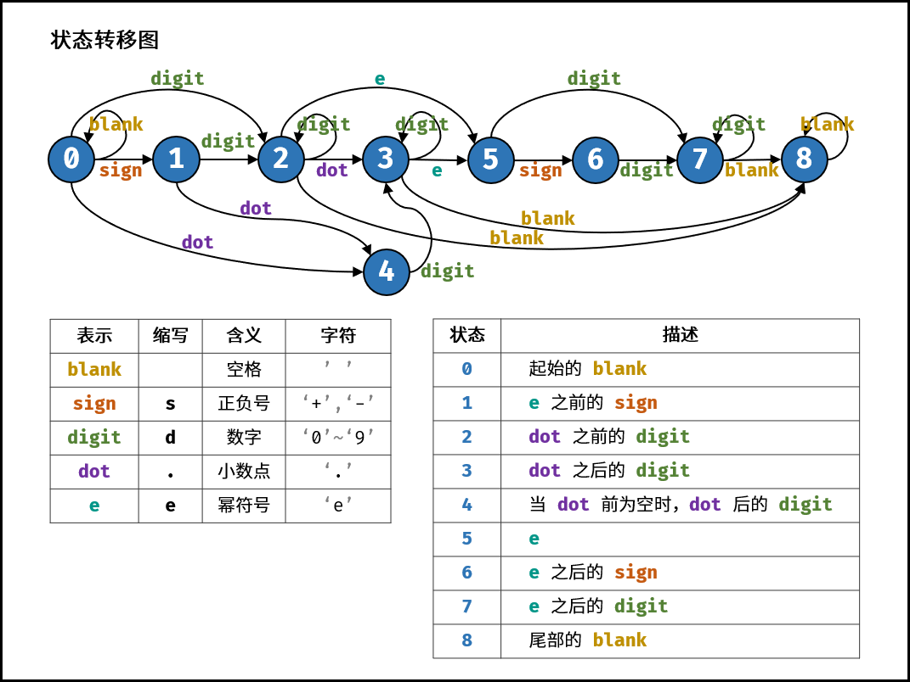

## 03 数组中重复的数字

找出数组中重复的数字。


在一个长度为 n 的数组 nums 里的所有数字都在 0～n-1 的范围内。数组中某些数字是重复的，但不知道有几个数字重复了，也不知道每个数字重复了几次。请找出数组中任意一个重复的数字。

**示例 1：**

```
输入：
[2, 3, 1, 0, 2, 5, 3]
输出：2 或 3 
```

**解法一：可以修改原数组**

也称鸽巢原理

```java
class Solution {
    public int findRepeatNumber(int[] nums) {
        // 省略边界处理
        for (int i = 0; i < nums.length; i++) {
            while (nums[i] != i) {
                if (nums[i] == nums[nums[i]]) return nums[i];
                int tmp = nums[i];
                nums[i] = nums[tmp];
                nums[tmp] = tmp;
            }
        }
        return -1;
    }
}
```

时间O(n)，空间O(n)

**解法二：不可以修改原数组**

使用二分，但不能通过，因为题目有微小的区别，原题是大小为n的数组，有n-1的范围，而该题是n的范围。

遇到[0, 1, 2, 0, 4, 5, 6, 7, 8, 9]有5个数小于等于4，5个数大于4，导致二分出错。

```java
class Solution {
    public int findRepeatNumber(int[] nums) {
        int left = 0, right = nums.length - 1;
        while (left <= right) {
            int mid = left + (right - left) / 2;
            int count = countRange(nums, left, mid);
            if (left == right) {
                if (count > 1) return left;
            }
            if (count > mid - left + 1)
                right = mid;
            else left = mid + 1;
        }
        return -1;
    }

    private int countRange(int[] nums, int start, int end) {
        int res = 0;
        for (int i = 0; i < nums.length; i++) {
            if (nums[i] >= start && nums[i] <= end)
                res++;
        }
        return res;
    }
}
```

时间O(nlogn)，空间O(1)

## 04 二维数组中的查找

在一个 n * m 的二维数组中，每一行都按照从左到右递增的顺序排序，每一列都按照从上到下递增的顺序排序。请完成一个函数，输入这样的一个二维数组和一个整数，判断数组中是否含有该整数。

**示例:**

现有矩阵 matrix 如下：

```
[
  [1,   4,  7, 11, 15],
  [2,   5,  8, 12, 19],
  [3,   6,  9, 16, 22],
  [10, 13, 14, 17, 24],
  [18, 21, 23, 26, 30]
]
```


给定 target = 5，返回 true。

给定 target = 20，返回 false。

**限制：**

- 0 <= n <= 1000

- 0 <= m <= 1000


 **解法：**

不断切掉最右边的列和最上边的行，如果剩余矩阵的右上角为target，返回true，否则返回false

```java
class Solution {
    public boolean findNumberIn2DArray(int[][] matrix, int target) {
        if (matrix.length == 0 || matrix[0].length == 0)
            return false;
        int i = 0, j = matrix[0].length - 1;
        while (j >= 0 && i < matrix.length) {
            if (matrix[i][j] > target) j--;
            else if (matrix[i][j] < target) i++;
            else if (matrix[i][j] == target) return true;
        }
        return false;
    }
}
```

## 05  替换空格

请实现一个函数，把字符串 s 中的每个空格替换成"%20"。

**示例 1：**

```
输入：s = "We are happy."
输出："We%20are%20happy."
```

**限制：**

- 0 <= s 的长度 <= 10000


**解法：**

先遍历一遍，求出有几个字符，算出要扩容的量，再从后往前填写，但参数是String类型就不可能原地解决

快乐就完事了

```java
class Solution {
    public String replaceSpace(String s) {
        return s.replace(" ", "%20");
    }
}
```

## 06 从尾到头打印链表

输入一个链表的头节点，从尾到头反过来返回每个节点的值（用数组返回）。

**示例 1：**

```
输入：head = [1,3,2]
输出：[2,3,1]
```

**限制：**

- 0 <= 链表长度 <= 10000


**解法一：先反转单链表后输出**

```java
class Solution {
    public int[] reversePrint(ListNode head) {
        ListNode node = reverse(head);
        ListNode tmp = node;
        int len = 0, idx = 0;
        while (tmp != null) {
            len++;
            tmp = tmp.next;
        }
        int[] res = new int[len];
        while (node != null) {
            res[idx++] = node.val;
            node = node.next;
        }
        return res;
    }

    private ListNode reverse(ListNode node) {
        if (node == null || node.next == null) return node;
        ListNode newHead = reverse(node.next);
        ListNode tmp = node.next;
        tmp.next = node;
        node.next = null;
        return newHead;
    }
}
```

**解法二：不修改原链表的情况下打印**

```java
class Solution {
    public int[] reversePrint(ListNode head) {
        Deque<Integer> stack = new LinkedList<>();
        while (head != null) {
            stack.push(head.val);
            head = head.next;
        }
        int[] res = new int[stack.size()];
        int idx = 0;
        while (!stack.isEmpty()) {
            res[idx++] = stack.pop();
        }
        return res;
    }
}
```

**解法三：在直接输出的情况下可用**

直接使用递归栈

```java
public static void reversePrint(ListNode node) {
    if (node == null) return;
    reversePrint(node.next);
    System.out.println(node.val);
}
```

## 07 重建二叉树

输入某二叉树的前序遍历和中序遍历的结果，请重建该二叉树。假设输入的前序遍历和中序遍历的结果中都不含重复的数字。

例如，给出

```
前序遍历 preorder = [3,9,20,15,7]
中序遍历 inorder = [9,3,15,20,7]
```

返回如下的二叉树：

```
	3
   / \
  9  20
    /  \
   15   7
```

**限制：**

- 0 <= 节点个数 <= 5000


**解法：**

也可以把中序遍历的数组按<值，下标>存成map，可以减少在中序中找节点的开销。

```java
class Solution {
    int[] preorder;
    int[] inorder;

    public TreeNode buildTree(int[] preorder, int[] inorder) {
        this.preorder = preorder;
        this.inorder = inorder;
        return recursion(0, preorder.length, 0, inorder.length);
    }

    // 参数：前序的范围和中序的范围(前闭后开)
    private TreeNode recursion(int preLeft,int preRight,int inLeft,int inRight){
        if (preLeft == preRight || inLeft == inRight) return null;
        int val = preorder[preLeft];    // 根节点
        int posi = -1;  // 中序的根节点位置
        for (int i = inLeft; i < inRight; i++) {
            if (inorder[i] == val) {
                posi = i;
                break;
            }
        }
        int leftLen = posi - inLeft;    // 左子树大小
        int rightLen = inRight - posi - 1;  // 右子树大小
        TreeNode node = new TreeNode(val);  // 返回的结点
        node.left = recursion(preLeft + 1, 
                preLeft + leftLen + 1, inLeft, posi);
        node.right = recursion(preLeft + leftLen + 1, 
                preLeft + 1 + leftLen + rightLen, posi + 1, inRight);
        return node;
    }
}
```

## 09 用两个栈实现队列

用两个栈实现一个队列。队列的声明如下，请实现它的两个函数 appendTail 和 deleteHead ，分别完成在队列尾部插入整数和在队列头部删除整数的功能。(若队列中没有元素，deleteHead 操作返回 -1 )

**示例 1：**

```
输入：
["CQueue","appendTail","deleteHead","deleteHead"]
[[],[3],[],[]]
输出：[null,null,3,-1]
```

**示例 2：**

```
输入：
["CQueue","deleteHead","appendTail","appendTail","deleteHead","deleteHead"]
[[],[],[5],[2],[],[]]
输出：[null,-1,null,null,5,2]
```

**提示：**

- 1 <= values <= 10000
- 最多会对 appendTail、deleteHead 进行 10000 次调用

**解法：**

```java
class CQueue {
    Deque<Integer> stack1;  // 用于入栈
    Deque<Integer> stack2;  // 用于出栈

    public CQueue() {
        stack1 = new LinkedList<>();
        stack2 = new LinkedList<>();
    }
    
    public void appendTail(int value) {
        stack1.push(value);
    }
    
    public int deleteHead() {
        if (!stack2.isEmpty()) return stack2.pop();
        while (!stack1.isEmpty()) {
            stack2.push(stack1.pop());
        }
        if (stack2.isEmpty()) return -1;
        return stack2.pop();
    }
}
```

## 10-I 斐波那契数列

写一个函数，输入 n ，求斐波那契（Fibonacci）数列的第 n 项。斐波那契数列的定义如下：

F(0) = 0,   F(1) = 1
F(N) = F(N - 1) + F(N - 2), 其中 N > 1.
斐波那契数列由 0 和 1 开始，之后的斐波那契数就是由之前的两数相加而得出。

答案需要取模 1e9+7（1000000007），如计算初始结果为：1000000008，请返回 1。

**示例 1：**

```
输入：n = 2
输出：1
```

**示例 2：**

```
输入：n = 5
输出：5
```

**提示：**

- 0 <= n <= 100


**解法：**

```java
class Solution {
    public int fib(int n) {
        if (n == 0) return 0;
        if (n == 1) return 1;
        int mod = 1000000007;
        // c是fib(n) a是fib(n-1) b是fib(n-2)
        int a = 1, b = 0, c = 0;
        for (int i = 2; i <= n; i++) {
            c = (a + b) % mod;
            b = a;
            a = c;
        }
        return c;
    }
}
```

## 10-II 青蛙跳台阶问题

一只青蛙一次可以跳上1级台阶，也可以跳上2级台阶。求该青蛙跳上一个 n 级的台阶总共有多少种跳法。

答案需要取模 1e9+7（1000000007），如计算初始结果为：1000000008，请返回 1。

**示例 1：**

```
输入：n = 2
输出：2
```

**示例 2：**

```
输入：n = 7
输出：21
```

**提示：**

- 0 <= n <= 100


**解法：**

```java
class Solution {
    public int numWays(int n) {
        if (n == 0) return 1;
        if (n == 1) return 1;
        int mod = 1000000007;
        // c是fib(n) a是fib(n-1) b是fib(n-2)
        int a = 1, b = 1, c = 0;
        for (int i = 2; i <= n; i++) {
            c = (a + b) % mod;
            b = a;
            a = c;
        }
        return c;
    }
}
```

## 11 旋转数组的最小数字

把一个数组最开始的若干个元素搬到数组的末尾，我们称之为数组的旋转。输入一个递增排序的数组的一个旋转，输出旋转数组的最小元素。例如，数组 [3,4,5,1,2] 为 [1,2,3,4,5] 的一个旋转，该数组的最小值为1。  

**示例 1：**

```
输入：[3,4,5,1,2]
输出：1
```

**示例 2：**

```
输入：[2,2,2,0,1]
输出：0
```

**书上的解法，看中间移两边：**

```java
class Solution {
    public int minArray(int[] numbers) {
        int left = 0, right = numbers.length - 1;
        while (numbers[left] >= numbers[right]) {
            if (left == right - 1) {
                return numbers[right];
            }
            int mid = left + (right - left) / 2;
            if (numbers[left]==numbers[right]&&numbers[left]==numbers[mid]) {
                return inorderSearch(numbers, left, right);
            }
            if (numbers[mid] >= numbers[left])
                left = mid;
            else if (numbers[mid] <= numbers[right])
                right = mid; 
        }
        return numbers[left];
    }

    private int inorderSearch(int[] numbers, int left, int right) {
        for (int i = left + 1; i <= right; i++) {
            if (numbers[i] < numbers[i - 1]) {
                return numbers[i];
            }
        }
        return numbers[left];
    }
}
```

**更简洁的实现，只比右边和中间：**

```java
class Solution {
    public int findMin(int[] nums) {
        int left = 0, right = nums.length - 1;
        if (nums[left] < nums[right]) return nums[0];
        while (left < right){
            int mid = left + (right - left) / 2;
            if (nums[mid] > nums[right]) left = mid + 1;
            else if (nums[mid] < nums[right]) right = mid;
            else right = right - 1;
        }
        return nums[left];
    }
}
```

## 12 矩阵中的路径

请设计一个函数，用来判断在一个矩阵中是否存在一条包含某字符串所有字符的路径。路径可以从矩阵中的任意一格开始，每一步可以在矩阵中向左、右、上、下移动一格。如果一条路径经过了矩阵的某一格，那么该路径不能再次进入该格子。例如，在下面的3×4的矩阵中包含一条字符串“bfce”的路径（路径中的字母用加粗标出）。

[["a","b","c","e"],
["s","f","c","s"],
["a","d","e","e"]]

但矩阵中不包含字符串“abfb”的路径，因为字符串的第一个字符b占据了矩阵中的第一行第二个格子之后，路径不能再次进入这个格子。

**示例 1：**

```
输入：board = [["A","B","C","E"],["S","F","C","S"],["A","D","E","E"]], word = "ABCCED"
输出：true
```

**示例 2：**

```
输入：board = [["a","b"],["c","d"]], word = "abcd"
输出：false
```

**提示：**

- 1 <= board.length <= 200
- 1 <= board[i].length <= 200

**解法：**

```java
class Solution {
    public boolean exist(char[][] board, String word) {
        if (board == null || board[0] == null || board.length == 0 || board[0].length == 0 || word == null || word.equals("")) {
            return false;
        }
        boolean[][] isVisited = new boolean[board.length][board[0].length];
        char[] chs = word.toCharArray();

        for (int i = 0; i < board.length; i++) {
            for (int j = 0; j < board[0].length; j++) {
                if (board[i][j] == chs[0]) {
                    if (bfs(board, i, j, isVisited, chs, 0)) return true;
                }
            }
        }
        return false;
    }

    private boolean bfs(char[][] board, int i, int j, boolean[][] isVisited, char[] chs, int index) {
        if (index == chs.length) {
            return true;
        }
        // 判断越界、是否和字符是否相等
        if (i < 0 || j < 0 || i == board.length || j == board[0].length || isVisited[i][j] || board[i][j] != chs[index]) {
            return false;
        }
        isVisited[i][j] = true;
        boolean res = bfs(board, i + 1, j, isVisited, chs, index + 1)
                || bfs(board, i - 1, j, isVisited, chs, index + 1)
                || bfs(board, i, j + 1, isVisited, chs, index + 1)
                || bfs(board, i, j - 1, isVisited, chs, index + 1);
        isVisited[i][j] = false;
        return res;
    }
}
```

## 13 机器人的运动范围

地上有一个m行n列的方格，从坐标 [0,0] 到坐标 [m-1,n-1] 。一个机器人从坐标 [0, 0] 的格子开始移动，它每次可以向左、右、上、下移动一格（不能移动到方格外），也不能进入行坐标和列坐标的数位之和大于k的格子。例如，当k为18时，机器人能够进入方格 [35, 37] ，因为3+5+3+7=18。但它不能进入方格 [35, 38]，因为3+5+3+8=19。请问该机器人能够到达多少个格子？

**示例 1：**

```
输入：m = 2, n = 3, k = 1
输出：3
```

**示例 2：**

```
输入：m = 3, n = 1, k = 0
输出：1
```

**提示：**

- 1 <= n,m <= 100
- 0 <= k <= 20

**解法：**

```java
class Solution {
    boolean[][] visited;

    public int movingCount(int m, int n, int k) {
        this.visited = new boolean[m][n];
        return backTrace(m, n, k, 0, 0);
    }

    // 行数 列数 k值 行下标 列下标
    private int backTrace(int m, int n, int k, int i, int j) {
        int count = 0;
        if (i<0||i>=m||j<0||j>=n||visited[i][j]||check(i,j)>k)
            return 0;
        visited[i][j] = true;
        count += 1 + backTrace(m, n, k, i + 1, j)
                + backTrace(m, n, k, i - 1, j)
                + backTrace(m, n, k, i, j + 1)
                + backTrace(m, n, k, i, j - 1);
        return count;
    }

    // 数位和
    private int check(int i, int j) {
        int sum = 0;
        while (i > 0) {
            sum += i % 10;
            i /= 10;
        }
        while (j > 0) {
            sum += j % 10;
            j /= 10;
        }
        return sum;
    }
}
```

## 14-I 剪绳子 DP

给你一根长度为 n 的绳子，请把绳子剪成整数长度的 m 段（m、n都是整数，n>1并且m>1），每段绳子的长度记为 k[0],k[1]...k[m-1] 。请问 `k[0]*k[1]*...*k[m-1] `可能的最大乘积是多少？例如，当绳子的长度是8时，我们把它剪成长度分别为2、3、3的三段，此时得到的最大乘积是18。

**示例 1：**

```
输入: 2
输出: 1
解释: 2 = 1 + 1, 1 × 1 = 1
```

**示例 2:**

```
输入: 10
输出: 36
解释: 10 = 3 + 3 + 4, 3 × 3 × 4 = 36
```

**提示：**

- 2 <= n <= 58

**解法：**

状态：i >= 4时：dp[i] = 长度为 i 的绳子的最大乘积；i < 4 时 dp[i] = i

转移：dp[i] = max(dp[i - x] * dp[x])

base case: i < 4 时 dp[i] = i。dp[0]舍弃。因为当n < 4时，剪过的乘积小于本身的长度，而题目要求至少剪一刀

```java
class Solution {
    public int cuttingRope(int n) {
        if (n == 2) return 1;
        if (n == 3) return 2;
        int[] dp = new int[n + 1];
        dp[1] = 1;
        dp[2] = 2;
        dp[3] = 3;
        for (int i = 4; i < dp.length; i++) {
            int left = 1, right = i - 1;
            dp[i] = 0;
            while (left <= right) {
                dp[i] = Math.max(dp[i], dp[left++] * dp[right--]);
            }
        }
        return dp[n];
    }
}
```

## 14-II 剪绳子 贪心

给你一根长度为 n 的绳子，请把绳子剪成整数长度的 m 段（m、n都是整数，n>1并且m>1），每段绳子的长度记为 k[0],k[1]...k[m-1] 。请问 `k[0]*k[1]*...*k[m-1] `可能的最大乘积是多少？例如，当绳子的长度是8时，我们把它剪成长度分别为2、3、3的三段，此时得到的最大乘积是18。

**示例 1：**

```
输入: 2
输出: 1
解释: 2 = 1 + 1, 1 × 1 = 1
```

**示例 2:**

```
输入: 10
输出: 36
解释: 10 = 3 + 3 + 4, 3 × 3 × 4 = 36
```

**提示：**

- 2 <= n <= 1000

**解法：**

找规律得：

```java
n     乘积     子数字
2       1       1 1
3       2       1 2
4       4       2 2
5       6       2 3
6       9       3 3
7       12      2 2 3
8       18      2 3 3
9       27      3 3 3
10      36      2 2 3 3
11      54      2 3 3 3
12      81      3 3 3 3
13      108     2 2 3 3 3
14      162     2 3 3 3 3
15      243     3 3 3 3 3
16      324     2 2 3 3 3 3
17      486     2 3 3 3 3 3
18      729     3 3 3 3 3 3
19      972     2 2 3 3 3 3 3
20      1458    2 3 3 3 3 3 3
21      2187    3 3 3 3 3 3 3
22      2916    2 2 3 3 3 3 3 3
23      4374    2 3 3 3 3 3 3 3
24      6561    3 3 3 3 3 3 3 3
25      8748    2 2 3 3 3 3 3 3 3
26      13122   2 3 3 3 3 3 3 3 3
27      19683   3 3 3 3 3 3 3 3 3
28      26244   2 2 3 3 3 3 3 3 3 3
29      39366   2 3 3 3 3 3 3 3 3 3
```

也就是5以上的数字需要分出尽可能多的3

```java
class Solution {
    public int cuttingRope(int n) {
        if (n == 2) return 1;
        if (n == 3) return 2;
        int mod = 1000000007;
        long res = 1;	// 注意这里一定是long，10亿*3>21亿
        while (n > 4) {
            res *= 3;
            res %= mod;
            n -= 3;
        }
        return (int)(res * n % mod);
    }
}
```

## 15 二进制中1的个数

请实现一个函数，输入一个整数，输出该数二进制表示中 1 的个数。例如，把 9 表示成二进制是 1001，有 2 位是 1。因此，如果输入 9，则该函数输出 2。

**示例 1：**

```
输入：00000000000000000000000000001011
输出：3
解释：输入的二进制串 00000000000000000000000000001011 中，共有三位为 '1'。
```

**示例 2：**

```
输入：00000000000000000000000010000000
输出：1
解释：输入的二进制串 00000000000000000000000010000000 中，共有一位为 '1'。
```

**示例 3：**

```
输入：11111111111111111111111111111101
输出：31
解释：输入的二进制串 11111111111111111111111111111101 中，共有 31 位为 '1'。
```

**解法一：**

```java
public class Solution {
    // you need to treat n as an unsigned value
    public int hammingWeight(int n) {
        int res = 0;
        while(n != 0) {
            res+=n&1;
            n=n>>>1;    // 注意>>>是无符号位移
            // >> 是有符号位移，负数右移会在左边填1，造成死循环
        }
        return res;
    }
}
```

**解法二**

```java
public class Solution {
    public int hammingWeight(int n) {
        int count = 0;
        while (n != 0) {
            count++;
            n = (n - 1) & n;	// 把最末尾的一个1变为0
        }
        return count;
    }
}
```

**JDK中的解法：**

```java
public class Solution {
    public int hammingWeight(int n) {
        return Integer.bitCount(n);
    }
}
```

源码：

```java
public static int bitCount(int i) {
    // HD, Figure 5-2
    i = i - ((i >>> 1) & 0x55555555);
    i = (i & 0x33333333) + ((i >>> 2) & 0x33333333);
    i = (i + (i >>> 4)) & 0x0f0f0f0f;
    i = i + (i >>> 8);
    i = i + (i >>> 16);
    return i & 0x3f;
}
```

## 16 数值的整数次方

实现函数double Power(double base, int exponent)，求base的exponent次方。不得使用库函数，同时不需要考虑大数问题。

**示例 1:**

```
输入: 2.00000, 10
输出: 1024.00000
```

**示例 2:**

```
输入: 2.10000, 3
输出: 9.26100
```

**示例 3:**

```
输入: 2.00000, -2
输出: 0.25000
解释: 2-2 = 1/22 = 1/4 = 0.25
```


说明:

- -100.0 < x < 100.0
- n 是 32 位有符号整数，其数值范围是 [−231, 231 − 1] 。

**解法**

在书中，次方数是非负数，而本题中不是，所以不能使用位运算

当 n 为奇数时 $a^n = a^{n/2} * a^{n/2} * a$，

当 n 为偶数时 $a^n = a^{n/2} * a^{n/2}$

```java
class Solution {
    public double myPow(double x, int n) {
        if (n == 0) return 1;
        if (n == 1) return x;
        if (n == -1) return 1 / x;
        double a = myPow(x, n / 2);
        double mod = myPow(x, n % 2);
        return a * a * mod;
    }
}
```

快速幂的迭代做法：

```java
class Solution {
    double quickMul(double x, long N) {
        double ans = 1.0;
        // 贡献的初始值为 x
        double x_contribute = x;
        // 在对 N 进行二进制拆分的同时计算答案
        while (N > 0) {
            if (N % 2 == 1) {
                // 如果 N 二进制表示的最低位为 1，那么需要计入贡献
                ans *= x_contribute;
            }
            // 将贡献不断地平方
            x_contribute *= x_contribute;
            // 舍弃 N 二进制表示的最低位，这样我们每次只要判断最低位即可
            N /= 2;
        }
        return ans;
    }

    public double myPow(double x, int n) {
        long N = n;
        return N >= 0 ? quickMul(x, N) : 1.0 / quickMul(x, -N);
    }
}
```

## 17 打印从1到最大的n位数

输入数字 n，按顺序打印出从 1 到最大的 n 位十进制数。比如输入 3，则打印出 1、2、3 一直到最大的 3 位数 999。

**示例 1:**

```
输入: n = 1
输出: [1,2,3,4,5,6,7,8,9]
```

**说明：**

- 用返回一个整数列表来代替打印
- n 为正整数

**解法：**

因为题目中返回的是int数组，所以n肯定不会大于10

```java
class Solution {
    public int[] printNumbers(int n) {
        int rightRange = (int)Math.pow(10, n);
        int[] res = new int[rightRange - 1];
        for (int i = 1; i < rightRange; i++) {
            res[i - 1] = i;
        }
        return res;
    }
}
```

但实际上，n可能会大于10甚至更大，所以用字符串解决才是正确的方法，用字符串模拟加一

更好的方法是把它看作是一个全排列问题，每一位都可以是 0 ~ 9 中的任意数字，排列 n 位，用回溯法，最前面的0不输出。

## 18 删除链表的结点

给定单向链表的头指针和一个要删除的节点的值，定义一个函数删除该节点。

返回删除后的链表的头节点。

**注意：**此题对比原题有改动

**示例 1:**

```
输入: head = [4,5,1,9], val = 5
输出: [4,1,9]
解释: 给定你链表中值为 5 的第二个节点，那么在调用了你的函数之后，该链表应变为 4 -> 1 -> 9.
```

**示例 2:**

```
输入: head = [4,5,1,9], val = 1
输出: [4,5,9]
解释: 给定你链表中值为 1 的第三个节点，那么在调用了你的函数之后，该链表应变为 4 -> 5 -> 9.
```

**说明：**

- 题目保证链表中节点的值互不相同
- 若使用 C 或 C++ 语言，你不需要 free 或 delete 被删除的节点

**解法：**

```java
class Solution {
    public ListNode deleteNode(ListNode head, int val) {
        if (head.val == val) return head.next;
        ListNode node = head;
        while (node.next.val != val) node = node.next;
        node.next = node.next.next;
        return head;
    }
}
```

书上的题目的第二个参数是要删除的结点的引用。所以可以分为三种情况：

- 只有一个结点。即head就是被删除的结点，返回null
- 删除的是末尾结点，按照上面的代码删除
- 其他情况可以把`要删除的结点`的`下一个结点的值`复制到`要删除的结点`，再删除下一个结点。O(1)

## 19 正则表达式匹配

请实现一个函数用来匹配包含'. '和'*'的正则表达式。模式中的字符'.'表示任意一个字符，而'*'表示它前面的字符可以出现任意次（含0次）。在本题中，匹配是指字符串的所有字符匹配整个模式。例如，字符串"aaa"与模式"a.a"和"ab*ac*a"匹配，但与"aa.a"和"ab*a"均不匹配。

**示例 1:**

```
输入:
s = "aa"
p = "a"
输出: false
解释: "a" 无法匹配 "aa" 整个字符串。
```

**示例 5:**

```
输入:
s = "mississippi"
p = "mis*is*p*."
输出: false
```

**说明：**

- s 可能为空，且只包含从 a-z 的小写字母。
- p 可能为空，且只包含从 a-z 的小写字母以及字符 `.` 和` *`，无连续的 `*`。

**解法：**

```java
class Solution {
    String s;
    String p;

    public boolean isMatch(String s, String p) {
        this.s = s;
        this.p = p;
        return match(0, 0);
    }

    public boolean match(int i, int j) {
        if (j == p.length()) return i == s.length();
        // 判断自身是否匹配
        boolean selfMatch = (i < s.length() && (p.charAt(j) == '.' || s.charAt(i) == p.charAt(j)));
        // 有*时的匹配
        if (j + 1 < p.length() && p.charAt(j + 1) == '*') {
            return (selfMatch && match(i + 1, j)) || match(i, j + 2);
        }
        // 普通匹配
        return selfMatch && match(i + 1, j + 1);
    }
}
```

可以记忆化递归，可以改为dp

## 20 表示数值的字符串

请实现一个函数用来判断字符串是否表示数值（包括整数和小数）。例如，字符串"+100"、"5e2"、"-123"、"3.1416"、"0123"都表示数值，但"12e"、"1a3.14"、"1.2.3"、"+-5"、"-1E-16"及"12e+5.4"都不是。

**解法：**

使用DFA，图和代码不对应，图是题解中画的很好的一个DFA，2、3、7、8是终态。



```java
class Solution {
    public boolean isNumber(String s) {
        s = s.trim();
        if (s.length() == 0) return false;
        if (s.charAt(0) == '+' || s.charAt(0) == '-')
            s = s.substring(1);
        DFA dfa = new DFA();
        for (int i = 0; i < s.length(); i++) {
            dfa.trans(s.charAt(i));
        }
        return dfa.accept();
    }
}

class DFA {
    int state = 0;

    void trans(char c) {
        if (state == 0) {
            if (c >= '0' && c <= '9') state = 2;
            else if (c == '.') state = 3;
            else state = -1;
        }  else if (state == 2) {
            if (c >= '0' && c <= '9') state = 2;
            else if (c == '.') state = 4;
            else if (c == 'e' || c == 'E') state = 5;
            else state = -1;
        } else if (state == 3 && c >= '0' && c <= '9') {
            state = 4;
        } else if (state == 4) {
            if (c >= '0' && c <= '9') state = 4;
            else if (c == 'e' || c == 'E') state = 5;
            else state = -1;
        } else if (state == 5) {
            if (c >= '0' && c <= '9') state = 6;
            else if (c == '+' || c == '-') state = 1;
            else state = -1;
        } else if (state == 1 && c >= '0' && c <= '9') {
            state = 6;
        } else if (state == 6 && c >= '0' && c <= '9') {
            state = 6;
        } else state = -1;
    }

    boolean accept() {
        return state == 2 || state == 4 || state == 6;
    }
}
```

## 21 调整数组顺序使奇数位于偶数前面

输入一个整数数组，实现一个函数来调整该数组中数字的顺序，使得所有奇数位于数组的前半部分，所有偶数位于数组的后半部分。

**示例：**

```
输入：nums = [1,2,3,4]
输出：[1,3,2,4] 
注：[3,1,2,4] 也是正确的答案之一。
```

**提示：**

- 1 <= nums.length <= 50000
- 1 <= nums[i] <= 10000

**解法：**

双指针技巧

```java
class Solution {
    public int[] exchange(int[] nums) {
        int left = 0, right = nums.length - 1;
        while (left < right) {
            while (nums[left] % 2 == 1 && left < right) left++;
            while (nums[right] % 2 == 0 && left < right) right--;
            if (left < right) {
                int tmp = nums[left];
                nums[left] = nums[right];
                nums[right] = tmp;
            }
        }
        return nums;
    }
}
```

## 22 链表中倒数第k个结点

输入一个链表，输出该链表中倒数第k个节点。为了符合大多数人的习惯，本题从1开始计数，即链表的尾节点是倒数第1个节点。例如，一个链表有6个节点，从头节点开始，它们的值依次是1、2、3、4、5、6。这个链表的倒数第3个节点是值为4的节点。

**示例：**

```
给定一个链表: 1->2->3->4->5, 和 k = 2.

返回链表 4->5.
```

**解法：**

让快指针先走k - 1步，快指针到达尾节点时，满指针即为所求。

注意鲁棒性，k < 1，head == null，链表少于 k 个结点

```java
class Solution {
    public ListNode getKthFromEnd(ListNode head, int k) {
        if (k < 1) return head;
        if (head == null) return head;
        ListNode fast = head, slow = head;
        for (int i = 1; i < k; i ++) {
            if (fast.next != null) fast = fast.next;
            else return head; 
        }
        while (fast.next != null) {
            fast = fast.next;
            slow = slow.next;
        }
        return slow;
    }
}
```

## 23 链表中环的入口结点

由于leetcode的剑指offer部分没有这道题，我们使用leetcode142环形链表II代替。

**解法：**

```java
public class Solution {
    private ListNode getIntersection(ListNode head) {
        ListNode fast = head;
        ListNode slow = head;
        while (fast != null && fast.next != null) {
            fast = fast.next.next;
            slow = slow.next;
            if (fast == slow) return slow;
        }
        return null;
    }

    public ListNode detectCycle(ListNode head) {
        if (head == null) return null;
        ListNode intersect = getIntersection(head);
        if (intersect == null) return null;
        while (head != intersect) {
            head = head.next;
            intersect = intersect.next;
        }
        return intersect;
    }
}
```

## 24 反转链表

定义一个函数，输入一个链表的头节点，反转该链表并输出反转后链表的头节点。

**示例:**

```
输入: 1->2->3->4->5->NULL
输出: 5->4->3->2->1->NULL
```

**限制：**

- 0 <= 节点个数 <= 5000


**解法：**

递归

```java
class Solution {
    public ListNode reverseList(ListNode head) {
        if (head == null || head.next == null) return head;
        ListNode newHead = reverseList(head.next);
        head.next.next = head;
        head.next = null;
        return newHead;
    }
}
```

迭代

```java
class Solution {
    public ListNode reverseList(ListNode head) {
        ListNode pre = null;    // 当前结点的前一个
        ListNode cur = head;    // 当前结点
        while(cur != null) {
            ListNode tmp = cur.next;
            cur.next = pre;
            pre = cur;  // 顺序
            cur = tmp;  // 不能错
        }
        return pre;
    }
}
```

## 25 合并两个排序的链表

输入两个递增排序的链表，合并这两个链表并使新链表中的节点仍然是递增排序的。

**示例1：**

```
输入：1->2->4, 1->3->4
输出：1->1->2->3->4->4
```

**限制：**

- 0 <= 链表长度 <= 1000


**解法：**

使用递归看起来更简洁

```java
class Solution {
    public ListNode mergeTwoLists(ListNode l1, ListNode l2) {
        if (l1 == null) return l2;
        if (l2 == null) return l1;
        ListNode newHead;
        if (l1.val <= l2.val) {
            newHead = l1;
            newHead.next = mergeTwoLists(l1.next, l2);
        } else {
            newHead = l2;
            newHead.next = mergeTwoLists(l1, l2.next);
        }
        return newHead;
    }
}
```

## 26 树的子结构

输入两棵二叉树A和B，判断B是不是A的子结构。(约定空树不是任意一个树的子结构)

B是A的子结构， 即 A中有出现和B相同的结构和节点值。

**例如:**

```
给定的树 A:
 	 3
 	/ \
   4   5
  / \
 1   2
 
给定的树 B：
   4 
  /
 1
返回 true，因为 B 与 A 的一个子树拥有相同的结构和节点值。
```

**解法：**

```java
class Solution {
    public boolean isSubStructure(TreeNode A, TreeNode B) {
        if (A == null || B == null) return false;
        boolean res = false;
        if (A.val == B.val) res = doesTreeAHasTreeB(A, B);
        if (res == false) res = isSubStructure(A.left, B);
        if (res == false) res = isSubStructure(A.right, B);
        return res;
    }

    public boolean doesTreeAHasTreeB(TreeNode A, TreeNode B) {
        if (B == null || A == null) return false;
        boolean match = (B.val == A.val);
        if (B.left == null && B.right == null) return match;
        if (B.left != null) match &= doesTreeAHasTreeB(A.left, B.left);
        if (B.right!=null) match &= doesTreeAHasTreeB(A.right, B.right);
        return match;
    }
}
```

## 27 二叉树的镜像

请完成一个函数，输入一个二叉树，该函数输出它的镜像。例如

```
输入：
	 4
   /   \
  2     7
 / \   / \
1   3 6   9
镜像输出：
     4
   /   \
  7     2
 / \   / \
9   6 3   1
```

**示例 1：**

```
输入：root = [4,2,7,1,3,6,9]
输出：[4,7,2,9,6,3,1]
```

**限制：**

- 0 <= 节点个数 <= 1000


**解法：**

```java
class Solution {
    public TreeNode mirrorTree(TreeNode root) {
        recursion(root);
        return root;    
    }

    private void recursion(TreeNode root) {
        if (root == null) return;
        TreeNode tmp = root.left;
        root.left = root.right;
        root.right = tmp;
        recursion(root.left);
        recursion(root.right);
    }
}
```

## 28 对称的二叉树

请实现一个函数，用来判断一棵二叉树是不是对称的。如果一棵二叉树和它的镜像一样，那么它是对称的。

```
例如，二叉树 [1,2,2,3,4,4,3] 是对称的。

	1
   / \
  2   2
 / \ / \
3  4 4  3
但是下面这个 [1,2,2,null,3,null,3] 则不是镜像对称的:

	1
   / \
  2   2
   \   \
   3    3
```

**解法：**

对称的二叉树先左后右的前序和先右后左的前序相同

```java
class Solution {
    public boolean isSymmetric(TreeNode root) {
        return recursion(root, root);
    }

    private boolean recursion(TreeNode n1, TreeNode n2) {
        if (n1 == null && n2 == null) return true;
        if (n1 == null || n2 == null) return false;
        if (n1.val != n2.val) return false;
        return recursion(n1.left, n2.right) && recursion(n1.right, n2.left);
    }
}
```

## 29 顺时针打印矩阵

输入一个矩阵，按照从外向里以顺时针的顺序依次打印出每一个数字。

**示例 1：**

```
输入：matrix = [[1,2,3],[4,5,6],[7,8,9]]
输出：[1,2,3,6,9,8,7,4,5]
```

**示例 2：**

```
输入：matrix = [[1,2,3,4],[5,6,7,8],[9,10,11,12]]
输出：[1,2,3,4,8,12,11,10,9,5,6,7]
```

**限制：**

- 0 <= matrix.length <= 100
- 0 <= matrix[i].length <= 100

**解法：**

```java
class Solution {
    int[] res;
    int idx;

    public int[] spiralOrder(int[][] matrix) {
        if (matrix.length == 0 || matrix[0].length == 0)
            return new int[0];
        res = new int[matrix.length * matrix[0].length];
        idx = 0;
        int start = 0;
        // 一圈一圈向里输出，每次输出一圈
        while (start * 2 < matrix.length && start * 2 < matrix[0].length) {
            printCircle(matrix, start); // 输出一圈
            start++;
        }
        return res;
    }

    private void printCircle(int[][] matrix, int start) {
        int endX = matrix[0].length - start - 1;
        int endY = matrix.length - start - 1;
        for (int i = start; i <= endX; i++)
            res[idx++] = matrix[start][i];
        if (start < endY)   // 多于一行时向下
            for (int i = start + 1; i <= endY; i++)
                res[idx++] = matrix[i][endX];
        if (start < endX && start < endY)  // 多于一行且多于一列向左      
            for (int i = endX - 1; i >= start; i--)
                res[idx++] = matrix[endY][i];
        if (start < endX && start < endY - 1)   // 多于两行且多于一列向上
            for (int i = endY - 1; i > start; i--)
                res[idx++] = matrix[i][start];
    }
}
```

## 30 包含min函数的栈

定义栈的数据结构，请在该类型中实现一个能够得到栈的最小元素的 min 函数在该栈中，调用 min、push 及 pop 的时间复杂度都是 O(1)。

**示例:**

```
MinStack minStack = new MinStack();
minStack.push(-2);
minStack.push(0);
minStack.push(-3);
minStack.min();   --> 返回 -3.
minStack.pop();
minStack.top();      --> 返回 0.
minStack.min();   --> 返回 -2.
```

**提示：**

- 各函数的调用总次数不超过 20000 次


**解法：**

使用一个辅助栈记录每个状态的最小值

```java
class MinStack {

    Deque<Integer> stack;
    Deque<Integer> minStack;    // 保存栈每一个状态的最小值

    public MinStack() {
        stack = new LinkedList<>();
        minStack = new LinkedList<>();
    }
    
    public void push(int x) {
        stack.push(x);
        if (!minStack.isEmpty() && x > minStack.peek()) 
            minStack.push(minStack.peek());
        else minStack.push(x);
    }
    
    public void pop() {
        stack.pop();
        minStack.pop();
    }
    
    public int top() {
        return stack.peek();
    }
    
    public int min() {
        return minStack.peek();
    }
}
```

## 31 栈的压入弹出序列

输入两个整数序列，第一个序列表示栈的压入顺序，请判断第二个序列是否为该栈的弹出顺序。假设压入栈的所有数字均不相等。例如，序列 {1,2,3,4,5} 是某栈的压栈序列，序列 {4,5,3,2,1} 是该压栈序列对应的一个弹出序列，但 {4,3,5,1,2} 就不可能是该压栈序列的弹出序列。

**示例 1：**

```
输入：pushed = [1,2,3,4,5], popped = [4,5,3,2,1]
输出：true
解释：我们可以按以下顺序执行：
push(1), push(2), push(3), push(4), pop() -> 4,
push(5), pop() -> 5, pop() -> 3, pop() -> 2, pop() -> 1
```

**示例 2：**

```
输入：pushed = [1,2,3,4,5], popped = [4,3,5,1,2]
输出：false
解释：1 不能在 2 之前弹出。
```

**提示：**

- 0 <= pushed.length == popped.length <= 1000
- 0 <= pushed[i], popped[i] < 1000
- pushed 是 popped 的排列。

**解法：**

使用一个栈，如果`pushed[i] != poped[j]`就不断入栈，反之就不断出栈，最后栈空就表示poped是正确的序列

```java
class Solution {
    public boolean validateStackSequences(int[] pushed, int[] popped) {
        Deque<Integer> stack = new LinkedList<>();
        int idx = 0;
        for (int i = 0; i < pushed.length; i++) {
            if (stack.isEmpty() || stack.peek() != popped[idx]) {
                stack.push(pushed[i]);
            }
            while (!stack.isEmpty() && stack.peek() == popped[idx]) {
                stack.pop();
                idx++;
            }
        }
        return stack.isEmpty();
    }
}
```

## 32-I 从上到下打印二叉树

从上到下打印出二叉树的每个节点，同一层的节点按照从左到右的顺序打印。

**例如:**

```
给定二叉树: [3,9,20,null,null,15,7],

	3
   / \
  9  20
    /  \
   15   7
返回：

[3,9,20,15,7]
```

**提示：**

- 节点总数 <= 1000


**解法：**

```java
class Solution {
    public int[] levelOrder(TreeNode root) {
        Queue<TreeNode> queue = new LinkedList<>();
        if (root == null) return new int[0];
        ArrayList<Integer> list = new ArrayList<>();
        queue.offer(root);
        while(!queue.isEmpty()) {
            TreeNode node = queue.poll();
            if (node.left != null) queue.offer(node.left);
            if (node.right != null) queue.offer(node.right);
            list.add(node.val);
        }
        int[] res = new int[list.size()];
        for (int i = 0; i < list.size(); i++) res[i] = list.get(i);
        return res;
    }
}
```

## 32-II 从上到下打印二叉树II

从上到下按层打印二叉树，同一层的节点按从左到右的顺序打印，每一层打印到一行。

**例如:**

```
给定二叉树: [3,9,20,null,null,15,7],

    3
   / \
  9  20
    /  \
   15   7
返回其层次遍历结果：

[
  [3],
  [9,20],
  [15,7]
]
```

**提示：**

- 节点总数 <= 1000


**解法：**

```java
/**
 * Definition for a binary tree node.
 * public class TreeNode {
 *     int val;
 *     TreeNode left;
 *     TreeNode right;
 *     TreeNode(int x) { val = x; }
 * }
 */
class Solution {
    public List<List<Integer>> levelOrder(TreeNode root) {
        List<List<Integer>> res = new LinkedList<>();
        if (root == null) return res;
        Queue<TreeNode> queue = new LinkedList();
        queue.offer(root);
        while (!queue.isEmpty()) {
            int size = queue.size();
            List<Integer> list = new LinkedList<>();
            for (int i = 0; i < size; i++) {
                TreeNode node = queue.poll();
                if (node.left != null) queue.offer(node.left);
                if (node.right != null) queue.offer(node.right);
                list.add(node.val);
            }
            res.add(list);
        }
        return res;
    }
}
```

## 32-III 从上到下打印二叉树III

请实现一个函数按照之字形顺序打印二叉树，即第一行按照从左到右的顺序打印，第二层按照从右到左的顺序打印，第三行再按照从左到右的顺序打印，其他行以此类推。

**例如:**

```
给定二叉树: [3,9,20,null,null,15,7],

    3
   / \
  9  20
    /  \
   15   7
返回其层次遍历结果：

[
  [3],
  [20,9],
  [15,7]
]
```

**提示：**

- 节点总数 <= 1000


**解法：**

这道题在上一题的基础上，增加了偶数行倒序输出的要求，所以要在偶数行输出时加一个栈

```java
class Solution {
    public List<List<Integer>> levelOrder(TreeNode root) {
        List<List<Integer>> res = new LinkedList<>();
        if (root == null) return res;
        int level = 1;
        Deque<Integer> stack = new LinkedList<>();
        Queue<TreeNode> queue = new LinkedList<>();
        queue.offer(root);
        while (!queue.isEmpty()) {
            int size = queue.size();
            List<Integer> list = new LinkedList<>();
            if ((level & 1) == 1) {
                for (int i = 0; i < size; i++) {
                    TreeNode node = queue.poll();
                    if (node.left != null) queue.offer(node.left);
                    if (node.right != null) queue.offer(node.right);
                    list.add(node.val);
                }
            } else {
                for (int i = 0; i < size; i++) {
                    TreeNode node = queue.poll();
                    if (node.left != null) queue.offer(node.left);
                    if (node.right != null) queue.offer(node.right);
                    stack.push(node.val);
                }
                while(!stack.isEmpty()) list.add(stack.pop());
            }
            level++;
            res.add(list);
        }
        return res;
    }
}
```

## 33 二叉搜索树的后序遍历序列

输入一个整数数组，判断该数组是不是某二叉搜索树的后序遍历结果。如果是则返回 true，否则返回 false。假设输入的数组的任意两个数字都互不相同。

 

参考以下这颗二叉搜索树：

```
     5
    / \
   2   6
  / \
 1   3
```

**示例 1：**

```
输入: [1,6,3,2,5]
输出: false
```

**示例 2：**

```
输入: [1,3,2,6,5]
输出: true
```

**提示：**

- 数组长度 <= 1000


**解法：**

最右边的是根节点，左子树应该都小于根节点，右子树应该都大于根节点。

```
class Solution {
    public boolean verifyPostorder(int[] postorder) {
        return verfiyPart(postorder, 0, postorder.length - 1);
    }

    private boolean verfiyPart(int[] postorder, int left, int right) {
        if (left >= right) return true;
        int rootVal = postorder[right];
        int i = left;
        for (; i < right; i++)
            if (postorder[i] >= rootVal) break;
        for (int j = i; j < right; j++) 
            if (postorder[j] < rootVal) return false;
        return verfiyPart(postorder, left, i - 1) && 
                verfiyPart(postorder, i, right - 1);
    }
}
```

## 34 二叉树中和为某一值的路径

输入一棵二叉树和一个整数，打印出二叉树中节点值的和为输入整数的所有路径。从树的根节点开始往下一直到叶节点所经过的节点形成一条路径。

**示例:**
给定如下二叉树，以及目标和 sum = 22，

              5
             / \
            4   8
           /   / \
          11  13  4
         /  \    / \
        7    2  5   1
**返回:**

```
[
   [5,4,11,2],
   [5,8,4,5]
]
```

**提示：**

- 节点总数 <= 10000


**解法：**

使用回溯，缺点是最终结果完全相反，需要反转每个子链表，并且反转大链表

```java
class Solution {
    LinkedList<List<Integer>> res = new LinkedList<>();
    LinkedList<List<Integer>> revRes = new LinkedList<>();

    public List<List<Integer>> pathSum(TreeNode root, int sum) {
        if (root == null) return res;
        LinkedList<Integer> list = new LinkedList<Integer>();
        backTrace(list, root, sum);
        // 每个小链表反转，大链表也要反转
        while(!res.isEmpty()) {
            LinkedList<Integer> tmp = (LinkedList<Integer>)res.pop();
            LinkedList<Integer> revTmp = new LinkedList<Integer>();
            while(!tmp.isEmpty()) {
                revTmp.push(tmp.pop());
            }
            revRes.push(revTmp);
        }
        return revRes;
    }

    private void backTrace(LinkedList<Integer> list, TreeNode root, int sum){
        if (sum == root.val && root.left == null && root.right == null) {
            list.push(root.val);
            res.push(new LinkedList(list));
            list.pop();
            return;
        }
        if (root.left != null) {
            list.push(root.val);
            backTrace(list, root.left, sum - root.val);
            list.pop();
        }
        if (root.right != null) {
            list.push(root.val);
            backTrace(list, root.right, sum - root.val);
            list.pop();
        }
    }
}
```

树上的解法，也是回溯

```java
class Solution {
    LinkedList<List<Integer>> res = new LinkedList<>();
    LinkedList<Integer> stack = new LinkedList<>();

    public List<List<Integer>> pathSum(TreeNode root, int sum) {
        if (root == null) return res;
        backTrace(root, sum);
        return res;
    }

    private void backTrace(TreeNode root, int sum){  
        stack.addLast(root.val);    // 必须加在这里，不然少输出一个结点
        if (root.left == null && root.right == null && root.val == sum) {
            LinkedList<Integer> list = new LinkedList<>();
            Iterator<Integer> iter = stack.iterator();
            while (iter.hasNext()) {
                list.add(iter.next());
            }
            res.addLast(list);
        }
        
        if (root.left != null) backTrace(root.left, sum - root.val);
        if (root.right != null) backTrace(root.right, sum - root.val);
        stack.pollLast();
    }
}
```

## 35 复杂链表的复制

请实现 copyRandomList 函数，复制一个复杂链表。在复杂链表中，每个节点除了有一个 next 指针指向下一个节点，还有一个 random 指针指向链表中的任意节点或者 null。

**示例 ：**


```
输入：head = [[7,null],[13,0],[11,4],[10,2],[1,0]]
输出：[[7,null],[13,0],[11,4],[10,2],[1,0]]
```

**提示：**

- `-10000 <= Node.val <= 10000`
- `Node.random` 为空（null）或指向链表中的节点。
- 节点数目不超过 1000 。

**解法：**

使用哈希表，时间空间复杂度均为O(n)。

```java
class Solution {
    public Node copyRandomList(Node head) {
        if (head == null) return null;
        Map<Node, Node> map = new HashMap<>();
        Node node = head;
        // 复制val
        while (node != null) {
            Node copy = new Node(node.val);
            map.put(node, copy);
            node = node.next;
        }
        // 复制next和random
        node = head;
        while (node != null) {
            map.get(node).next = map.get(node.next);
            map.get(node).random = map.get(node.random);
            node = node.next;
        }
        return map.get(head);
    }
}
```

书上的解法，说是原地的，但链表长度还是扩展了一倍

```java
class Solution {
    public Node copyRandomList(Node head) {
        if (head == null) return null;
        cloneNodes(head);
        connectRandom(head);
        return reconnectNodes(head);
    }

    // 把每一个复制的结点放到原结点后面
    private void cloneNodes(Node head) {
        while (head != null) {
            Node node = new Node(head.val);
            node.next = head.next;
            head.next = node;
            head = node.next;
        }
    }

    // 连接复制结点的random
    private void connectRandom(Node head) {
        while (head != null) {
            if (head.random != null)
                head.next.random = head.random.next;
            head = head.next.next;
        }
    }

    // 把链表分成两个
    private Node reconnectNodes(Node head) {
        Node cloneHead = head.next;
        Node cloneNode = cloneHead;
        head.next = cloneNode.next;
        head = head.next;
        while (head != null) {
            cloneNode.next = head.next;
            cloneNode = cloneNode.next;
            head.next = cloneNode.next;
            head = head.next;
        }
        return cloneHead;
    }
}
```

## 36 二叉搜索树与双向链表

输入一棵二叉搜索树，将该二叉搜索树转换成一个排序的循环双向链表。要求不能创建任何新的节点，只能调整树中节点指针的指向。

为了让您更好地理解问题，以下面的二叉搜索树为例：


我们希望将这个二叉搜索树转化为双向循环链表。链表中的每个节点都有一个前驱和后继指针。对于双向循环链表，第一个节点的前驱是最后一个节点，最后一个节点的后继是第一个节点。

下图展示了上面的二叉搜索树转化成的链表。“head” 表示指向链表中有最小元素的节点。


特别地，我们希望可以就地完成转换操作。当转化完成以后，树中节点的左指针需要指向前驱，树中节点的右指针需要指向后继。还需要返回链表中的第一个节点的指针。

 **解法：**

[高赞题解](https://leetcode-cn.com/problems/er-cha-sou-suo-shu-yu-shuang-xiang-lian-biao-lcof/solution/mian-shi-ti-36-er-cha-sou-suo-shu-yu-shuang-xian-5/)

```java
class Solution {
    private Node head = null;  // 要返回的头结点
    private Node pre = null;   // 递归中小于当前结点的结点，最终的尾结点

    public Node treeToDoublyList(Node root) {
        if (root == null) return null;
        dfs(root);
        head.left = pre;
        pre.right = head;
        return head;
    }

    private void dfs(Node cur) {
        if (cur == null) return;
        dfs(cur.left);
        cur.left = pre;
        if (pre != null) pre.right = cur;
        else head = cur;
        pre = cur;
        dfs(cur.right);
    }
}
```

## 37 序列化二叉树

请实现两个函数，分别用来序列化和反序列化二叉树。

**示例:** 

```
你可以将以下二叉树：

    1
   / \
  2   3
     / \
    4   5

序列化为 "[1,2,3,null,null,4,5]"
```

**解法：**

```java
public class Codec {
    int index = 0;  // 给反序列化用的全局变量

    // Encodes a tree to a single string.
    public String serialize(TreeNode root) {
        if (root == null) return "#";
        StringBuilder res = new StringBuilder();
        recursion(root, res);
        return res.toString();
    }

    private void recursion(TreeNode root, StringBuilder res) {
        if (root == null) {
            res.append('#').append(',');
            return;
        }
        res.append(root.val).append(',');
        recursion(root.left, res);
        recursion(root.right, res);
    }

    // Decodes your encoded data to tree.
    public TreeNode deserialize(String data) {
        if (data.equals("#")) return null;
        String[] inputs = data.split(",");
        return build(inputs);
    }

    private TreeNode build(String[] inputs) {
        if (inputs[index].equals("#")) {
            index++;
            return null;
        }
        TreeNode node = new TreeNode(Integer.parseInt(inputs[index]));
        index++;
        node.left = build(inputs);
        node.right = build(inputs);
        return node;
    }
}
```

如果不使用全局变量index，可以使用一个队列：

```java
public class Codec {
    // Encodes a tree to a single string.
    public String serialize(TreeNode root) {
        return recursion(root);
    }

    // 基于先序的序列化： 当前结点 左 右
    public String recursion(TreeNode node) {
        if (node == null) return "# ";
        StringBuilder sb = new StringBuilder();
        sb.append(node.val).append(" ");
        sb.append(recursion(node.left));
        sb.append(recursion(node.right));
        return sb.toString();
    }

    // Decodes your encoded data to tree.
    public TreeNode deserialize(String data) {
        // 边界条件
        if (data == null) return null;
        // 拆分序列化字符串 并装入队列
        String values[] = data.split(" ");
        Queue<String> queue = new LinkedList<>();
        for (String str : values){
            queue.offer(str);
        }
        return recursiveRecovery(queue);
    }

    public TreeNode recursiveRecovery(Queue<String> queue){
        String str = queue.poll();
        if (str.equals("#")) return null;
        // 按照相同的当前 左 右 的顺序恢复
        TreeNode root = new TreeNode(Integer.parseInt(str));
        root.left = recursiveRecovery(queue);
        root.right = recursiveRecovery(queue);
        return root;
    }
}
```

## 38 字符串的排列

输入一个字符串，打印出该字符串中字符的所有排列。

你可以以任意顺序返回这个字符串数组，但里面**不能有重复元素**。

**示例:**

```
输入：s = "abc"
输出：["abc","acb","bac","bca","cab","cba"]
```

**限制：**

- 1 <= s 的长度 <= 8

**解法：**

使用全排列套路模板 + set判断是否选取过 + set去重

```java
class Solution {
    Set<String> res = new HashSet<>();

    public String[] permutation(String s) {
        StringBuilder sb = new StringBuilder();
        Set<Integer> set = new HashSet<>();
        backTrace(s, set, sb);
        String[] ans = new String[res.size()];
        int idx = 0;
        for (String str : res) {
            ans[idx++] = str;
        }
        return ans;
    }

    private void backTrace(String s, Set<Integer> set, StringBuilder sb) {
        if (sb.length() == s.length()) {
            res.add(sb.toString());
            return;
        }
        for (int i = 0; i < s.length(); i++) {
            if (set.contains(i)) continue;
            set.add(i);
            sb.append(s.charAt(i));
            backTrace(s, set, sb);
            set.remove(i);
            sb.deleteCharAt(sb.length() - 1);
        }
    }
}
```

书上的解法：也是修改，深入，撤销修改的回溯结构

```java
class Solution {
    List<String> res = new ArrayList<>();
    char[] c;

    public String[] permutation(String s) {
        c = s.toCharArray();
        dfs(0);
        return res.toArray(new String[res.size()]);
    }

    private void dfs(int start) {
        if (start == c.length - 1) {
            res.add(String.valueOf(c));
            return;
        }
        Set<Character> set = new HashSet();
        for (int i = start; i < c.length; i++) {
            if (set.contains(c[i])) continue;
            set.add(c[i]);
            swap(i, start); // 求出所有可能出现在第一个位置的字符
            dfs(start + 1); // 固定第一个字符，求后面所有字符的全排列
            swap(i, start); // 第一个字符逐个和后面的字符交换
        }
    }

    private void swap(int a, int b) {
        char tmp = c[a];
        c[a] = c[b];
        c[b] = tmp;
    }
}
```

## 39 数组中出现次数超过一半的数字

数组中有一个数字出现的次数超过数组长度的一半，请找出这个数字。

你可以假设数组是非空的，并且给定的数组总是存在多数元素。

**示例:**

```
输入: [1, 2, 3, 2, 2, 2, 5, 4, 2]
输出: 2
```

**限制：**

- 1 <= 数组长度 <= 50000

 **第一时间想到的解法：**

```java
class Solution {
    public int majorityElement(int[] nums) {
        Map<Integer, Integer> map = new HashMap<>();
        for (int n : nums)
            map.put(n, map.getOrDefault(n, 0) + 1);
        for (Map.Entry<Integer, Integer> entry : map.entrySet()) {
            if (entry.getValue() > nums.length / 2)
                return entry.getKey();
        }
        return -1;
    }
}
```

**书上基于快排的partition函数的解法：**

思想是求出数组的中位数，如果输入符合要求，那么这个中位数一定是数组中存在最多的元素。

```java
class Solution {
    public int majorityElement(int[] nums) {
        // 省略检测nums是否是空指针 以及 nums长度
        int mid = nums.length >> 1;
        int start = 0;
        int end = nums.length - 1;
        int index = partition(nums, start, end);
        while (index != mid) {
            if (index > mid) {
                end = index - 1;
                index = partition(nums, start, end);
            } else {
                start = index + 1;
                index = partition(nums, start, end);
            }
        }
        // 省略检测是否过半
        return nums[mid];
    }

    private int partition(int[] data, int start, int end) {
        Random random = new Random();
        int index = random.nextInt(end - start + 1) + start;
        swap(data, index, end);
        int small = start - 1;
        for (int i = start; i < end; i++) {
            if (data[i] < data[end]) {
                ++small;
                if (small != i) swap(data, small, i);
            }
        }
        ++small;
        swap(data, small, end);
        return small;
    }

    private void swap(int[] data, int start, int end) {
        int tmp = data[start];
        data[start] = data[end];
        data[end] = tmp;
    }
}
```

使用摩尔投票法求众数

```java
class Solution {
    public int majorityElement(int[] nums) {
        int m = 0;  // 众数
        int count = 0;
        for (int i = 0; i < nums.length; i++) {
            if (count == 0) {
                m = nums[i];
                count = 1;
            }
            else if (m == nums[i]) count++;
            else count--;
        }
        return m;
    }
}
```

## 40 最小的K个数

输入整数数组 arr ，找出其中最小的 k 个数。例如，输入4、5、1、6、2、7、3、8这8个数字，则最小的4个数字是1、2、3、4。

**示例 1：**

```
输入：arr = [3,2,1], k = 2
输出：[1,2] 或者 [2,1]
```

**示例 2：**

```
输入：arr = [0,1,2,1], k = 1
输出：[0]
```

**限制：**

- 0 <= k <= arr.length <= 10000
- 0 <= arr[i] <= 10000

**解法：**

基于快排partition的做法

```java
class Solution {
    public int[] getLeastNumbers(int[] arr, int k) {
        int[] res = new int[k];
        if (arr.length == 0 || k == 0) return res;
        int start = 0, end = arr.length - 1;
        int index = partition(arr, start, end);
        while (index != k - 1) {
            if (index > k - 1) {
                end = index - 1;
                index = partition(arr, start, end);
            } else {
                start = index + 1;
                index = partition(arr, start, end);
            }
        }
        for (int i = 0; i < k; i++) {
            res[i] = arr[i];
        }
        return res;
    }

    private int partition(int[] arr, int start, int end) {
        Random random = new Random();
        int index = random.nextInt(end - start + 1) + start;
        swap(arr, start, end);
        int small = start - 1;
        for (int i = start; i < end; i++) {
            if (arr[i] < arr[end]) {
                small++;
                if (small != i) swap(arr, small, i);
            }
        }
        small++;
        swap(arr, small, end);
        return small;
    }

    private void swap(int [] arr, int start, int end) {
        int tmp = arr[start];
        arr[start] = arr[end];
        arr[end] = tmp;
    }
}
```

基于堆的做法，适合海量数据

```java
class Solution {
    public int[] getLeastNumbers(int[] arr, int k) {
        if (arr.length == 0 || k == 0) return new int[0];
        Heap heap = new Heap(k);
        for (int a : arr) heap.add(a);
        return heap.getAll();
    }
}

class Heap {    // 最大堆
    int[] value;

    public Heap(int length) {
        value = new int[length];
        Arrays.fill(value, Integer.MAX_VALUE);
    }
    
    public void add(int num) {
        value[0] = Math.min(value[0], num);
        maxHeapify(0);
    }

    public int[] getAll() {
        return value;
    }

    // 结点i的左右都是有序的，而i可能小于它的左右，所以需要下沉
    private void maxHeapify(int i) {
        int left = 2 * i + 1;
        int right = 2 * i + 2;
        int largest = i;
        if (left < value.length && value[left] > value[largest])
            largest = left;
        if (right < value.length && value[right] > value[largest])
            largest = right;
        if (largest != i) {
            swap(largest, i);
            maxHeapify(largest);
        }
    }

    private void swap(int a, int b) {
        int tmp = value[a];
        value[a] = value[b];
        value[b] = tmp;
    }
}
```

或者使用java中的优先队列

```java
class Solution {
    public int[] getLeastNumbers(int[] arr, int k) {
        if (arr.length == 0 || k == 0) return new int[0];
        Queue<Integer> pq = new PriorityQueue<>((v1, v2) -> v2 - v1);
        for (int a : arr) {
            if (pq.size() < k) pq.offer(a);
            else if (a < pq.peek()) {
                pq.poll();
                pq.offer(a);
            }
        }
        int[] res = new int[pq.size()];
        int idx = 0;
        for (int n : pq) res[idx++] = n;
        return res;
    }
}
```

## 41 数据流中的中位数

如何得到一个数据流中的中位数？如果从数据流中读出奇数个数值，那么中位数就是所有数值排序之后位于中间的数值。如果从数据流中读出偶数个数值，那么中位数就是所有数值排序之后中间两个数的平均值。

例如，

[2,3,4] 的中位数是 3

[2,3] 的中位数是 (2 + 3) / 2 = 2.5

设计一个支持以下两种操作的数据结构：

- void addNum(int num) - 从数据流中添加一个整数到数据结构中。
- double findMedian() - 返回目前所有元素的中位数。

**示例 1：**

```
输入：
["MedianFinder","addNum","addNum","findMedian","addNum","findMedian"]
[[],[1],[2],[],[3],[]]
输出：[null,null,null,1.50000,null,2.00000]
```

**示例 2：**

```
输入：
["MedianFinder","addNum","findMedian","addNum","findMedian"]
[[],[2],[],[3],[]]
输出：[null,null,2.00000,null,2.50000]
```

**限制：**

- 最多会对 addNum、findMedia进行 50000 次调用。


**解法：**

使用两个堆，数组的左半边放到大根堆里，右半边放到小根堆里，这样堆顶就都是数组中间的数。

入A堆时，先把当前元素加入B堆，再把B堆的堆顶入到A堆，这样就可以保证两个堆各占数组一边，代码中是先入右小根堆，再入左大根堆，所以数组个数是偶数个，中位数就是两个堆顶的平均，奇数就是右小根堆的堆顶。

```java
class MedianFinder {
    Queue<Integer> maxHeap; // 左半边放最大堆
    Queue<Integer> minHeap; // 右半边放最小堆

    /** initialize your data structure here. */
    public MedianFinder() {
        maxHeap = new PriorityQueue<>((v1, v2) -> v2 - v1);
        minHeap = new PriorityQueue<>();
    }
    
    public void addNum(int num) {
        if (maxHeap.size() < minHeap.size()) {
            minHeap.offer(num);
            maxHeap.offer(minHeap.poll());
        } else {
            maxHeap.offer(num);
            minHeap.offer(maxHeap.poll());
        }
    }
    
    public double findMedian() {
        if (maxHeap.size() == minHeap.size()) {
            return (maxHeap.peek() + minHeap.peek()) / 2.0;
        }
        return minHeap.peek();
    }
}
```

## 42 连续子数组的最大和

输入一个整型数组，数组里有正数也有负数。数组中的一个或连续多个整数组成一个子数组。求所有子数组的和的最大值。

要求时间复杂度为O(n)。

**示例1:**

```
输入: nums = [-2,1,-3,4,-1,2,1,-5,4]
输出: 6
解释: 连续子数组 [4,-1,2,1] 的和最大，为 6。
```

**提示：**

- 1 <= arr.length <= 10^5
- -100 <= arr[i] <= 100

**解法：**

状态：dp[i] 就是到下标 i - 1 为止的最大连续和。

转移：要么前面的数不要了，从当前下标开始`dp[i] = nums[i - 1]`；

​			要么和前面的数连起来`dp[i] = dp[i - 1 + nums[i - 1]]`。

```java
class Solution {
    public int maxSubArray(int[] nums) {
        int[] dp = new int[nums.length + 1];
        for (int i = 1; i <= nums.length; i++) {
            dp[i] = Math.max(dp[i - 1] + nums[i - 1], nums[i - 1]);
        }
        int res = Integer.MIN_VALUE;
        for (int i = 1; i < dp.length; i++) {
            res = Math.max(res, dp[i]);
        }
        return res;
    }
}
```

## 43 1~n整数中1出现的次数

输入一个整数 n ，求1～n这n个整数的十进制表示中1出现的次数。

例如，输入12，1～12这些整数中包含1 的数字有1、10、11和12，1一共出现了5次。

**示例 1：**

```
输入：n = 12
输出：5
```

**示例 2：**

```
输入：n = 13
输出：6
```

**限制：**

- 1 <= n < 2^31

**解法：**

[题解](https://leetcode-cn.com/problems/1nzheng-shu-zhong-1chu-xian-de-ci-shu-lcof/solution/mian-shi-ti-43-1n-zheng-shu-zhong-1-chu-xian-de-2/)

```java
class Solution {
    public int countDigitOne(int n) {
        int low = 0;
        int digit = 1;
        int res = 0;
        while (digit <= n) {
            int high = n / (digit * 10);
            int cur = (n % (digit * 10)) / digit;
            if (cur == 0) res += high * digit;
            else if (cur == 1) res += high * digit + low + 1;
            else res += (high + 1) * digit;
            n -= cur * digit;
            low += cur * digit;
            digit *= 10;
        } 
        return res;
    }
}
```

## 44 数字序列中某一位的数字

数字以0123456789101112131415…的格式序列化到一个字符序列中。在这个序列中，第5位（从下标0开始计数）是5，第13位是1，第19位是4，等等。

请写一个函数，求任意第n位对应的数字。

**示例 1：**

```
输入：n = 3
输出：3
```

**示例 2：**

```
输入：n = 11
输出：0
```

**限制：**

- 0 <= n < 2^31


**解法：**

```java
class Solution {
    public int findNthDigit(int n) {
        if (n < 0) return -1;
        int digit = 1;
        while (true) {
            long numbers = countNumbers(digit);
            if (n < numbers) return find(n, digit);
            n -= numbers;
            digit++;
        }
    }

    private long countNumbers(int digit) {
        if (digit == 1) return 10;
        return 9 * (long)Math.pow(10, digit - 1) * digit;
    }

    private int find(int n, int digit) {
        if (digit == 1) return n;
        int num = n / digit;
        int posi = n % digit;
        int value = (int)Math.pow(10, digit - 1) + num;
        String str = String.valueOf(value);
        return Integer.parseInt("" + str.charAt(posi));
    }
}
```

## 45 把数组排成最小的数

输入一个非负整数数组，把数组里所有数字拼接起来排成一个数，打印能拼接出的所有数字中最小的一个。

**示例 1:**

```
输入: [10,2]
输出: "102"
```

**示例 2:**

```
输入: [3,30,34,5,9]
输出: "3033459"
```

**提示:**

- 0 < nums.length <= 100

**说明:**

- 输出结果可能非常大，所以你需要返回一个字符串而不是整数
- 拼接起来的数字可能会有前导 0，最后结果不需要去掉前导 0

**解法：**

对字符串的排序方法：`(s1 + s2).compareTo(s2 + s1);`

```java
class Solution {
    public String minNumber(int[] nums) {
        String[] arr = new String[nums.length];
        for (int i = 0; i < nums.length; i++) {
            arr[i] = String.valueOf(nums[i]);
        }
        Arrays.sort(arr, (s1, s2) -> {return (s1+s2).compareTo(s2+s1);});
        StringBuilder sb = new StringBuilder();
        for (String s: arr) sb.append(s);
        return sb.toString();
    }
}
```

## 46 把数字翻译成字符串

给定一个数字，我们按照如下规则把它翻译为字符串：0 翻译成 “a” ，1 翻译成 “b”，……，11 翻译成 “l”，……，25 翻译成 “z”。一个数字可能有多个翻译。请编程实现一个函数，用来计算一个数字有多少种不同的翻译方法。

**示例 1:**

```
输入: 12258
输出: 5
解释: 12258有5种不同的翻译，分别是"bccfi", "bwfi", "bczi", "mcfi"和"mzi"
```

**提示：**

- $0 <= num < 2^{31}$


**解法：**

状态：dp[i]就是前 i 个数字能有几种翻译方法

转移：如果和前一个数组组合起来小于26，`dp[i] = dp[i - 1] + dp[i - 2]`意为前 n - 2 个数字接一个两位数和前 n - 1 接一位数两种情况

basecase：dp[0] =  dp[1] = 1

```java
class Solution {
    public int translateNum(int num) {
        String str = String.valueOf(num);
        int[] dp = new int[str.length() + 1];
        dp[0] = dp[1] = 1;
        for (int i = 2; i < dp.length; i++) {
            if (str.charAt(i - 2) == '2' && str.charAt(i - 1) <= '5')
                dp[i] = dp[i - 1] + dp[i - 2];
            else if (str.charAt(i - 2) == '1') 
                dp[i] = dp[i - 1] + dp[i - 2];
            else dp[i] = dp[i - 1];
        }
        return dp[str.length()];
    }
}
```

## 47 礼物的最大价值

在一个 m*n 的棋盘的每一格都放有一个礼物，每个礼物都有一定的价值（价值大于 0）。你可以从棋盘的左上角开始拿格子里的礼物，并每次向右或者向下移动一格、直到到达棋盘的右下角。给定一个棋盘及其上面的礼物的价值，请计算你最多能拿到多少价值的礼物？

**示例 1:**

```
输入: 
[
  [1,3,1],
  [1,5,1],
  [4,2,1]
]
输出: 12
解释: 路径 1→3→5→2→1 可以拿到最多价值的礼物
```

**提示：**

- 0 < grid.length <= 200
- 0 < grid[0].length <= 200

**解法：**

```java
class Solution {
    public int maxValue(int[][] grid) {
        if (grid.length == 0 || grid[0].length == 0) return 0;
        int row = grid.length, col = grid[0].length;
        for (int i = 1; i < row; i++)
            grid[i][0] += grid[i - 1][0];
        for (int i = 1; i < col; i++)
            grid[0][i] += grid[0][i - 1];
        for (int i = 1; i < row; i++)
            for (int j = 1; j < col; j++) {
                grid[i][j] += Math.max(grid[i - 1][j], grid[i][j - 1]);
            }
        return grid[row - 1][col - 1];
    }
}
```

## 48 最长不含重复字符的子字符串

请从字符串中找出一个最长的不包含重复字符的子字符串，计算该最长子字符串的长度。

**示例 1:**

```
输入: "abcabcbb"
输出: 3 
解释: 因为无重复字符的最长子串是 "abc"，所以其长度为 3。
```

**示例 2:**

```
输入: "bbbbb"
输出: 1
解释: 因为无重复字符的最长子串是 "b"，所以其长度为 1。
```

**示例 3:**

```
输入: "pwwkew"
输出: 3
解释: 因为无重复字符的最长子串是 "wke"，所以其长度为 3。
     请注意，你的答案必须是 子串 的长度，"pwke" 是一个子序列，不是子串。
```

**提示：**

- s.length <= 40000


**解法：**

```java
class Solution {
    public int lengthOfLongestSubstring(String s) {
        Set<Character> set = new HashSet<>();
        int left = 0, right = 0, res = 0;
        while (right < s.length()) {
            if (set.contains(s.charAt(right))) {
                res = Math.max(res, set.size());
                while (s.charAt(left) != s.charAt(right))
                    set.remove(s.charAt(left++));
                set.remove(s.charAt(left));
                left++;
            }
            set.add(s.charAt(right++));
        }
        return Math.max(res, set.size());
    }
}
```

## 49 丑数

我们把只包含质因子 2、3 和 5 的数称作丑数（Ugly Number）。求按从小到大的顺序的第 n 个丑数。

**示例:**

```
输入: n = 10
输出: 12
解释: 1, 2, 3, 4, 5, 6, 8, 9, 10, 12 是前 10 个丑数。
```

**说明:**  

- 1 是丑数。
- n 不超过1690。

**解法：**

这个题用三指针，第一个丑数是1，以后的丑数都是基于前面的小丑数分别乘2，3，5构成的。我们每次添加进去一个当前计算出来个三个丑数的最小的一个，并且是谁计算的，谁指针就后移一位。

```java
class Solution {
    public int nthUglyNumber(int n) {
        if (n <= 0) return 0;
        int[] ugly = new int[n];
        ugly[0] = 1;
        int mul2 = 0, mul3 = 0, mul5 = 0;
        for (int i = 1; i < n; i++) {
            ugly[i] = threeMin(ugly[mul2]*2, ugly[mul3]*3, ugly[mul5]*5);
            if (ugly[mul2] * 2 == ugly[i]) mul2++;
            if (ugly[mul3] * 3 == ugly[i]) mul3++;
            if (ugly[mul5] * 5 == ugly[i]) mul5++;
        }
        return ugly[n - 1];
    }

    private int threeMin(int n1, int n2, int n3) {
        int res = Math.min(n1, n2);
        return Math.min(res, n3);
    }
}
```

## 50 第一个只出现一次的字符

在字符串 s 中找出第一个只出现一次的字符。如果没有，返回一个单空格。 s 只包含小写字母。

**示例:**

```
s = "abaccdeff"
返回 "b"

s = "" 
返回 " "
```

**限制：**

- 0 <= s 的长度 <= 50000


**解法：**

```java
class Solution {
    public char firstUniqChar(String s) {
        if (s.length() == 0) return ' ';
        Map<Character, Integer> map = new HashMap<>();
        for (int i = 0; i < s.length(); i++) {
            char c = s.charAt(i);
            map.put(c, map.getOrDefault(c, 0) + 1);
        }
        for (int i = 0; i < s.length(); i++) {
            if (map.get(s.charAt(i)) == 1)
                return s.charAt(i);
        }
        return ' ';
    }
}
```

## 51 数组中的逆序对

在数组中的两个数字，如果前面一个数字大于后面的数字，则这两个数字组成一个逆序对。输入一个数组，求出这个数组中的逆序对的总数。

**示例 1:**

```
输入: [7,5,6,4]
输出: 5
```

**限制：**

- 0 <= 数组长度 <= 50000


**解法：**

使用树状数组，统计有几个小于当前值的数字。

```java
class Solution {
    int c[];
    int a[];

    public int reversePairs(int[] nums) {
        discretization(nums);
        c = new int[a.length];
        int res = 0;
        for (int i = nums.length - 1; i >= 0; i--) {
            int index = getIndex(nums[i]);
            res += getSum(index - 1);
            update(index);
        }
        return res;
    }

    private void discretization(int[] nums) {
        Set<Integer> set = new HashSet<>();
        for (int n : nums) set.add(n);
        a = new int[set.size() + 1];
        int index = 1;
        for (int n : set) a[index++] = n;
        Arrays.sort(a, 1, a.length);
    }

    private int lowBit(int x) {
        return x & (-x);
    }

    private int getSum(int idx) {
        int res = 0;
        while (idx > 0) {
            res += c[idx];
            idx -= lowBit(idx);
        }
        return res;
    }

    private void update(int idx) {
        while (idx < c.length) {
            c[idx]++;
            idx += lowBit(idx);
        }
    }

    private int getIndex(int num) {
        return Arrays.binarySearch(a, 1, a.length, num);
    }
}
```

书上使用了归并排序的思想，当`nums[leftIdx] > nums[rightIdx]`时，在左半部分中 leftIdx 的后面都大于nums[leftIdx]，而右半部分的 rightIdx 及前面的部分都小于nums[lefftIdx]，所以有`right - mid`个逆序对。

复制数组是为了不改变输入数组，与算法本身无关。

```java
class Solution {
    public int reversePairs(int[] nums) {
        if (nums.length == 0) return 0;
        int[] data = Arrays.copyOf(nums, nums.length);
        return mergeSort(data, 0, data.length - 1);
    }

    private int mergeSort(int[] nums, int left, int right) {
        if (left == right) return 0;
        int mid = left + (right - left) / 2;
        int leftCnt = mergeSort(nums, left, mid);
        int rightCnt = mergeSort(nums, mid + 1, right);
        int curCnt = merge(nums, left, mid, right);
        return leftCnt + curCnt + rightCnt;
    }

    private int merge(int[] nums, int left, int mid, int right) {
        int[] tmpArr = new int[right - left + 1];
        int count = 0, tmpIdx = tmpArr.length - 1;
        int leftIdx = mid, rightIdx = right;
        while (leftIdx >= left && rightIdx > mid) {
            if (nums[leftIdx] > nums[rightIdx]) {
                tmpArr[tmpIdx--] = nums[leftIdx--];
                // (mid,right]中右指针(含)前面有几个数字
                // 就代表[left,right]中有几个逆序对
                count += rightIdx - mid;
            } else {
                tmpArr[tmpIdx--] = nums[rightIdx--];
            }
        }
        while (leftIdx >= left) tmpArr[tmpIdx--] = nums[leftIdx--];
        while (rightIdx > mid) tmpArr[tmpIdx--] = nums[rightIdx--];
        for (int i = 0; i < tmpArr.length; i++)
            nums[left++] = tmpArr[i];
        return count;
    }
}
```

## 52 两个链表的第一个公共结点

输入两个链表，找出它们的第一个公共节点。

**示例：**


```java
输入：intersectVal = 8, listA = [4,1,8,4,5], listB = [5,0,1,8,4,5], skipA = 2, skipB = 3
输出：Reference of the node with value = 8
输入解释：相交节点的值为 8 （注意，如果两个列表相交则不能为 0）。从各自的表头开始算起，链表 A 为 [4,1,8,4,5]，链表 B 为 [5,0,1,8,4,5]。在 A 中，相交节点前有 2 个节点；在 B 中，相交节点前有 3 个节点。
```

**解法：**

书上的解法，倒着找，找最后一个相同结点

```java
public class Solution {
    public ListNode getIntersectionNode(ListNode headA, ListNode headB) {
        Deque<ListNode> stackA = new LinkedList<>();
        Deque<ListNode> stackB = new LinkedList<>();
        while (headA != null) {
            stackA.push(headA);
            headA = headA.next;
        }
        while (headB != null) {
            stackB.push(headB);
            headB = headB.next;
        }
        ListNode res = null;
        ListNode n1 = null;
        ListNode n2 = null;
        while (!stackA.isEmpty() && !stackB.isEmpty()) {
            n1 = stackA.pop();
            n2 = stackB.pop();
            if (n1 != n2) return res; 
            res = n1;
        }
        return n1;
    }
}
```

更快乐的解法，但稍慢些。

```java
public class Solution {
    public ListNode getIntersectionNode(ListNode headA, ListNode headB) {
        Set<ListNode> setA = new HashSet<>();
        while (headA != null) {
            setA.add(headA);
            headA = headA.next;
        }
        while (headB != null) {
            if (setA.contains(headB)) return headB;
            headB = headB.next;
        }
        return null;
    }
}
```

## 53-I 在排序数组中查找数字 I

统计一个数字在排序数组中出现的次数。

**示例 1:**

```
输入: nums = [5,7,7,8,8,10], target = 8
输出: 2
```

**示例 2:**

```
输入: nums = [5,7,7,8,8,10], target = 6
输出: 0
```

**限制：**

- 0 <= 数组长度 <= 50000


**解法：**

双二分

```java
class Solution {
    public int search(int[] nums, int target) {
        if (nums.length == 0) return 0;
        int left = leftSearch(nums, target);
        int right = rightSearch(nums, target);
        if (left == -1 || right == -1) return 0;
        return right - left + 1;
    }

    private int leftSearch(int[] nums, int target) {
        int left = 0, right = nums.length - 1;
        while (left <= right) {
            int mid = left + (right - left) / 2;
            if (nums[mid] >= target)
                right = mid - 1;
            else left = mid + 1;
        }
        if (left >= nums.length) return -1;
        return (nums[left] == target) ? left : -1;
    }

    private int rightSearch(int[] nums, int target) {
        int left = 0, right = nums.length - 1;
        while (left <= right) {
            int mid = left + (right - left) / 2;
            if (nums[mid] <= target)
                left = mid + 1;
            else right = mid - 1;
        }
        if (right < 0) return -1;
        return (nums[right] == target) ? right : -1;
    }
}
```

## 53-II 0 ~ n-1中缺失的数字

一个长度为n-1的递增排序数组中的所有数字都是唯一的，并且每个数字都在范围0～n-1之内。在范围0～n-1内的n个数字中有且只有一个数字不在该数组中，请找出这个数字。

**示例 1:**

```
输入: [0,1,3]
输出: 2
```

**示例 2:**

```
输入: [0,1,2,3,4,5,6,7,9]
输出: 8
```

**限制：**

- 1 <= 数组长度 <= 10000

**解法：**

我的二分：

```java
class Solution {
    public int missingNumber(int[] nums) {
        if (nums.length == 0) return 0;
        if (nums[0] == 1) return 0;
        if (nums[nums.length - 1] == nums.length - 1) return nums.length;
        int left = 0, right = nums.length;
        while (left < right) {
            int mid = left + (right - left) / 2;
            if (nums[mid] > mid)
                right = mid - 1;
            else left = mid + 1;
        }
        return (right != nums[right]) ? right : right + 1;
    }
}
```

官方题解的二分：

```java
class Solution {
    public int missingNumber(int[] nums) {
        if (nums.length == 0) return 0;
        int left = 0, right = nums.length - 1;
        while (left <= right) {
            int mid = left + (right - left) / 2;
            if (nums[mid] == mid)
                left = mid + 1;
            else right = mid - 1;
        }
        return left;
    }
}
```

## 54 二叉搜索树的第k大结点

给定一棵二叉搜索树，请找出其中第k大的节点。

**示例 1:**

```
输入: root = [3,1,4,null,2], k = 1
   3
  / \
 1   4
  \
   2
输出: 4
```

**解法:**

反向中序遍历，遍历到第k个输出

```java
class Solution {
    public int kthLargest(TreeNode root, int k) {
        Deque<TreeNode> stack = new LinkedList<>();
        while (true) {
            while (root != null) {
                stack.push(root);
                root = root.right;
            }
            if (stack.isEmpty()) break;
            root = stack.pop();
            k--;
            if (k == 0) return root.val;
            root = root.left;
        }
        return -1;
    }
}
```

## 55-I 二叉树的深度

输入一棵二叉树的根节点，求该树的深度。从根节点到叶节点依次经过的节点（含根、叶节点）形成树的一条路径，最长路径的长度为树的深度。

**例如：**

```
给定二叉树 [3,9,20,null,null,15,7]，

    3
   / \
  9  20
    /  \
   15   7
返回它的最大深度 3 。
```

**提示：**

- 节点总数 <= 10000

**解法：**

```java
class Solution {
    public int maxDepth(TreeNode root) {
        if (root == null) return 0;
        return 1 + Math.max(maxDepth(root.left), maxDepth(root.right));
    }
}
```

## 55-II 平衡二叉树

输入一棵二叉树的根节点，判断该树是不是平衡二叉树。如果某二叉树中任意节点的左右子树的深度相差不超过1，那么它就是一棵平衡二叉树。

**示例 1:**

```
给定二叉树 [3,9,20,null,null,15,7]

    3
   / \
  9  20
    /  \
   15   7
返回 true 。
```

**示例 2:**

```
给定二叉树 [1,2,2,3,3,null,null,4,4]

       1
      / \
     2   2
    / \
   3   3
  / \
 4   4
返回 false 。
```

**限制：**

- 1 <= 树的结点个数 <= 10000

**解法：**

在计算高度的同时计算高度差

```java
class Solution {
    public boolean isBalanced(TreeNode root) {
        return recursion(root) != -1;
    }

    // 求深度的过程中判断深度差
    public int recursion(TreeNode root) {
        if (root == null) return 0;
        int left = recursion(root.left);
        if (left == -1) return -1;
        int right = recursion(root.right);
        if (right == -1) return -1;
        return Math.abs(left - right) <= 1 ? 
                Math.max(left, right) + 1 : -1;
    }
}
```

## 56-I 数组中数字出现的次数I

一个整型数组 nums 里除两个数字之外，其他数字都出现了两次。请写程序找出这两个只出现一次的数字。要求时间复杂度是O(n)，空间复杂度是O(1)。

**示例 1：**

```
输入：nums = [4,1,4,6]
输出：[1,6] 或 [6,1]
```

**示例 2：**

```
输入：nums = [1,2,10,4,1,4,3,3]
输出：[2,10] 或 [10,2]
```

**限制：**

- 2 <= nums.length <= 10000

**解法：**

一个数字和它本身异或的结果是0，如果只有一个数字出现了一次，那么异或所有数字的到的值就是只出现一次的数字。

本题思路，先全部异或，找出最后一个 1 的位置，再根据该位置是否为 1，将原数组分为两个部分，两部分各有一个数字只出现一次。

```java
class Solution {
    public int[] singleNumbers(int[] nums) {
        int sum = 0;
        for (int n : nums)
            sum ^= n;
        int flag = (-sum) & sum;    //sum二进制1的最低位
        int[] res = new int[2];
        for (int n : nums) {
            if ((flag & n) == 0) res[0] ^= n;
            else res[1] ^= n;
        }
        return res;
    }
}
```

## 56-II 数组中出现的次数II

在一个数组 nums 中除一个数字只出现一次之外，其他数字都出现了三次。请找出那个只出现一次的数字。

**示例 1：**

```
输入：nums = [3,4,3,3]
输出：4
```

**示例 2：**

```
输入：nums = [9,1,7,9,7,9,7]
输出：1
```

**限制：**

- 1 <= nums.length <= 10000
- 1 <= nums[i] < 2^31

**解法：**

如果一个数字出现3次，它的二进制每一位也出现的3次。如果把所有的出现三次的数字的二进制表示的每一位都分别加起来，那么每一位都能被3整除。 我们把数组中所有的数字的二进制表示的每一位都加起来。如果某一位能被3整除，那么这一位对只出现一次的那个数的这一肯定为0。如果某一位不能被3整除，那么只出现一次的那个数字的该位置一定为1.

```java
class Solution {
    public int singleNumber(int[] nums) {
        int[] bitCount = new int[32];
        for (int n : nums) {
            int bitMask = 1;
            for (int i = 31; i > 0; i--) {
                if ((n & bitMask) != 0) bitCount[i]++;
                bitMask = bitMask << 1;
            }
        }
        int res = 0;
        for (int i = 0; i < 32; i++) {
            res = res << 1;
            res += bitCount[i] % 3;
        }
        return res;
    }
}
```

## 57-I 和为s的两个数字

输入一个递增排序的数组和一个数字s，在数组中查找两个数，使得它们的和正好是s。如果有多对数字的和等于s，则输出任意一对即可。

**示例 1：**

```
输入：nums = [2,7,11,15], target = 9
输出：[2,7] 或者 [7,2]
```

**示例 2：**

```
输入：nums = [10,26,30,31,47,60], target = 40
输出：[10,30] 或者 [30,10]
```

**限制：**

- 1 <= nums.length <= 10^5
- 1 <= nums[i] <= 10^6

**解法：**

```java
class Solution {
    public int[] twoSum(int[] nums, int target) {
        int left = 0, right = nums.length - 1;
        int[] res = new int[2];
        while (left < right) {
            if (nums[left] + nums[right] < target) left++;
            else if (nums[left] + nums[right] > target) right--;
            else {
                res[0] = nums[left];
                res[1] = nums[right];
                break;
            }
        }
        return res;
    }
}
```

## 57-II 和为s的连续正数序列

输入一个正整数 target ，输出所有和为 target 的连续正整数序列（至少含有两个数）。

序列内的数字由小到大排列，不同序列按照首个数字从小到大排列。

**示例 1：**

```
输入：target = 9
输出：[[2,3,4],[4,5]]
```

**示例 2：**

```
输入：target = 15
输出：[[1,2,3,4,5],[4,5,6],[7,8]]
```

**限制：**

- 1 <= target <= 10^5

**解法：**

```java
class Solution {
    public int[][] findContinuousSequence(int target) {
        List<int[]> list = new ArrayList<>();
        int left = 1;
        int right = 1;
        while(left <= target / 2) {
            int sum2 = (left + right) * (right - left + 1);
            if (sum2 == target * 2) {
                int[] tmp = new int[right - left + 1];
                for (int i = left; i <= right; i++) {
                    tmp[i - left] = i;
                }
                list.add(tmp);
                left++;
            } else if (sum2 >= target * 2) {
                left++;
            } else {
                right++;
            }
        }
        return list.toArray(new int[list.size()][]);
    }
}
```

## 58-I 反转单词顺序

输入一个英文句子，翻转句子中单词的顺序，但单词内字符的顺序不变。为简单起见，标点符号和普通字母一样处理。例如输入字符串"I am a student. "，则输出"student. a am I"。

**示例 1：**

```
输入: "the sky is blue"
输出: "blue is sky the"
```

**示例 2：**

```
输入: "  hello world!  "
输出: "world! hello"
解释: 输入字符串可以在前面或者后面包含多余的空格，但是反转后的字符不能包括。
```

**示例 3：**

```
输入: "a good   example"
输出: "example good a"
解释: 如果两个单词间有多余的空格，将反转后单词间的空格减少到只含一个。
```

**说明：**

- 无空格字符构成一个单词。
- 输入字符串可以在前面或者后面包含多余的空格，但是反转后的字符不能包括。
- 如果两个单词间有多余的空格，将反转后单词间的空格减少到只含一个。

**解法：**

书上的做法是先反转整个句子，再反转每个单词

```java
class Solution {
    public String reverseWords(String s) {
        s = s.trim();
        String[] ss = s.split("\\s+");
        StringBuilder sb = new StringBuilder();
        for (int i = ss.length - 1; i > 0; i--) {
            sb.append(ss[i]).append(" ");
        }
        return sb.append(ss[0]).toString();
    }
}
```

## 58-II 左旋转字符串

字符串的左旋转操作是把字符串前面的若干个字符转移到字符串的尾部。请定义一个函数实现字符串左旋转操作的功能。比如，输入字符串"abcdefg"和数字2，该函数将返回左旋转两位得到的结果"cdefgab"。

**示例 1：**

```
输入: s = "abcdefg", k = 2
输出: "cdefgab"
```

**示例 2：**

```
输入: s = "lrloseumgh", k = 6
输出: "umghlrlose"
```

**限制：**

- 1 <= k < s.length <= 10000

**解法：**

书上的方法是先反转前半部分，再反转后半部分，再整体反转。

我觉得这个题时间和空间复杂度总得有一个O(n)，没什么好写的。

```java
class Solution {
    public String reverseLeftWords(String s, int n) {
        String res = s.substring(n);
        return res + s.substring(0, n);
    }
}
```

## 59-I 滑动窗口的最大值

给定一个数组 nums 和滑动窗口的大小 k，请找出所有滑动窗口里的最大值。

**示例:**

```
输入: nums = [1,3,-1,-3,5,3,6,7], 和 k = 3
输出: [3,3,5,5,6,7] 
解释: 

  滑动窗口的位置                最大值
---------------               -----
[1  3  -1] -3  5  3  6  7       3
 1 [3  -1  -3] 5  3  6  7       3
 1  3 [-1  -3  5] 3  6  7       5
 1  3  -1 [-3  5  3] 6  7       5
 1  3  -1  -3 [5  3  6] 7       6
 1  3  -1  -3  5 [3  6  7]      7
```

**提示：**

- 你可以假设 k 总是有效的，在输入数组不为空的情况下，1 ≤ k ≤ 输入数组的大小。


**解法：**

使用单调队列

```java
class MonotonicQueue {  // 单调队列
    private Deque<Integer> data = new LinkedList<>();
    public void push(int n) {   // 入队尾，队尾比n小的出队
        while (!data.isEmpty() && data.peekLast() < n) {
            data.pollLast();
        }
        data.offerLast(n);
    }

    public int max() {  // 队头元素肯定是最大的
        return data.peekFirst();
    }

    public void pop(int n) {    // 如果队头滑出窗口才出队
        if (!data.isEmpty() && data.peekFirst() == n) {
            data.pollFirst();
        }
    }
}

public class Solution {
    public int[] maxSlidingWindow(int[] nums, int k) {
        if (nums.length == 0) return new int[0];
        MonotonicQueue queue = new MonotonicQueue();
        int[] res = new int[nums.length - k + 1];
        for (int i = 0; i < nums.length; i++) {
            if(i < k - 1) {
                queue.push(nums[i]);
            } else {
                queue.push(nums[i]);
                res[i - k + 1] = queue.max();
                queue.pop(nums[i - k + 1]);
            }
        }
        return res;
    }
}
```

## 59-II 队列的最大值

请定义一个队列并实现函数 max_value 得到队列里的最大值，要求函数max_value、push_back 和 pop_front 的均摊时间复杂度都是O(1)。

若队列为空，pop_front 和 max_value 需要返回 -1

**示例 1：**

```
输入: 
["MaxQueue","push_back","push_back","max_value","pop_front","max_value"]
[[],[1],[2],[],[],[]]
输出: [null,null,null,2,1,2]
```

**示例 2：**

```
输入: 
["MaxQueue","pop_front","max_value"]
[[],[],[]]
输出: [null,-1,-1]
```

**限制：**

- 1 <= push_back,pop_front,max_value的总操作数 <= 10000
- 1 <= value <= 10^5

**解法：**

使用一个双端队列实现单调队列，注意入队时是 peekLast 和 pollLast，java的双端队列队头和栈顶都是最左侧，也就是说poll，pop，peek返回的都是最左的元素。

```java
class MaxQueue {
    Queue<Integer> data = new LinkedList<>();
    Deque<Integer> maxumums = new LinkedList<>();

    public MaxQueue() {}
    
    public int max_value() {
        if (maxumums.isEmpty()) return -1;
        return maxumums.peek();
    }
    
    public void push_back(int value) {
        while (!maxumums.isEmpty() && maxumums.peekLast() < value) {
            maxumums.pollLast();
        }
        maxumums.offer(value);
        data.offer(value);
    }
    
    public int pop_front() {
        if (maxumums.isEmpty()) return -1;
        int val = data.poll();
        if (maxumums.peek() == val)
            maxumums.poll();
        return val;
    }
}
```

## 60 n个骰子的点数

把n个骰子扔在地上，所有骰子朝上一面的点数之和为s。输入n，打印出s的所有可能的值出现的概率。

你需要用一个浮点数数组返回答案，其中第 i 个元素代表这 n 个骰子所能掷出的点数集合中第 i 小的那个的概率。

**示例 1:**

```
输入: 1
输出: [0.16667,0.16667,0.16667,0.16667,0.16667,0.16667]
```

**示例 2:**

```
输入: 2
输出: [0.02778,0.05556,0.08333,0.11111,0.13889,0.16667,0.13889,0.11111,0.08333,0.05556,0.02778]
```

**限制：**

- 1 <= n <= 11

**解法一：递归**

先求频数，频数 / 总数 = 概率

```java
class Solution {
    int[] count;    // 频数
    int number;

    public double[] twoSum(int n) {
        this.count = new int[6 * n - n + 1];
        this.number = n;
        probability(number, 0);
        double[] res = new double[count.length];
        double total = Math.pow(6, n);
        for (int i = 0; i < count.length; i++)
            res[i] = count[i] / total;
        return res;
    }

    // 参数：还剩几个骰子没投，当前总和
    private void probability(int n, int sum) {
        if (n == 0) {
            count[sum - number] += 1;
            return;
        }
        for (int i = 1; i <= 6; i++) 
            probability(n - 1, sum + i);
    }
}
```

**解法二：循环**

第 i - 1个骰子投出 n 的频数 = 前 i - 1个骰子投出 n - 1 的频数 + 前 i - 1个骰子投出 n - 2 的频数 + ... + 前 i - 1个骰子投出 n - 6 的频数（前提是 n - 6 是 i - 1 个骰子能投出来的数，比如 6 个骰子投不出 5）

第 i 个骰子只依赖第 i - 1 个的结果，所以只需要两列数组。

```java
class Solution {
    public double[] twoSum(int n) {
        int[][] count = new int[2][6 * n + 1];
        int flag = 0;
        for (int i = 1; i <= 6; i++)
            count[flag][i] = 1;
        for (int i = 2; i <= n; i++) {
            for (int j = 0; j < i; j++)
                count[1 - flag][j] = 0;
            for (int j = i; j <= 6 * i; j++) {
                count[1 - flag][j] = 0;
                for (int k = 1; k <= j && k <= 6; k++)
                    count[1 - flag][j] += count[flag][j - k];
            }
            flag = 1 - flag;
        }
        double res[] = new double[6 * n - n + 1];
        double total = Math.pow(6, n);
        for (int i = 0; i < res.length; i++)
            res[i] = count[flag][i + n] / total;
        return res;
    }
}
```

